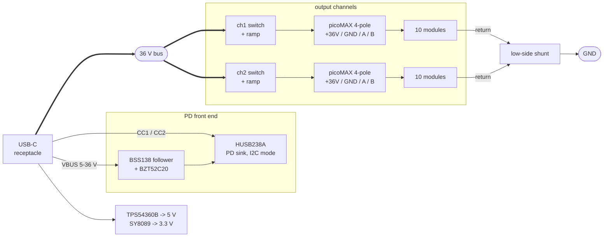
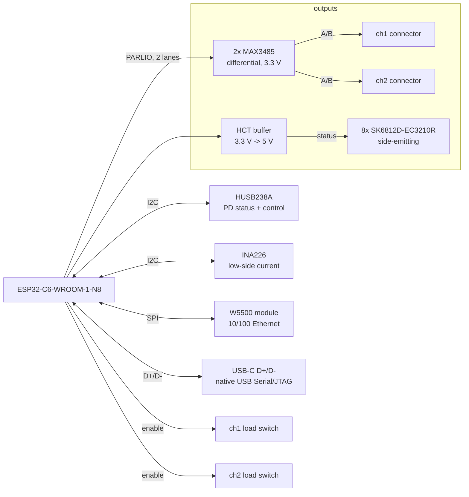
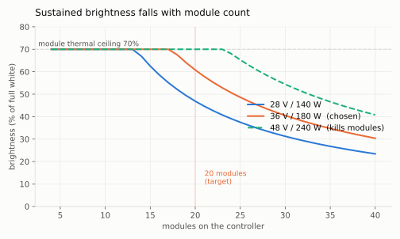
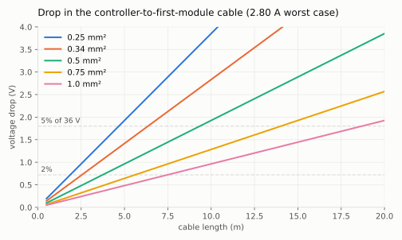
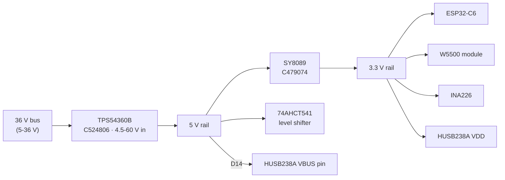
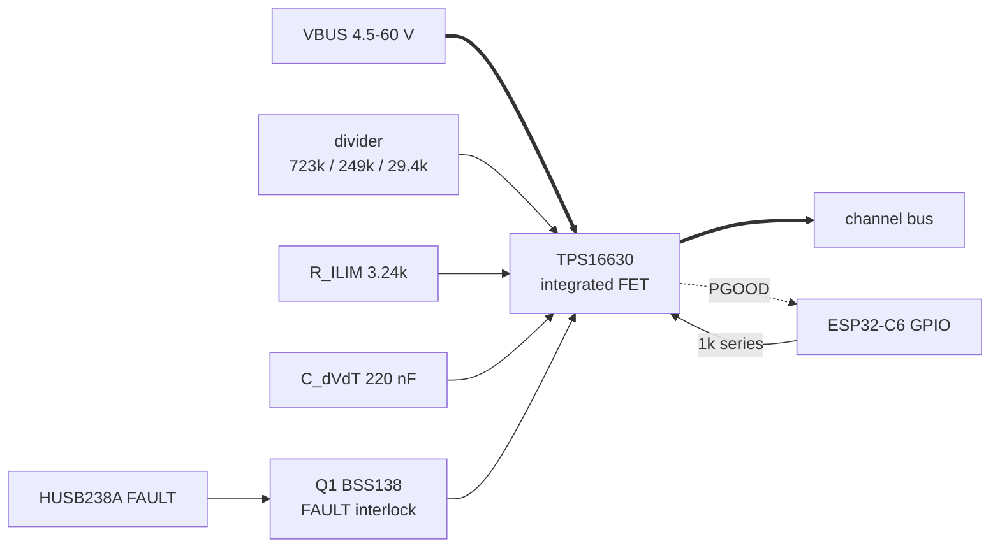
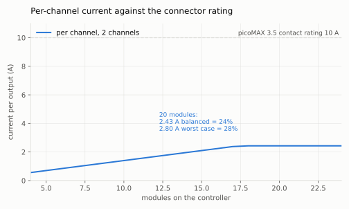
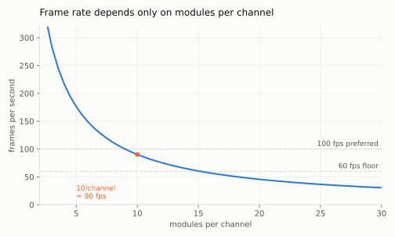

# LED matrix controller — status

Design brief in `BRIEF.md`. Nothing laid out yet. Requirements are settled;
several items under Open questions still block the netlist.

## What the board does

Negotiates USB PD, supplies a chained set of LED matrix modules over a
high-voltage bus, and runs an ESP32-C6 that drives the chain over Ethernet
(W5500) or USB. Brightness is capped in software to whatever PD actually
negotiated, so modules can be added freely within the power budget — the eFuse's
ramp does not depend on how much capacitance hangs on it — and the board divides the
available power between them.

## Environment

**The wall mounts on a soundwall for tekno. Sustained, high-amplitude vibration
is a given, not an edge case.** This gates part selection from here on rather
than being something to remember ad hoc.

Vibration attacks a connection two ways — the connector walking out of its
header, and the wire loosening in its termination. Screw terminals are
specifically bad at the second: screws back out, and industrial practice is
periodic re-torquing, which nobody is going to do on a soundwall.

It also puts anything with **mass on long leads** at risk of solder-joint
fatigue. Affected, and still to be revisited:

- the module's bulk electrolytic — a 220-330 uF radial cap is a lump of mass on
  two leads, and this is the classic vibration failure. Bond the body down, or
  move to SMD polymer or an MLCC bank
- converter board inductors — heavy and tall
- **board mounting**: standoffs at several points, not two corners. An
  unsupported span has a resonance and parts in the middle see amplified
  acceleration
- **cable strain relief**: a tie-down near each connector so cable movement does
  not load the contacts. Cheap, and it matters more than the connector choice

## Settled decisions

| Decision | Choice | Why |
|---|---|---|
| Bus voltage | **36 V** | highest EPR PDO the modules survive; XL1509 is 40 V operating / 45 V absolute |
| Power budget | **180 W** (36 V x 5 A) | EPR fixed PDO; matches the original brief |
| PD controller | **HUSB238A-BB001-QN16R** (C24833806) | I2C variant |
| PD mode | **I2C**, ADDR to GND = 0x42 | GPIO mode caps at 28 V/3.25 A = 91 W |
| PD front end | **p.16 Figure 6 topology** | 36 V exceeds the 33 V VBUS absolute max, so the chip sits behind a BSS138 follower. It carries **no power path**: VBUS feeds the bus directly and the channels switch downstream |
| Channel switching | **TPS16630** (C1849461) x2 | 60 V / 6 A eFuse with an integrated FET. Works from **4.5 V**, so the LED output follows the rails down instead of dying below a 12 V contract |
| External part ratings | **60 V class throughout** | the channel eFuse is 67 V absolute (1.15x the 58.1 V TVS clamp), and the TPS54360B and SS36 are 60 V, which sets the real limit at 1.03x. Still no room for a future 48 V/240 W bus, which would need every module respun anyway |
| Channels | **2**, 10 modules each | fps depends only on modules per channel; 10/ch = 90 fps |
| Target scale | **20 modules**, 80% perceived brightness | what 180 W supports before brightness falls off; 10 per channel |
| UART bridge | **none** | ESP32-C6 has native USB Serial/JTAG, and PD runs on CC not D+/D- |
| MCU | ESP32-C6-WROOM-1-N8 (C5366877) | from brief |
| Ethernet | **W5500 module** (W5500 Lite / WIZ850io class), soldered down | the brief said W5500; this design first read that as the bare chip. A finished module carries the PHY front end, the crystal and the magnetics, which retires two blocking open questions and the hardest routing on the board |
| Current sense | **INA226** (C49851), **low-side** | specified 0-36 V operating (40 V absolute), so on a 36 V bus there is no operating margin at all; the shunt goes in the ground return where common mode is ~0 V |
| Module connector | **Wago picoMAX 3.5** (2091 series), 4-pole: **+36V / GND / A / B** | 10 A, push-in spring, integrated locking latch. Spring force does not relax like a screw; the latch stops it walking out. Reichelt 2091-1424 board side, 2091-1104 cable side; not LCSC |
| Data link | **differential pair**, MAX3485 (C6395158) x2 | one per channel. Removes the single-ended distance limit and the level shifting at this end |
| Status-LED level shift | **74AHCT541** (C84548) | the SK6812 chain needs 5 V logic off a 3.3 V GPIO. Octal and only one channel used — oversized, see KB |

### Architecture

Split into power and control. One diagram carrying both always crosses itself,
because the MCU touches everything on the board.

**Power path** — left to right, the two channels parallel:

Thick edges carry the bus current; thin edges are control and sense. The shunt
sits in the **return** path, which is what makes low-side sensing work.

**Control and data:**

Both I2C devices share one bus. The buffer drives only the status chain — the
data outputs are differential and need no level shifting here — so one channel
of eight is used.

### Why not 240 W

48 V is supported by the PD chip (p.16 Figure 6) but **destroys the modules** - the XL1509
is 40 V operating, 45 V absolute. 240 W would need every module respun onto a 60 V-class
buck. The controller's bus-side parts are rated **60 V class**, which does not leave room
for 48 V — that would want 100 V throughout, where only the channel switch is
100 V today. Since 48 V needs every module respun
anyway, the door is closed by the modules, not by this board.

### Why not 28 V

At 14 modules, 140 W and 180 W are nearly indistinguishable (83% vs 85% perceived) —
the 180 W case is thermally capped there, the 140 W case just barely power-limited at 67%. At 20 modules the gap is real: 71% vs 80%. 20 modules is the target,
so the extra front-end complexity is worth it.

## Power budget

180 W, less **5 W** for the controller, leaves **175 W** for modules. 5 W is the
figure every calculation and `figures.py` actually use; the thermal budget's
3.98 W is the computed total and the 1.0 W difference is deliberate headroom.
Perceived brightness applies a gamma of 2.2.

| Modules | Power | Perceived | fps (2 ch) | Binds on |
|---|---|---|---|---|
| 10 | 70% | 85% | 176 | thermal |
| 14 | 70% | 85% | 128 | thermal |
| 20 | 61% | 80% | 90 | power |
| 24 | 51% | 73% | 76 | power |

<picture>
  <source media="(prefers-color-scheme: dark)" srcset="figures/brightness-vs-modules-dark.svg">
  
</picture>

Thermal and power cross over near 17 modules. Below that the modules are heat-limited
however much is negotiated; above it, software divides what is available.

## Cabling

**Terminology:** the link is called a **differential pair** throughout. The
drivers are RS-485 transceivers and follow RS-485 line levels, but none of the
RS-485 *connector* conventions apply — the pair runs over two poles of a picoMAX
alongside power and ground.

The converter is a **separate board from the LED matrix**: controller → wire →
per-module converter board on the back of the wall → LED matrix board. The
modules sit adjacent and chain board-to-board like a snake, so **only the
controller-to-first-module cable has any length.** Everything after it is a
short board-to-board link whose drop is negligible.

That single cable carries the whole channel: 2.43 A sustained, 4.0 A on a
full-white flash.

<picture>
  <source media="(prefers-color-scheme: dark)" srcset="figures/cable-drop-vs-hop-length-dark.svg">
  
</picture>

Cross-sections per **IEC 60228**, loop resistance 2ρ/A with ρ(Cu) = 0.0172
Ω·mm²/m at 20 °C:

| mm² | 5 m | 10 m | 15 m | max at 5% |
|---|---|---|---|---|
| 0.25 | 1.67 V | 3.34 V | 5.02 V | 5.4 m |
| 0.34 | 1.23 V | 2.46 V | 3.69 V | 7.3 m |
| **0.50** | **0.84 V** | **1.67 V** | 2.51 V | **10.8 m** |
| 0.75 | 0.56 V | 1.11 V | 1.67 V | 16.1 m |
| 1.00 | 0.42 V | 0.84 V | 1.25 V | 21.5 m |

**Power is not the constraint.** The converter needs only 6.5 V in (5 V out plus
1.5 V dropout), so from 36 V there is 29.5 V of headroom — the cable would have
to be absurd before the converter stopped regulating. The 5% line above is an
efficiency choice, not a functional limit. At 0.5 mm² and 10 m the cable burns
**4.06 W** per channel, which is the real cost.

**Data is no longer the limit.** Going differential removed it. A differential
pair is good for tens of metres at 800 kbps, well past anything power
allows, and it is far more tolerant of a room full of switching converters than
a single-ended line would have been.

So **power is now the only constraint: 0.5 mm², up to about 10.8 m** at 5% drop.
That is a real gain over the ~5 m the single-ended link would have been held to.

Practice for the pair:

- **Twist A and B together.** The connector pinout is +36V / GND / A / B so the
  pair is adjacent and away from the power conductor.
- **120 Ω termination at the far end**, on the first converter board.
- Keep the pair away from the +36 V conductor and its converter switching noise.

Worth noting this is a dividend of the 36 V decision. At a 5 V bus a 1.6 V drop
would be 32% of the supply; at 36 V it is 4.5%.

## Status indication

Eight SK6812D-EC3210R in a chain on ONE GPIO, level-shifted through a 74AHCT541.

**Why all eight are RGB when only two need colour for their own job.** The
obvious saving is two addressable LEDs for the fault indicators plus six plain
ones for the bar, and it does not pay:

| | power | GPIOs | parts | cost |
|---|---|---|---|---|
| **8 addressable + 74AHCT541 (chosen)** | **0.120 W** | 1 | **9** | $0.87 |
| 8 plain 0805 + 74HC595 + 8 resistors | 0.053 W | 1 | 17 | **$0.15** |
| 2 addressable + 6 plain, driven directly | 0.070 W | 7 — none spare | 10 | — |

**GPIO count is a tie, not a win**, and an earlier version of this section said
otherwise. A 74HC595 shares SCLK and MOSI with the Ethernet module and needs only
a latch pin — exactly what the addressable chain costs — and it would replace the
74AHCT541, which exists only because SK6812 wants 5 V logic. The plain option is
genuinely buildable: YLED0805R (C19171391) at 127k stock and 0.8 ¢.

Two things decide it, and they pull opposite ways. **Part count favours
addressable** — nine against seventeen, because the shift-register version needs
eight current-limiting resistors where the SK6812s have drivers built in, and on
a small run that outweighs 72 ¢. **And colour has become load-bearing.** The bar
reads watts across 180 W, so on a 36 W contract one LED lights whether the wall
is dark or the supply is small; without colour there is no way to tell those
apart. That did not matter while 36 V was the only normal case — since the UVLO
change, 12, 20, 28 and 36 V all are.

Power is not the deciding factor: 67 mW is 1.6% of a budget sitting at 1.17×.

**A real simplification does exist and is not taken:** three addressable LEDs
showing two colours each would encode the same six power levels, so five parts
instead of eight at 0.075 W. It is rejected on readability — a bar is read at a
glance and a colour-coded bar is read twice.

- **6 as a power bar** - watts, not volts, at 30 W per LED across the 180 W budget.
  Watts is what the limiter reasons about and it reads at a glance. **Colour
  carries the negotiated voltage** — a requirement rather than an option since the
  UVLO change made 12/20/28/36 V all normal, and the reason the bar is RGB. (Actual PD PDOs are 5/9/12/15/20/28/36/48, but 48 V is
  never requested because it destroys modules, so a voltage bar would need 7.)
- **1 for power limiting**, **1 for thermal limiting**. RGB encodes history on a single
  LED rather than one per time window: bright red = limiting now, orange = within
  5 min, dim yellow = within 10 min, off = clean for 10+ min.

Selected: **SK6812D-EC3210R** (C2890041), a **side-emitting** 3.2 × 1.1 mm part.

**Side-emitting is the point.** In an enclosure a top-view indicator needs a
window in the lid; a side-view one shines out the board edge, which is where
someone looking at a wall-mounted controller already is. Electrically it is the
same part family: IDOUT 10.5/12/13.5 mA against the MINI-E's 10/12/14.5 mA, so
the 0.12 W budget is unchanged.

| | SK6812MINI-E | **SK6812D-EC3210R** |
|---|---|---|
| area each | 12.25 mm² | **3.52 mm²** — saves 70 mm² over eight |
| emission | top | **side** |
| price for eight | $0.65 | $0.90 |
| stock | 187k | 52k |

**What side-emitting actually requires is a clear path, not an edge.** The light
leaves parallel to the board, so nothing tall may stand in front of it. The board
edge is the natural place because that is where an enclosure opening would be,
but the constraint is line of sight.

**And board edge is not scarce.** An earlier version of this section called it
the binding resource, which was wrong by a factor of six:

| | |
|---|---|
| perimeter at 72 × 74 mm | **292 mm** |
| committed — USB-C 9, two picoMAX 32, RJ45 16, antenna keep-out 18 | 75 mm, **26%** |
| free | **217 mm** |
| eight LEDs at 3.2 mm plus spacing | **34 mm**, 15% of what is free |

"All four edges are committed" in the mechanical section means each edge carries
*something*, not that any is full.

**The pin order is not the same as the MINI-E's** — 1 GND / 2 DOUT / 3 DIN /
4 VDD against 1 GND / 2 DIN / 3 VDD / 4 DOUT. A netlist written for one is wrong
for the other, with DIN and VDD swapped, which is the failure mode the standing
rule about pin numbers exists for.

**The level shifter stays regardless of which variant is chosen.** Every SK6812
in this family wants VIH ≥ 0.6-0.65 × VDD, i.e. 3.0-3.25 V on a 5 V rail, and the
ESP32-C6 guarantees only V_OH ≥ 0.8 × VDD = **2.64 V**. Even the SK6812-EC20
(C2909058), whose 0.6 × VDD is the most permissive of the three, is out of reach.
The 74AHCT541 is not a part any LED choice can delete.

**The thermal indicator is a model, not a measurement.** There is no temperature sensor
on the modules - the controller infers thermal state from commanded brightness
integrated over time against the RthJA figures in the knowledge base. Real thermal data
would need a sensor on the module, i.e. a module revision.

## Software power limiting

The use case is flashing effects, not sustained brightness, which changes what
the limiter has to do.

**Predictive limiting is primary.** Compute a frame's draw before displaying it
and scale the frame if it would breach the negotiated current. Reacting to a
measurement is too late: a sudden all-white flash steps the bus by several amps,
and if that exceeds what PD negotiated the source can cut VBUS entirely, blacking
out the whole installation.

The model needs three terms, and an earlier version of this paragraph had only
the first:

    I_bus  =  (sum(channel values) x 20 mA / 255) x 5 V / (36 V x eta)   [LED term]
           +  N_ICs x 0.6 mA x 5 V / (36 V x eta)                        [quiescent floor]
           +  controller overhead

- **The sum is amperes at the module's 5 V rail**, and the contract is amperes at
  the **negotiated** bus voltage. The divisor is `V_negotiated × η / 5` — **5.4**
  at 36 V and 75% efficiency, but **3.0** at 20 V and **1.8** at 12 V. Hard-wiring
  36 V here would under-predict bus current by **3×** on a 12 V contract, which is
  the least forgiving one the board accepts. Dividing by η *raises* the bus current, so it belongs in the
  numerator of that ratio, not the denominator: an earlier version of this bullet
  said 9.6 (= 7.2/0.75) and would have **under-predicted bus current by 44%**, in
  the one computation whose whole purpose is to stop the source cutting VBUS.
  Sanity check against this document's own numbers: 20 modules at full white is
  43.2 A at 5 V, and 43.2/5.4 = **8.0 A**, which is exactly the 2 × 4.0 A per
  channel stated in Cabling.
- **An all-black frame does not draw zero.** The WS2812D-F8 specifies no
  quiescent current; the sibling SK6812 gives 0.6 mA per IC and the family runs
  0.5-1 mA. At 720 ICs that is 0.36-0.72 A at 5 V, i.e. **2.4-4.8 W off the
  bus** — 1.3-2.7% of a budget this document already computes at 5.2 A against a
  5.0 A contract. The floor is not optional headroom; it is always present.
- η is the same optimistic 75% the whole power budget rests on, characterised at
  28 V rather than 36 V. The limiter inherits that error and should carry a
  margin for it rather than trusting the figure.

**The step is slower than "microseconds".** The modules' own converters and their
3.3 mF of bulk slew a full-white transition over roughly 100 µs, not
instantaneously — which is what makes a predictive limiter viable at all, and is
worth stating because the earlier wording argued the opposite way.

**And "61% brightness" is not 61% of the current, continuously.** The WS2812
dims by duty-cycling its constant-current sinks at roughly **400 Hz**, so at 61%
a module draws its *full-white* 3.98 A for 61% of each 2.5 ms period and nothing
for the rest. What reaches the bus is set by a current divider, and it is a **phasor** divider
— an earlier version of this paragraph added a resistance to a reactance as
scalars and got the wrong fraction. The channel's 3.3 mF bank is **0.121 Ω** at
400 Hz; the path is cable, switch and sense resistance:

    bus share = |Z_C| / |R + Z_C| = 0.121 / sqrt(R² + 0.121²)

| cable | R (loop) | bus share | ripple seen |
|---|---|---|---|
| ~5 m, 0.5 mm² | 0.35 Ω | 32.7% | **±0.51 A** |
| 10 m, 0.5 mm² | 0.69 Ω | 17.3% | **±0.27 A** |

The two shares do not sum to one with the capacitor's — they are orthogonal
components, which is exactly what the scalar version got wrong. **The document's
own worked case is 10 m**, so ±0.27 A is the figure that matches the rest of the
design; ±0.5 A applies to a short cable and is the conservative end.

Every current figure in this document is a frame average, which is the right
basis for the thermal and contract budgets and the wrong one for the INA226's
alert threshold and for anything about PD source behaviour. **Whether the ripple
adds or averages across a chain depends on whether the modules' PWM phases stay
correlated** — they re-latch every frame, so they plausibly do — and nothing here
establishes which. Treat ±0.5 A as the working figure and the correlation as
unverified.

**The INA226 is the slow loop**: calibrating the model, noticing the module
count changed, and acting as a safety net. Not the first line of defence.

**Inrush is handled in hardware, not software** — each channel switch ramps into
its own module bank under power limit rather than switching into it. See
Channel switching and inrush.

## Cold-start sequence

**The rails are fed from VBUS directly.** There is no master pass FET — see
Channel switching and inrush. Wiring the rails behind any switch creates a circular deadlock that
would stop the board ever powering up:

> EN_N is pulled up internally and the HUSB238A is enabled by pulling it to GND
> (datasheet p.5). If EN_N sits on an MCU GPIO, that GPIO is high-Z until the MCU
> is powered. So the chip stays disabled, GATE never closes, the bus never comes
> up, the rails never come up, and the MCU never boots to pull EN_N low.

Feeding the rails pre-FET breaks it, and turns EN_N's internal pull-up from a
trap into the correct safe default — nothing negotiates until firmware is alive:

1. Plug in. VBUS is at vSafe5V (5 V), both channel switches are off, no LED power.
2. The TPS54360B runs straight off that 5 V — this is exactly why ~100% duty
   pass-through was a selection criterion — giving ~4.85 V, and the SY8089 makes
   3.3 V from it.
3. The MCU boots. EN_N is still high (internal pull-up), so the PD chip is idle.
4. Firmware pulls EN_N low and the HUSB238A negotiates. **It is powered from
   VDD**, which step 2 already brought up — an earlier version of this step said
   the chip "self-powers from VBUS, so it needs nothing from us", and that is
   exactly what does not work here: behind the Figure 6 follower the VBUS pin
   sees only 3.05-3.75 V at vSafe5V, under the 4.5 V the chip needs when VDD is
   absent. D14 holds the pin at ~4.19 V and VDD does the supplying.
5. VBUS rises to 36 V. The rails ride through it; the TPS54360B is a 60 V part
   and simply leaves pass-through.
6. Past ~4.5 V each TPS16630 is above its own operating minimum, and firmware
   enables the channels by driving the enable GPIOs **high**. Both may be
   released together: the dV/dt-controlled inrush is 0.72 A per channel, so
   1.44 A against a 5.0 A contract.
7. Each eFuse turns on after **11.6 ms** (742 µs + 49.5 × C_dVdT in nF) and ramps
   its own 3.3 mF at a dV/dt-controlled **0.72 A**, taking **165 ms**. The bus is
   already static, so they ramp into a steady source. The multi-second insertion
   delay the LM5069 imposed is gone with it.

There is no master pass FET — see Channel switching and inrush. A PD
fault sheds the LED channels while the controller stays alive to report it, which
is the behaviour we want.

## Rail architecture

The board must run from a 5 V bus as well as 36 V, with software holding back
what it cannot power. That constrains the rails more than the 36 V case does.

**And the LED output follows them all the way.** The TPS16630 operates from
**4.5 V**, so there is no PD level at which the rails work and the wall does not —
including a plain laptop port at vSafe5V. Earlier revisions set this threshold at
28 V and then 8 V, each of which made this sentence true of the rails and false of
the load.

**TPS54360B** (4.5-60 V in, 3.5 A, 60k stock). Chosen specifically because its automatic
BOOT recharge circuit allows "duty cycles approaching 100%", so "the maximum output
voltage is near the minimum input supply voltage" (datasheet p.10). An ordinary buck
cannot make 5 V from a 5 V bus; this one passes through.

Output across the input range at 0.7 A, from the datasheet's p.12 Eq. 1, inverted:

    V_OUT = 0.99·V_IN + 0.99·V_F − 0.99·R_DS(on)·I_OUT − V_F − R_dc·I_OUT

with R_dc = **0.0725 Ω** — the SPM6530T-100M's DCR — and R_DS(on) = **0.12 Ω**, which is the datasheet's own
choice for this case (§8.2: *"the BOOT-SW = 3 V curve in Figure 1 was used for
RDS(on) = 0.12 Ω because the device operates with low drop out"*).

**That 0.12 Ω is a typical, and the table below is therefore a typical.** The p.5
electrical table gives 92 mΩ typ / **190 mΩ max**, and the datasheet adds that
values *"must include tolerance … at their maximum operating temperature"*. At
190 mΩ the rail is **4.52 V** on a 4.75 V bus — still over the 74AHCT541's 4.5 V
minimum, which the lower-DCR inductor bought — and D14 then holds the VBUS pin at
**4.15 V**, cutting both 4.0 V margins from 0.19 V to **0.145 V**. The corner is flagged for the thresholds; the 4.50 V row
itself should be read as typical, not as the floor.

| bus | 5 V rail | 74AHCT541 needs 4.5-5.5 V |
|---|---|---|
| 4.75 V (USB-C low tolerance) | **4.56 V** | 0.06 V over the floor |
| 5.00 V | 4.81 V | ok |
| >= 5.25 V | 5.00 V | ok |

Two earlier versions of this table were wrong in opposite directions: one assumed
a flat 0.15 V drop and got 4.60 V, the other used a 163 mΩ inductor and got
4.50 V — exactly the 74AHCT541's floor. With the lower-DCR part it is **4.56 V**,
and D14 holds the HUSB238A VBUS pin at **4.19 V**.

**Neither is fatal, and here is why.** The 74AHCT541 only drives the status LED
chain; a marginal rail during the few seconds of the 5 V phase means the
indicators may misbehave before negotiation, not that the board fails to start.
And 4.19 V still clears the VBUS pin's 3.15 V minimum by 0.98 V. What it does
erode is the margin against two 4.0 V thresholds — see Known electrical limits.

**The sag at low bus voltage matters locally, not across the cable.** An earlier
version argued it was self-correcting because the modules' own XL1509 is also in
pass-through at 5 V, so module VDD falls too and WS2812 thresholds track. That
tracking argument is void here — the controller's 5 V rail and the modules' 5 V
rail no longer share a signal path, only a differential pair at 3.3 V logic.

What the sag actually threatens is the **SK6812 status chain on this board**:
its VIH is 0.65 x VDD, so at a 4.56 V rail the threshold is 2.96 V and the
74AHCT541 drives it comfortably. The binding constraint is the buffer's own
4.5 V supply minimum, which the rail clears by 0.06 V — see the dropout table.

**SY8089** (C479074, SOT-23-5, 100k stock) for 3.3 V rather than an LDO. At 4.85 V in,
3.3 V out, and the ESP32-C6's **382 mA** worst-case transmit peak, an LDO would burn ~0.6 W; a
synchronous buck burns under 0.1 W and avoids a thermal problem in a small package.

### Why two conversion stages

The board needs **both** rails: 3.3 V for the MCU, Ethernet module, INA226 and the
HUSB238A's VDD, and 5 V for the 74AHCT541, the SK6812 status chain and **D14**.

**The reason is the status chain, not the modules.** An earlier version of this
paragraph argued from the WS2812's 0.7 x VDD = 3.5 V threshold — but the
controller does not drive any WS2812. It drives two MAX3485s at 3.3 V, and the
3.3 -> 5 V shift lives on the converter board, which the module record states
outright. The governing number is the **status chain's 0.65 x 5.0 = 3.25 V** on
the controller's own rail, which a 3.3 V GPIO clears by only 50 mV — margin, plus
the rail's own sag, is what justifies the buffer.

**What the 3.3 V rail actually carries**, which until now was a bare "~2.3 W":

| Load | mA | Note |
|---|---|---|
| ESP32-C6, TX peak | 382 | datasheet Table 13, 802.11b at 20.5 dBm, 100% duty — pessimistic as a continuous figure |
| Ethernet module | 152 | 0.50 W at 3.3 V |
| 2x MAX3485 | ~29 | 2 mA I_CC each **plus ~12 mA each of line current** — a driver with DE asserted pulls load current 100% of the time |
| HUSB238A VDD | 4.5 | active sink |
| INA226 + pull-ups | ~6 | |
| **total** | **~574 mA = 1.89 W** | inside the ~2.3 W the rail is sized for |

The transceivers' line current is the row that was missing: it appears in the
thermal budget as 0.06 W of *board heat* — correct, since most of it is burned in
the far-end 120 Ω on the converter board — but it is a real continuous draw on
the SY8089 either way. Note the datasheet gives neither a loaded I_CC nor a V_OD
at 120 Ω, so this row is estimated and cannot be verified from it.

Cascading costs almost nothing. The 3.3 V rail delivers ~2.3 W, so:

| | efficiency | lost |
|---|---|---|
| cascade, 36 -> 5 -> 3.3 V | ~78% | 0.649 W |
| hypothetical single 36 -> 3.3 V | ~80% | 0.575 W |

**A 74 mW penalty**, against saving a second wide-input buck. (Earlier versions
of this passage gave 60 mW, 66 mW and 74 mW from the same two efficiencies; 2.3 W
at 78% and 80% is 0.649 W against 0.575 W.) The alternatives
are all worse:

- **Two parallel wide-input bucks** (bus to 5 V, bus to 3.3 V) needs two
  TPS54360-class parts and two inductors, for that same 74 mW.
- **One bus-to-3.3 V buck plus a charge pump to 5 V** works — the level shifter
  draws only tens of mA — but adds a part and puts switching noise next to the
  data lines.
- **Eliminating the 5 V rail is not available.** An earlier version of this
  bullet called it "the only real simplification" and framed it as a *module*
  change — running the modules at 4.5 V so a 3.3 V GPIO could drive their
  WS2812s directly. That argument belongs to a design where the controller
  drives the modules' LEDs, which this one stopped doing when the link went
  differential. Three things on **this** board need 5 V and no module revision
  touches any of them: the 74AHCT541, the SK6812 status chain it buffers, and
  **D14**, which must sit above the HUSB238A's VBUS pin to hold it at 4.19 V.

So the two stages are forced by the 5 V logic requirement, and the cascade is
the cheapest way to meet it.

## Protection architecture

**The eFuse question is resolved, and by an eFuse.** The TPS26630 was dropped
early because its integrated FET is 40 V (1.11x at 36 V). Its sibling the
**TPS16630** carries a **60 V** FET at 67 V absolute, which is more margin than
the TPS54360B and SS36 on the same node have, so the original objection does not
apply to it. One per channel now does the current limiting the bus never had.

What protects the load, in order of speed:

1. **TPS16630 current limit**, 5.56 A typ per channel. Autonomous, but see Known
   electrical limits: against a 5.0 A *total* contract the PD source acts first
   on a hard short, so "one chain sheds, the other keeps running" is **not
   reliably obtainable**
2. **TPS16630 OVP**, a hardware overvoltage cut-off at 40.9 V typ, needing no firmware
3. the PD source limiting at the negotiated level
4. HUSB238A FAULT into the interlock transistors, pulling both SHDN pins low on
   OTP or an adapter-capability fault (OVP/UVP do not survive the clamp topology
   above 28 V)
5. software via the INA226, as a slow safety net

**What is still unprotected is the bus node upstream of the two controllers.**
The rails and the PD front end sit there with only the TVS
and the PD source's own limiting between them and a fault.

**Current sensing is low-side.** The shunt sits in the ground return, so
common-mode is near 0 V and the INA226's rating — 0-36 V operating, 40 V absolute,
so no operating margin on a 36 V bus — stops mattering. Forced by both 85 V parts (INA228, INA238) being at zero stock;
it turned out to be the better answer. Costs the ability to detect an output
short to ground, and lifts the load ground by 50 mV at 5 A through 10 mOhm.

**The Figure 6 "Voltage Regulator" is a BSS138 source follower.** Hynetek
publishes it with values at [hynetek.com/2730.html](https://www.hynetek.com/2730.html)
— it is not in the datasheet. Gate pulled up through 10 kΩ and clamped by a Zener, source feeding the VBUS pin; a 0 Ω link bypasses it for
builds at 28 V or below.

**We use 20 V (BZT52C20), not Hynetek's 28 V.** It puts the VBUS pin at roughly
18.5 V, comfortably inside its 3.15-29.4 V window, where a 28-30 V part would sit
at ~28.5 V against a 29.4 V recommended maximum. The functions we rely on —
VBUS-present detection and supply backup — work anywhere in that range, and
OVP/UVP are lost to the clamp topology regardless. A deliberate deviation from
the vendor reference, worth validating.

This replaces the earlier assumption of a resistor-plus-Zener shunt, and the
difference matters: a follower holds the pin near (Vgate − Vth) with low output
impedance, where a series resistor would drop voltage with load current.

#### The follower is too lossy at 5 V, and the fix is two parts

The follower costs one Vgs, and it costs it exactly where there is no room. At
the bottom of vSafe5V — a **4.75 V** bus — it delivers only **3.05-3.75 V**,
against a VBUS-pin minimum of 4.5 V when VDD is unpowered. The chip would not
reliably come up.

**First: VDD (pin 5) is an input supply, so tie it to 3V3.** The datasheet is
explicit — *"It is recommended to tie this pin to the single cell battery or a
3.3 V power rail. When the power is not available from this pin, the VBUS pin may
power the internal circuitry"* (p.4). That one connection changes two numbers at
once:

| With VDD = 3.3 V | With VDD unpowered |
|---|---|
| VBUS pin range **3.15 – 29.4 V** | 4.5 – 29.4 V |
| VBUS pin current **330 µA typ / 800 µA max** | 4.5 mA |

The requirement drops by 1.35 V and the current by **5.6x**, which also shrinks
the follower's own Vgs. Sequencing makes this safe: nothing has to happen until
firmware pulls EN_N low, and by then the 5 V and 3.3 V rails are both up, because
they are fed from the bus directly.

**Second: a Schottky from the 5 V rail to the VBUS pin.** At a 4.75 V bus the
rail sits at **4.56 V** (the dropout table), and an RB751V-40 drops **0.37 V max
at 1 mA** (p.2), so the pin is held at **4.19 V** — and the follower, seeing its
source above (Vgate − Vth), simply stops conducting. Once the bus rises the
follower takes the pin to ~18.5 V and the Schottky is reverse-biased by 13.5 V,
well inside its 40 V rating. It does nothing at 36 V and everything at 5 V.

| | Follower alone | With D14 |
|---|---|---|
| Pin at a 4.75 V bus | 3.05 – 3.75 V | **4.19 V** |
| Against the 3.15 V minimum | **fails at the low corner** | 1.08 V margin |

**Two residuals at the bottom of vSafe5V, and they are tighter than they look.**
Both are 4.0 V thresholds against the 4.19 V the Schottky delivers:

| Threshold | Value | Margin at 4.19 V |
|---|---|---|
| `VBUS_OK` rising, vVBPRS_R | **3.67 / 4.0 / 4.4 V** min/typ/max (p.6) | +0.19 V on typ, **−0.27 V on max** |
| VBUS UV falling, vVBUV_F1 | **80% of the requested voltage** = 4.0 V on a 5 V RDO (p.6) | +0.19 V |

The first decides whether VBUS-present is seen; the second is the under-voltage
detector that, per the same datasheet's UVP section, *"moves out the Attached.SNK
state"*. An earlier version of this paragraph labelled 3.67 V as the typical —
it is the **minimum** — and argued the risk away on the grounds that "negotiation
runs on CC". That argument is weaker than it was made to sound: USB Type-C gates
the `AttachWait.SNK → Attached.SNK` transition on VBUS detection, which is what
vVBPRS_R implements, and the UV detector was not mentioned at all.

**Honest position: this works on a typical part and is not guaranteed at the
corner.** Both margins are 0.19 V, and both would widen by 0.35 V if the 5 V rail
were not at its own dropout floor. Bench-check it on the first board; if it
fails, the lever is the rail, not the diode — a lower-DCR inductor buys back
more than any Schottky swap can.

**Hynetek's >28 V gate drive is not built here, and this note survives only to
say why.** Figures 4, 5 and 6 all draw the *same* Zener gate network — the 28 V
one, not a 48 V feature — and above 28 V Hynetek replaces it with GATE pulled to
3V3 through 5.1 kΩ and level-shifted by a PMOS-then-NMOS pair into a high-side
P-FET.

That mattered while the HUSB238A's GATE pin drove the power path. **It no longer
does:** GATE is unconnected, the channels switch through their own controllers,
and none of this arrangement exists in the BOM. It also retires the open question
about a small-signal PMOS — the design needs no such part.

### No overvoltage protection above 28 V

Hynetek states it plainly: *"因为HUSB238A没有36V/48V OV保护"* — there is no
36 V/48 V OV protection. The clamp preserves the supply function and
VBUS-present detection, but **destroys OVP, UVP and the discharge path**. It is
also why 48 V is I²C-only while GPIO mode stops at 28 V.

Accepted, because it is inherent to the topology rather than a mistake — but it
changes what protects the bus. The **SMAJ36CA TVS is now the only fast
overvoltage protection**, with the 470 k/27 k ADC divider as a slow software
check. Those two were added for surge and brownout; they are now carrying OVP as
well.

Worth knowing this approach is the **outlier**. The common industry solution is
an active 0.42× ratiometric level shifter in a companion IC (TI TPD4S480,
Kinetic KTU1133, Fortune FA2218), which *preserves* measurement where Hynetek's
clamp does not. If a later revision wants real OVP back, that is the direction.

## Channel switching and inrush

**Four attempts at a discrete gate network, four failures.** The topology is
abandoned. Each channel now switches through a **TPS16630 eFuse** (C1849461),
which does ramp, current limit, overvoltage cut-off and fast turn-off in silicon
with an integrated FET.

### Why the discrete attempts kept failing

| Attempt | What it got right | What it broke |
|---|---|---|
| R_pu 100 k / R_pd 1 M | — | Vgs 3.27 V, FET never enhances |
| R_pu 10 M / R_pd 1 M / C_gd 1 uF | the divider | ramp on the wrong node; 180 s turn-off; dV/dt self-turn-on |
| Drop the pass FET, C_gd 3.3 uF | removed one FET | moved the same faults onto switches with 27x more load capacitance |
| C_gs + diode across R_pu | dV/dt immunity | the diode clamps Vgs so the FET never enhances; C_gs cannot set a ramp |

The fourth was written here as **settled**, which makes it the worst of the four.
Two independent errors, both found by review:

- **The bypass diode cannot work.** R_pu sits gate-to-source and carries current
  source-to-gate in *both* phases — when turning off (wanted) and when the
  pull-down drags the gate low (not wanted). A diode across it cannot tell those
  apart. Anode at the source, it forward-biases as soon as Vgs passes -0.6 V and
  clamps there, so the FET never reaches its -1.0 to -2.5 V threshold; anode at
  the gate, it is reverse-biased during turn-off and does nothing. The
  diode-across-a-resistor trick needs a *series* gate resistor to bypass, and
  this topology has none.
- **A gate-to-source capacitor cannot set a ramp.** The FET is in common source:
  the drain transition happens entirely inside the Miller plateau, where Vgs is
  constant by definition, so C_gs carries **zero** current while the drain slews.
  It adds turn-on *delay*, not dV/dt control. The drain rate would instead be set
  by the FET's own Crss against the net gate current — 326 uA into 98 pF is
  3.3 V/us, the full 36 V in about 11 us — with the current rise through a 35 S
  transconductance entirely uncontrolled.

The thread running through all four: **a discrete network has to deliver ramp,
current limit, turn-off and dV/dt immunity from one capacitor and two resistors,
and those requirements pull against each other.** No value set reconciles them.
That is what the integrated part exists for.

### The replacement

One **TPS16630** per channel: a 60 V, 6 A eFuse with an integrated 31 mΩ hot-swap
FET, adjustable current limit, adjustable overvoltage cut-off and a dV/dt pin
that sets the output slew rate directly.

**It replaced an LM5069 driving a discrete N-FET**, and the reason was the one
requirement the discrete arrangement could not meet: the LM5069 needs **8 V** to
operate, so the LED output was dead below a 12 V contract and dead on a laptop
port. The TPS16630 works from **4.5 V**.

| | LM5069 + NSS085N100S | TPS16630 |
|---|---|---|
| input range | 8-90 V | **4.5-60 V** |
| absolute max | 108 V | 67 V, 75 V for 10 ms |
| parts per channel | IC + FET + sense resistor | **IC only** |
| stock | 105 | 1141 |
| inrush | 1.05 A rising to a 5.5 A plateau | **constant 0.72 A** |
| two channels at once | 11 A — needed staggering | **1.44 A** |
| ramp vs module count | capacitance-limited at 12.7/channel | **independent** |
| dissipation | 0.35 W | 0.66 W |

The last row is the cost and it is real: 31 mΩ integrated against 9.5 mΩ discrete
plus a 10 mΩ shunt. Thermal headroom falls from 1.29x to **1.20x**, on a board
whose thermal section already calls 45 °C ambient over budget.

**What it buys back is three of this document's own known limits.** The inrush is
set by dV/dt rather than by a power limit, so it is *constant* rather than rising
into the current limit — which means both channels can be released together, the
ramp no longer exceeds the PD contract, and the ramp duration no longer depends
on how much capacitance is hanging on it.

### Values, derived

Per channel, from the datasheet's own equations rather than from its worked
example. **An earlier version of this section back-solved a gain of 33x from the
rounded example in §10.2.2.3 and was wrong**: the datasheet specifies
`GAIN(dVdT) = 23.5 / 25 / 26 V/V` directly (p.7), and Equations 1 and 2 give it
independently as `1/(20.8e3 × 2 µA) = 24.0`.

    t(dVdT)   = 20.8e3 × V_IN × C_dVdT          (2)
    I(INRUSH) = C_OUT × V_IN / t(dVdT)          (1)

| Element | Value | Derivation |
|---|---|---|
| R_ILIM | **3.24 kΩ** 1% | the datasheet tabulates 3 kΩ → 6 A and 4.02 kΩ → 4.5 A, i.e. I·R ≈ 18 kΩ·A, so 3.24 kΩ gives **5.56 A**. Clears the 4.0 A white-flash peak by 1.29x at the low end of its ±7% spread |
| C_dVdT | **220 nF** | Eq. 2 gives t = 20.8e3 × 36 × 220 nF = **165 ms**; Eq. 1 gives inrush = 3.3 mF × 36 / 165 ms = **0.72 A**. Carrying I(dVdT) 1.775-2.225 µA and GAIN 23.5-26 V/V, the spread is **137-190 ms** and **0.63-0.87 A** before C_dVdT's own ±10% |
| UVLO/OVP string | **723 kΩ / 249 kΩ / 29.4 kΩ** 1% | IN → R1 → **UVLO** → R2 → **OVP** → R3 → GND, against 1.2 V on both pins. UVLO is the *upper* tap. Gives **UVLO 4.32 V**, **OVP 40.9 V**, and draws 38 µA |
| C_IN | **100 nF** | §10.2.2 "a minimum of 0.1 µF is recommended" |
| PGOOD pull-up | **10 kΩ** to 3V3, shared | open drain; both channels wire-ORed onto one GPIO |

**The inrush is constant, which is the whole point.** Equations 1 and 2 make the
charging current independent of bus voltage and of how far the ramp has
progressed. At **0.72 A** per channel, **both channels can be released
simultaneously** — 1.44 A against a 5.0 A contract — and the staggering the
previous design needed is gone.

**The ramp time does not depend on module count, at 25 °C.** Equation 2 has no
C_OUT term, so t is **165 ms** whether a channel carries 10 modules or 20 — until
the thermal regulation loop engages and overrides the slew, which it will at
higher ambients (see below); only the inrush
scales, to 1.44 A per channel at 6.6 mF. That removes the
12.7-modules-per-channel start-up ceiling the LM5069's fault timer imposed — the
binding constraint returns to power, where it belongs.

**Turn-on delay** is `742 µs + 49.5 × C_dVdT[nF]` = **11.6 ms** at 220 nF, which
is what replaces the LM5069's multi-second insertion timer.

**Ramping 3.3 mF is characterised, and the comparison is energy, not farads.**
TI publishes the part powering into **15 mF** (Figure 16) — but at V_IN = 24 V
and with dVdT *open*, so ½CV² = **4.32 J**. Ours is ½ × 3.3 mF × 36² = **2.14 J**,
i.e. **2.0×** inside TI's demonstrated case, not the 4× a capacitance comparison
suggests. At the 20-module growth case it is **4.28 J ≈ 1.0×** — equal to the
demonstration, not a quarter of it.

**And the 165 ms ramp is a 25 °C figure.** Equation 3 gives the inrush power:

    P_D(inrush) = 0.5 × V_IN × I_INRUSH = 0.5 × 36 × 0.72 = **13 W** per channel

for 165 ms, 26 W for the pair — six times the board's entire steady budget. The
datasheet is explicit that if this exceeds the Figure 13 power-versus-time
boundary, the **thermal regulation loop** takes over, overrides the programmed
slew and starts a **1.25 s** `t(Treg_timeout)`; if the output has not come up by
then the FET turns off and MODE decides latch or retry. Reading Figure 13, 13 W
sits several hundred milliseconds inside the boundary at 25 °C but only ~40-60 ms
at 85 °C — on TI's EVM copper, which is better than this board's.

So **regulation will engage during the ramp at the 45 °C ambient this document
calls realistic**, the ramp will be longer than 165 ms there, and there *is* still
a start-up ceiling — it is `t(Treg_timeout)` rather than a fault timer, and it is
much further out than the LM5069's, but "165 ms whatever the load" is a 25 °C
claim and the 20-module case is where it would bite.

**Thresholds.** UVLO at 4.32 V sits just under the part's own 4.5 V minimum
operating voltage, so **the device's own floor is the binding one** and the LED
output follows the rails down to vSafe5V. Its hysteresis is 78 mV typ, so it
falls out at 4.06 V — still under that floor, which is why the hysteresis does
not need designing around.

**OVP cuts off at 40.9 V, and that number closes an accepted limit.** The
reference is **±2%** (1.176/1.2/1.224 V), not the ±10% of the LM5069 comparator
this design previously carried. With 1% resistors the trip lands between
**39.2 V and 42.5 V** — above the 37.8 V maximum bus by 1.4 V and below the
modules' 45 V absolute by 2.5 V. The window the old part could not fit into is
comfortable for this one.

**The release threshold is not comfortable, and closing the trip point did not
close it.** V(OVPF) is 1.09/1.122/1.15 V, so the channel re-enables at
**37.5-38.8 V** on the comparator spread alone and **36.4-39.9 V** once the 1%
resistors are carried. A compliant source may sit at **37.8 V indefinitely** —
which is inside that band. A low-corner part that trips on an excursion would
then **not re-enable on a healthy bus**: it needs the bus below 36.4 V, which a
36 V contract never reaches.

The lever is the same divider. Raising the trip raises the release with it, so
the fix is to accept a manual recovery — firmware can cycle SHDN, which the
datasheet states resets a latched device — rather than to retune. **Recorded as a
known limit**; the trip point still protects the modules, which is what the
accepted item was about.

### Enable

**An earlier version of this section could not enable a channel.** It put a
2N7002 open drain on SHDN *and* a 100 kΩ pull-down on the same pin — two paths to
ground and none to 3V3 — so both channels would have sat in low-IQ shutdown
permanently. The only thing that can raise SHDN is its own internal source
(2.48-3.3 V open circuit, ≤10 µA), which against 100 kΩ settles near 0.77 V,
under the 0.8 V guaranteed-shutdown threshold.

**SHDN is a logic input and the GPIO drives it directly.** It accepts 0-5 V with
V(SHUTR) ≤ 2 V, so a 3.3 V GPIO is in range with margin.

| Part | Value | Why |
|---|---|---|
| SHDN pull-down | **10 kΩ** to GND | fail-safe off through MCU reset. Against the pin's own ≤10 µA source this holds 0.1 V, clear of the 0.8 V shutdown threshold — 100 kΩ would sit at 0.77 V and might not shut down at all |
| GPIO series | **1 kΩ** | lets the FAULT transistor override a driven-high GPIO without shorting it. With 1 kΩ into 10 kΩ, SHDN reaches **3.0 V** when the GPIO is high, above the 2 V turn-on threshold |
| Q1/Q2 | BSS138 drain on SHDN | FAULT asserted must pull SHDN below the 0.8 V threshold, which needs R_DS ≤ 330 Ω against the 909 Ω Thévenin source — easily met, though R_DS is not characterised at this gate drive. The GPIO then sources 3.2 mA through the 1 kΩ |

**The logic is not inverted.** GPIO high enables, GPIO low or high-Z disables, and
the pull-down makes reset the off state. The 2N7002s the old arrangement needed
for the enable path are gone — Q1/Q2 no longer exist.

### What is still open here

- **PGOOD wiring.** Both TPS16630 PGOOD pins are open-drain; wiring them together
  into one GPIO with a pull-up reports "both channels good" and costs the single
  spare pin. Which channel failed is then inferred from which one firmware
  enabled. The part also brings an **IMON** current-monitor output per channel,
  which would give the per-channel sensing the shared shunt cannot — unused for
  now because there are no spare ADC pins.
- **The low-side shunt wants Kelvin connection.** R1 is 10 mΩ carrying the full
  5 A, so 0.25 W, and its sense traces are not a routing afterthought. (The eFuse
  has no sense resistor — this is the INA226's shunt, and an earlier version of
  this bullet described it as a per-channel part at 0.059 W.)
- **Second-source risk is lower than it was.** C1849461 is TI silicon at 1141
  units, where the LM5069 it replaces was a Tokmas clone at 105. The TPS16632
  variant adds adjustable output power limiting but fixes the overvoltage clamp
  at 39 V, which is under this bus's 37.8 V maximum plus margin — so the -30 is
  the right one here.
- **The OVP release threshold straddles the maximum bus.** See Known electrical
  limits: the trip point is sound, the recovery point is not, and the lever is
  firmware cycling SHDN rather than a divider change.

## Why two channels

Checked rather than assumed. At the 20-module target:

| channels | modules/ch | fps | A/ch balanced | % of 10 A | A/ch worst case | % |
|---|---|---|---|---|---|---|
| **2** | **10** | **90** | **2.43 A** | **24%** | 2.80 A | 28% |
| 3 | 6.7 | 134 | 1.62 A | 16% | 1.87 A | 19% |
| 4 | 5 | 176 | 1.22 A | 12% | 1.40 A | 14% |

"Worst case" is one channel sustained at the 70% thermal cap while the other is
dark — PD limits the *total* to 5 A, not how it splits. Percentages are against
the picoMAX's 10 A rating; at two channels the connector has 3.6x margin and is
nowhere near binding.

<picture>
  <source media="(prefers-color-scheme: dark)" srcset="figures/current-vs-connector-rating-dark.svg">
  
</picture>

Two is right because 180 W caps the wall near 20 modules anyway, so channels and
power budget run out together. 10 per channel is also the even physical grouping
wanted; three channels would mean 6.7 per chain for no benefit that is felt.

Two boundaries worth knowing rather than discovering:

- **An unbalanced load is no longer a connector problem.** PD caps the total at
  5 A but says nothing about the split, so one channel at the thermal cap while
  the other is dark draws 2.80 A — 28% of the picoMAX's 10 A. This was a real
  constraint at the old 3 A connector and is not one now.
- **Growth is no longer capped by start-up.** The LM5069 that preceded the
  TPS16630 had a fault timer that expired during the ramp above ~12.7 modules per
  channel, because t_start scaled with capacitance. Under dV/dt control the ramp
  is **165 ms whatever the load**; only the inrush scales, to 1.44 A per channel
  at 20 modules. The binding constraint is power again.

- **Frame rate past ~24 modules degrades too**, if the capacitance problem were
  solved: 24 -> 76 fps, 30 -> 61 fps (at the floor), 40 -> 46 fps (below it).
  Beyond ~24 is a board revision with 3-4
  channels, not a software change.

<picture>
  <source media="(prefers-color-scheme: dark)" srcset="figures/fps-vs-modules-per-channel-dark.svg">
  
</picture>

## Bill of materials

Active parts. Passives are listed below the table.

| Ref | Part | LCSC | Qty | Role | $ |
|---|---|---|---|---|---|
| U1 | HUSB238A-BB001-QN16R | C24833806 | 1 | USB PD sink, I2C mode | 0.66 |
| U2 | ESP32-C6-WROOM-1-N8 | C5366877 | 1 | MCU, native USB | 4.25 |
| U3 | W5500 module, WIZ850io-class | — | 1 | 10/100 Ethernet, **soldered down**, see Ethernet module | — |
| U4 | TPS54360B | C524806 | 1 | bus to 5 V, ~100% duty | 0.760 |
| U5 | SY8089A1AAC | C479074 | 1 | 5 V to 3.3 V | 0.087 |
| U6 | INA226 | C49851 | 1 | low-side current sense | 0.76 |
| U7,U8 | MAX3485 | C6395158 | 2 | differential line driver, one per channel | 0.35 |
| U9 | 74AHCT541 | C84548 | 1 | status-chain level shift (oversized, see KB) | 0.224 |
| U10,U11 | TPS16630PWPR | C1849461 | 2 | 60 V / 6 A eFuse, integrated FET, one per channel | 2.80 |
| Q1,Q2 | BSS138 | C7420339 | 2 | FAULT interlock, **one per channel** — logic-level, see Enable | 0.027 |
| Q3 | BSS138 | C7420339 | 1 | source follower feeding the VBUS pin | 0.027 |
| D1 | BZT52C20 | C19077415 | 1 | clamps the BSS138 follower gate | 0.017 |
| D2 | SS36 | C2903825 | 1 | TPS54360B catch diode (required, p.26) | 0.063 |
| D3-D6 | H5VL10B | C7420372 | 4 | ESD on USB-C D+/D- and CC1/CC2 | 0.0065 |
| D7-D9 | SMAJ36CA | C19077551 | 3 | 36 V TVS, clamps at 58.1 V — the eFuse is 67 V absolute (1.15x), but the 60 V bus parts are only **1.03x** | 0.037 |
| D10-D13 | SMAJ7.0CA | C19077529 | 4 | 7 V TVS on the A/B pair, 2 per output — clamps at **12 V**, under the MAX3485's ±15 V | 0.043 |
| D14 | RB751V-40 | C7502691 | 1 | 5V rail → HUSB238A VBUS pin at vSafe5V | 0.018 |
| L1 | SPM6530T-100M | C112288 | 1 | 10 µH, TPS54360B output, **3.8 A Isat, 72 mΩ DCR** | 0.228 |
| L2 | ANR6028T2R2M | C7427146 | 1 | 2.2 uH, SY8089 output | 0.068 |
| R1 | FRM252WFR010TN | C7419995 | 1 | 10 mΩ 1% shunt, low-side | 0.058 |
| R2 | 10 kΩ 0.25 W 1206 | — | 1 | bus bleeder, jellybean, final selection at layout | — |
| J1 | CX90B-16P (Hirose) | C3198004 | 1 | USB-C, **5 A / 48 V AC/DC**, USB 2.0 | 0.99 |
| J2,J3 | Wago picoMAX 3.5 4-pole, angled | 2091-1424 | 2 | module output, see sourcing table | 0.77 |
| LED1-8 | SK6812D-EC3210R | C2890041 | 8 | status chain, **side-emitting**, 3.2 × 1.1 mm | 0.113 |

**Not from LCSC/JLCPCB.** Two board items are hand-fitted — the Ethernet module
and the picoMAX headers — so the board is not fully JLCPCB-assemblable. The third
row below is the cable-side plug, which is not a board part at all and is listed
because a 20-module run needs twenty of them. Order numbers so the build is reproducible:

| Ref | Part | Source | Order no. | Price |
|---|---|---|---|---|
| U3 | JOY-IT SBC-USR-ES1, W5500 module | Reichelt | **DEBO SPI RJ45** (art. 305766) | €12.30 |
| J2,J3 | Wago picoMAX 3.5, pin header **angled**, 4-pole — board side | Reichelt | **WAGO 2091-1424** (art. 136753) | €0.77 |
| — | Wago picoMAX 3.5, **spring plug** 4-pole — cable side, 2 per module hop | Reichelt | **WAGO 2091-1104** (art. 136715) | — |

The straight-pin alternative is **2091-1524** (art. 136759, €3.10); angled is the
default because the cable then leaves parallel to a wall-mounted board rather
than standing off it. The spring plug is not a board part — it is counted here
because a 20-module run needs 20 of them and they are easy to forget when
ordering.

Passives, standard values, final selection at layout:

- **120 Ω** differential termination (far end, on the converter board — not here)
- **900 kΩ x3** on HUSB238A ADDR, DEBUG_N **and EN_HVDCP/OUT1**, per datasheet
  p.4-5 and p.11 Table 7, to keep standby current low. Three parts, not two —
  all three pins are dual-function and become push-pull outputs after
  initialisation, which is why the resistor cannot be omitted on any of them
- **TPS16630 support, per channel**: R_ILIM **3.24 kΩ** 1%, C_dVdT **220 nF**,
  UVLO/OVP string **723 kΩ / 249 kΩ / 29.4 kΩ** 1%, C_IN **100 nF** ≥100 V. All
  derived in Channel switching and inrush
- **10 kΩ** pull-down on each TPS16630 SHDN pin plus **1 kΩ** in series with the
  driving GPIO. The pull-down makes reset the off state; the series resistor lets
  the FAULT transistor override a driven-high GPIO. 100 kΩ would not be enough —
  see Enable
- **10 kΩ pull-down** on each FAULT interlock gate — a pull-*up* here would latch
  both channels into shutdown permanently, and the HUSB238A table's "BSS138 gate
  pull-up" row belongs to the VBUS follower, which is a different one of the three
  BSS138s, **4.7 kΩ** I2C pull-ups, **10 kΩ** on
  INT_N, **10 kΩ** on the shared PGD line
- **100 nF 0402** per supply pin, plus bulk per rail

## Network protocol

**Custom UDP, not Art-Net.** Art-Net's 512-channel universe limit means 20 modules
(2160 bytes of pixel data) would be split across 5 universes and 30 modules across
7 — protocol bookkeeping that buys nothing here, because this is one controller
driving its own fixed set of chains, not a lighting desk addressing arbitrary
fixtures.

A plain UDP frame protocol is simpler and smaller:

| Modules | Pixel bytes | Packets at 1400 B MTU | packets/s **if run at 90 fps** |
|---|---|---|---|
| 10 | 1080 | 1 | 90 pkt/s |
| 20 | 2160 | 2 | 180 pkt/s |
| 30 | 3240 | 3 | 270 pkt/s |

Trivial *bandwidth* for a W5500 — 1.56 Mbit/s at the target — but **not trivial
buffering, and the default allocation drops half of every frame.** The W5500 has
16 kB of RX split **2 kB per socket by default** (§3.3 p.30, `Sn_RXBUF_SIZE`
p.52), and it prepends an 8-byte PACKET-INFO header per datagram. Packet 1 of a
20-module frame occupies 1088 B; packet 2 arrives about 92 µs later on a 100 Mbit
link, while draining packet 1 over SPI costs 109 µs at 80 MHz and 218 µs at
40 MHz before interrupt latency. With 960 B free the W5500 **discards a datagram
that does not fit**. The fix is **eight** register writes at init, not one: the W5500's 16 kB of RX
is shared, and the sum over all eight sockets must not exceed it. Setting
`Sn_RXBUF_SIZE = 8` on the pixel socket while sockets 1-7 keep their 2 kB default
allocates **22 kB** and aliases buffer memory. Write 8 for the pixel socket and
0 or 1 for the rest.

Keep each datagram under the ~1400 byte MTU rather than relying on IP
fragmentation, which is fragile over UDP and makes a single lost fragment cost
the whole frame.

Worth building in from the start: a **frame number and byte offset** in each
packet header, so the controller only displays once every packet of a frame has
arrived. Without it a dropped packet tears the image instead of just repeating
the previous frame.

**And a stale-frame watchdog, which is a safety requirement rather than a
polish item.** "Repeat the previous frame" is the right behaviour for one lost
packet and the wrong one for a lost link: a frozen full-white frame is 180 W of
sustained load with nobody watching. Blank the output after a bounded number of
missed frames — a few hundred milliseconds — and treat link-down as immediate
blank.

Two more things the protocol section owes an implementer: **addressing** (static,
DHCP or mDNS — this is a wall with no display, so a lost address is a site
visit), and the **MAC address source**. The W5500 has no EEPROM and no assigned
MAC; derive one from the ESP32-C6's eFuse base MAC rather than hard-coding a
literal that would collide on a multi-controller wall.

TouchDesigner drives it directly. If Art-Net is ever wanted it can be a software
translation layer; nothing in the hardware depends on the choice.

## ESD and surge protection

A rave means people plugging and unplugging connectors, and up to 11 m of cable
per channel acting as an antenna. Three different problems, three different
parts:

| Interface | Part | Qty | Why that one |
|---|---|---|---|
| USB-C D+/D-, CC1/CC2 | H5VL10B | 4 | 5 V class, and low capacitance matters on USB 2.0 full speed |
| USB-C VBUS, both output +36 V | **SMAJ36CA** | 3 | Vrwm 36 V, Vbr 40.0-44.2 V, **Vc 58.1 V** — stays off at the PDO's +5% and clamps under the FET's 60 V rating |
| Differential A and B, both outputs | **SMAJ7.0CA** | 4 | 7 V bidirectional, clamps at 12 V — under the MAX3485's ±15 V |

**The A/B pair needed its own part, not the 5 V one.** The RS-485 electrical
standard these drivers follow defines a
common-mode range of −7 V to +12 V, so a 5 V clamp would conduct during normal
operation and corrupt the bus. 15 V clears the +12 V limit with margin, and
bidirectional is required because the lines swing both polarities.

**Ethernet needs nothing extra.** The module's RJ45 has integrated magnetics, so
the cable side is galvanically isolated, and Bob Smith termination is inside the
jack rather than something to add. Shield-to-GND bonding is the module's
arrangement, not ours.

**This was an error, now corrected.** The earlier text claimed "no part both
stays off at 36 V and clamps below 60 V" and leaned on the P-FET's body diode to
excuse a 64 V clamp. Both halves were wrong.

**SMAJ36CA** clamps at **58.1 V**, under the TPS16630's **67 V** absolute
maximum (1.15x) — so the earlier claim that no part could both stay off at 36 V
and clamp below 60 V was simply wrong, and was never checked.

But it is not comfortable either. A compliant PD fixed PDO is **±5%**, so a
source may sit at **37.8 V indefinitely** against Vrwm = 36 V. Checking only
Vbr(min) = 40 V was the wrong criterion: above Vrwm the leakage is unspecified
and strongly temperature-dependent — µA at 25 °C, potentially mA at 85 °C — which
means standby draw and self-heating on three parts.

**The 58.1 V against 60 V squeeze did not go away with the FET — it moved.** The
channel switch is 67 V absolute at 1.15x, but the clamp sits on the
*unswitched* bus, where the **TPS54360B** (60 V absolute input) and the **SS36**
catch diode (60 V) share the node. For those two it is still **1.03x**, measured
at 10/1000 µs, and an 8/20 µs surge drives the clamp higher. Changing the FET
fixed the part that was no longer the constraint. **Unresolved**, and the lever
is a lower-clamping TVS or a 100 V-class buck, not another FET.

**The body diode does not protect against input-side surges**, and with the
N-channel switch it points the other way than this section used to assume. Its
anode is on the **channel** bus and its cathode on the VBUS side, so it conducts
channel-to-VBUS: no help at all for a surge arriving on USB-C, and for an
output-side transient it defeats per-channel isolation by dumping onto the live
bus and into the TPS54360B input. The body diode is never part of the protection
argument here — it is a liability, which is why it also drives the back-feed
finding in Known electrical limits.

## Mechanical envelope

**Target: no larger than an iPhone 16 (71.6 x 147.6 mm), ideally 2/3 the
height — so 71.6 x 98 mm, 7045 mm2.**

Component area estimates at **~2340 mm2** — the Ethernet module made the board
slightly *bigger*, 575 mm2 against the ~496 it replaced, and an earlier 2310
figure predates that swap. At 45% utilisation (2-layer, relaxed) that is roughly
**72 x 74 mm**; at 60% (4-layer, dense) about 72 x 55 mm. The target is still met
with room to spare.

The largest items are where any further shrink comes from:

| Item | mm2 | Lever |
|---|---|---|
| ESP32-C6-WROOM-1-N8 | 459 | ESP32-C6-MINI-1 is 219 mm2 — saves 240 |
| 2x TPS16630 (HTSSOP-20) + copper | 260 | replaces 2x FET + 2x shunt + 2x MSOP at ~370 |
| 8x status LED, side-emitting | 28 | 3.52 mm² each; the top-view part was 98 mm² |
| W5500 module (25 × 23 mm) | 575 | unavoidable if Ethernet stays; replaces chip + crystal + jack at ~496 |

**The PPTCs are already gone** — there is no PPTC line in the BOM, and this
section is the record of why. They were specified when the connector was 3 A; at
the picoMAX's 10 A the worst case is 28% of rating and their job evaporated. They
were also through-hole radial — bulky, and mass on leads in a vibration
environment. Dropping them saved 192 mm2 and two hand-soldered parts, and the
per-channel overcurrent role they half-filled is now the eFuse's.

## What the ERC will and will not catch

Worth knowing before the first run, because a clean result is easy to
over-read. The rule set covers structure, connectivity, voltage against pin
ratings, decoupling, I2C pull-ups and part-specific rules. Against *this*
design it has specific gaps:

- **`S6-shorted-two-terminal` was added for this board** — a two-terminal part
  with the same net on every pin. It catches the *degenerate* form of the shunt
  mistake: both of R1's pins literally written `GND`. **It does not catch the
  likelier form**, where J2/J3 pin 2 is called `GND` and R1 therefore sits
  between two legitimately different nets — that is a connectivity fact about a
  different component, and no rule inspects it. An earlier version of this
  section claimed S6 covered that case; it does not, and the split return below
  remains a layout-discipline item with no automated backstop.
- **No I2C address-collision rule.** This design has already got that question
  wrong once (0x42 against the INA226), and the fix depends on pinning A0/A1 by
  hand — which the checker cannot see.
- **No do-not-fit / assembly-class flag.** The document explicitly fears a
  $22.89 WIZ850io landing on a PCBA order, and nothing machine-readable records
  that it must not.
- **No logic-level-domain rule**, which is the exact failure the 74AHCT541
  exists to prevent.
- **Half the rules have no regression test.** S2, S5, K2, K5, E1, E2, E3,
  P1-undervoltage, P2-thin, B1, Q1 and Q2 are untested — including all three
  electrical rules, which are the ones that would fire on a voltage mistake.

One documentation gap feeding this: only the **module** datasheet for the
ESP32-C6 is cached. Every GPIO, strapping, ADC and peripheral claim beyond the
pin table rests on the chip datasheet and TRM, which `ds.py` cannot re-read.

## What the board does on each contract

The UVLO change made four bus voltages normal where one used to be. Three things
in firmware are still written against 36 V and have to follow:

| | at 36 V | at a lower contract |
|---|---|---|
| **Limiter divisor** | 5.4 | `V_negotiated × η / 5` — 3.0 at 20 V, 1.8 at 12 V |
| **INA226 alert threshold** | sized against 5.0 A | the contract current, which is 3 A on 12/15 V PDOs |
| **Status power bar** | 30 W per LED across 180 W | must scale to the contract, or it shows one LED on a 36 W contract whatever the wall is doing |

**The ramp no longer scales against the contract.** Inrush is `C_OUT × dV/dt` =
0.72 A per channel whatever the bus voltage, so 1.44 A for both — 29% of a
36 V/5 A contract and 48% of a 12 V/3 A one. No staggering, and the limiter only
has to hold the frame down until the 165 ms ramp finishes.

**Downward renegotiation is new and untested.** With UVLO at 28 V the channels
opened at 26.2 V on any 36 → 28 → 20 V transition, isolating the module banks.
At 7.97 V they stay closed throughout, so the modules' 6.6 mF now rides the
transition. The attach-time isolation argument still holds — at attach the bus is
5 V, and the inrush is dV/dt-limited in any case — but the renegotiation case is not covered
by it and the 15 ms tSnkNewPower paragraph predates the change.

**The operator needs to know which contract was negotiated**, and no indicator
currently shows it. The document already notes that "voltage can be encoded in
colour if wanted"; with degradation as a headline feature that is a requirement
rather than an option.

## Layout constraints

Until now this document said "2-layer, relaxed" and "4-layer, dense" as area
utilisation factors and nothing else — no copper weight, no trace width, no
return path. For a board carrying 5 A next to a differential pair and an ADC,
that is the largest remaining gap.

**Copper weight: 2 oz (70 µm), and it is not a preference.** Trace widths per IPC-2221,
external layer:

| | 5 A bus | 2.43 A channel |
|---|---|---|
| 1 oz, 20 °C rise | 1.82 mm | 0.67 mm |
| 1 oz, 10 °C rise | 2.77 mm | 1.02 mm |
| **2 oz, 20 °C rise** | **0.91 mm** | **0.34 mm** |
| 2 oz, 10 °C rise | 1.38 mm | 0.51 mm |

Both the feed and the return need it. On 1 oz a 10 °C-rise bus trace is 2.8 mm
wide, which on a 72 × 74 mm board with four committed edges is awkward; on 2 oz
it is 1.4 mm and routine. 2 oz (70 µm) also halves the copper's contribution to the FET
thermal path.

**The eFuse's PowerPAD is now the thermal path, and it is not optional.** The
TPS16630 dissipates 0.27 W steady per channel and far more during the 165 ms
ramp, with the device regulating its own junction temperature — which it can only
do if the pad has somewhere to put the heat. TI's HTSSOP-20 PowerPAD wants a
soldered pour with thermal vias. An earlier version of this section worked
through a discrete FET's "1 in² of 2 oz copper" requirement; that part is gone,
and this constraint replaces it.

**The low-side shunt forces a split return, and nothing else in this document
says so.** R1 sits in the ground return so that both channels' current passes
through it before joining board ground. If the netlist calls J2/J3 pin 2 `GND` —
which is what the connector pinout says in six places — the shunt is shorted by
the ground pour and **the current sense reads zero**. The output connectors'
return must be its own net, joined to board ground only at the shunt. **No ERC
rule catches this** - S6 sees a part shorted by its own two pins, not a connector
wired to the wrong net one component away - so it is a layout-discipline item
with no automated backstop.

On a 2-layer board that also means the bottom layer is **not** a continuous
ground plane under the SPI bus, the differential pair and the ADC divider. Either
accept that and route the return deliberately, or go to 4 layers — which the
area table already shows the board does not need for density.

**The ESP32-C6 module's antenna keep-out is a copper and placement constraint,
not an area one.** Its recommended footprint (datasheet Figure 10 p.30) marks an
**18 × 6 mm antenna area** that must be copper-free on all layers. That area lies
*inside* the 18 × 25.5 mm outline, so the mechanical table's 459 mm² already
contains it — an earlier version of this paragraph claimed the budget was short
by the keep-out, and it is not.

What is still true is everything downstream: those 108 mm² carry **no copper on
any layer**, the module wants that edge overhanging the board, and with USB-C,
two angled picoMAX and the Ethernet module's RJ45 **all four edges are
committed** — meaning each edge carries something, not that any is full: those
four items total 75 mm of a 292 mm perimeter, 26%. On a 2-layer board the
keep-out punches a hole in the return path of a board carrying 5 A, which is a
routing problem rather than a space one.

## Thermals and the FET choice

Size and dissipation pull against each other: a TO-252 is cooled by the copper
around it, and a small board has less of it.

The TPS16630's integrated FET is **31 mΩ typ / 45 mΩ max at 85 °C**, so at
2.43 A per channel it dissipates **0.27 W each**, 0.53 W for the pair. That is
0.31 W more than the discrete 9.5 mΩ FET plus 10 mΩ shunt it replaced, and it is
the price of the part — thermal headroom goes from 1.29x to **1.20x**.

**The ramp is the device's own problem now, by design.** There is no SOA
calculation to do and no power limit to set: the part regulates its own junction
temperature through the ramp, and TI characterises it powering up into **15 mF**
(Figure 16), against the 3.3 mF per channel here. The energy is ½CV² = **2.14 J**
either way; what changed is that the datasheet takes responsibility for it.

The **PowerPAD carries that heat** and must be soldered to a pour — see Layout
constraints.

## Fault handling

**FAULT is wired as a hardware interlock, not just an interrupt.** The HUSB238A
pulls pin 13 high "if the power adapter cannot supply the required voltage or
current, or if an OVP/UVP/OTP event is detected" (datasheet p.5) — the chip
senses this natively, so no software is needed to notice it.

**Two** BSS138, Q1 and Q2, gates both on FAULT, sources to ground, and each
drain on **one channel's SHDN pin**. FAULT high turns them on, both SHDN pins go
low, both TPS16630s enter shutdown, and the LED load is shed regardless of what
firmware is doing.

**It has to be two transistors.** A MOSFET drain is a single node, so one device
tied to both SHDN pins would couple the two channels and either enable would then
disable *both* — destroying the independent enable the GPIO budget and
the per-channel shedding both depend on. Two devices, or a diode-OR into each
SHDN pin; two BSS138 at $0.027 is the cheaper of the two.

An earlier version of this paragraph described the interlock pulling *gates* low
to release *P-FETs*, which under the inverted enable logic would have **enabled**
both channels on a fault. That text predates the hot-swap controllers.

Supporting pieces:

- **Bus voltage sense**: **470 k / 27 k** divider into an ESP32-C6 ADC, plus
  **100 nF** at the tap. Gives **1.95 V at 36 V** and 2.72 V at 50 V, so events up to ~57 V are on-scale (3.26 V at 60 V is above the SAR's usable ceiling) —
  which matters because this divider is now the only overvoltage measurement the
  system has. An earlier 330 k/33 k gave 3.27 V, above the SAR ADC's ~3.1 V
  usable top at 12 dB, pinning the reading at full scale **at the normal
  operating point**. The INA226 cannot do this job: its VBUS pin is specified
  0-36 V against a 36 V bus, so no margin. The 100 nF fixes the source
  impedance, which an ESP32 SAR wants nearer 10 kΩ — but 25.5 kΩ with 100 nF is
  **τ = 2.55 ms**, so this cannot see an OV event faster than ~10 ms. It is a
  slow check, not fast protection, which matters because it is carrying the OVP
  role the HUSB238A lost.
- **No hold-up capacitor.** Three versions of one were designed and all three
  failed. On the bus it discharges backwards into a collapsed source — there is
  no switch between VBUS and the bus — and its 29 ms figure assumed only the
  2.2 W rail load, where sharing the bus with 5 A of LEDs drains 36 V to 5 V in
  **0.62 ms**. Behind a series Schottky it isolates correctly but costs 0.35-0.45 V
  on every start, putting the TPS54360B under its 4.5 V minimum at the bottom of
  vSafe5V. **Deleted.** A PD collapse now takes the controller down with the LEDs,
  which is a recoverable event on an LED wall rather than a failure, and it
  removes the largest single contributor to the Type-C bypass-capacitance limit.
- PD renegotiation gives a sink ~15 ms (tSnkNewPower) to reduce draw. One frame
  at 90 fps is 11.1 ms, so firmware can react **only if it is already watching**;
  blocking on a network read would miss the window. The FAULT interlock is the
  backstop for exactly that case.

## Per-IC support networks

Every value here is datasheet-mandated, not a preference. A schematic missing
any of them does not work. Cited so they can be checked rather than trusted.

### TPS54360B (U4) — bus to 5 V

| Part | Value | Source |
|---|---|---|
| BOOT cap, BOOT→SW | 100 nF X7R ≥10 V | p.27 §8.2.2.7 "must be connected for proper operation" |
| RT/CLK to GND | **100 kΩ 1% → 964 kHz** | p.14 §7.3.9 — the pin **cannot float**. The equation gives 963.7 kHz; "1 MHz" elsewhere is that rounded |
| Feedback divider | 53.6 kΩ / 10.2 kΩ 1% (VREF 0.8 V) | p.28 §8.2.2.9 |
| COMP network | ~4.7 kΩ + 33 nF series, 150 pF parallel | p.13 §7.3.5, eq. 44-51 |
| CIN | ≥3 µF **effective after DC-bias derating**, 100 V X7R | p.26 §8.2.2.6 |
| COUT | ≥22 µF 10 V X7R | p.24-25 §8.2.2.4 |

PowerPAD must be **electrically** connected to GND, not just thermally (p.3).
EN is left floating deliberately: abs max 8.4 V (p.4), and a UVLO divider would
sit at ~9.5 V on a 36 V bus — over it. Floating gives the internal 4.3 V UVLO.
No soft-start or PWRGD pin exists on the DDA package.

### SY8089 (U5) — 5 V to 3.3 V

| Part | Value | Source |
|---|---|---|
| Feedback divider | 100 kΩ / 22.1 kΩ 1% (VREF 0.600 V) | p.2, Table 1 p.7 |
| CIN | ≥10 µF ceramic | p.2 and p.7 |
| COUT | **≥22 µF** | p.1 selection table, validated against the 2.2 µH L2 |
| EN pull-up | 100 kΩ to 5 V | p.2 "Do not leave it floating" |

### Ethernet module (U3) — W5500 on a daughterboard

**The board carries a finished W5500 module, not a bare W5500.** The brief said
"W5500" and this design first read that as the chip, which put the PHY front end,
a 25 MHz crystal and an RJ45 with magnetics on the controller board. A module
removes all three.

What that retires, and this is the point rather than the cost saving:

| Gone | Why it mattered |
|---|---|
| EXRES1 12.4 kΩ 1%, TOCAP 4.7 µF, 1V2O 10 nF, RSVD tie, 4 × LED resistors | six values that all had to be exactly right |
| 25 MHz crystal | **CL mismatch was a blocking open question** — the part on hand was 20 pF against a required 18 pF |
| HR911105A and its centre taps | **the TCT/RCT bias network is undocumented** in the W5500 datasheet — the second blocking open question |
| Differential pair routing to the jack | the only controlled-impedance work on an otherwise forgiving board |

Both of those open questions were unresolvable here without WIZnet's reference
schematic. On a module they are the module vendor's problem, already solved in
volume.

**Interface: six signals plus power**, which is exactly what the controller
already budgets — the GPIO assignment does not change.

| Signal | Note |
|---|---|
| SCLK, MOSI, MISO, SCSn | SPI, mode 0, up to 80 MHz |
| RSTn | active low, **≥ 500 µs**; keep the pull-down that holds the PHY in reset while the MCU boots |
| INTn | open-drain interrupt |
| 3V3, GND | the module regulates its own 1.2 V core internally |

Two things a firmware author needs that the table above does not carry: after
RSTn returns high the W5500 runs an internal auto-configuration and **the host
must wait 50 ms** before talking to it (WIZ850io p.2, `TPL ≤ 50 ms`), and the
part accepts **SPI mode 0 or mode 3** — naming only mode 0 would send someone
down a clock-polarity rabbit hole.

**Soldered down, not socketed.** This is a soundwall: the same vibration argument
that chose picoMAX with a latch over screw terminals applies to a stacked
daughterboard. Pin headers soldered through both boards, no receptacle.

**Pin map, confirmed against the module on hand.** Two 1×6 headers, taken from
the WIZ850io datasheet p.2 and checked against the clone's silkscreen:

WIZnet calls the module's two headers J1 and J2, which collide with this board's
own J1 (USB-C) and J2/J3 (picoMAX). They are written **MJ1** and **MJ2** here.

| | 1 | 2 | 3 | 4 | 5 | 6 |
|---|---|---|---|---|---|---|
| **MJ1** | GND | GND | MOSI | SCLK | SCSn | INTn |
| **MJ2** | GND | 3V3 | 3V3 | NC | RSTn | MISO |

The clone reads as `INT CS SCK MO G G` and `G V V NC RST WT`. The first of those
is MJ1 right-to-left, which is what reading both headers left-to-right across the
board produces — **MJ1 and MJ2 sit on opposite edges, so they run in opposite
directions.** Both readings are therefore consistent with the table above. MJ2
position 4 being **NC** is not the discriminator an earlier version of this
paragraph claimed. On the WIZ550io, RDY is **MJ2-3**, MJ2-4 is nRESET, and it is
a **16-pad** part with MISO on MJ1-4 — so the real discriminator is **pad count,
12 against 16**, which a 12-pad clone settles outright. Note that pad count alone
does not exclude the **WIZ820io**, which WIZ850io p.1 says it is hardware
compatible with and which carries a **W5200** — a different register map. Settle
that one by chip marking, or by reading `VERSIONR` at bring-up: the W5500 returns
**0x04**.

**`WT` is MISO by elimination, not by datasheet.** Twelve pads; eleven are
identified, and the only mandatory SPI signal left unexposed is MISO — a W5500
module without it would be useless — and it sits exactly where both official
variants put it. That is sound but weaker than a datasheet line, so it carries
provenance `inferred` in the knowledge base. **Which it does not yet carry** —
`provenance.pins` on C134462 reads "datasheet p.2 Pin Description", and the
by-elimination reasoning for MISO lives only in a free-text note. `erc.py`'s
`unverified()` reads the structured field, so the one genuinely inferred pin on
this board would be treated at full error severity. Split the record, or downgrade
`provenance.pins` to `inferred` and lose the severity on the eleven pins that are
properly sourced.

**Neither WIZnet's documentation nor the LCSC datasheet states which physical
end is pin 1** — the wiki page carries a pinmap image and links an external
dimension PDF, and the LCSC file is an export of that page. So the handedness of
the clone against the official footprint cannot be settled on paper.

It can be settled with a multimeter in under a minute, with no power applied.
**All grounds are common**, so ringing MJ2 position 1 against the two G pads on
MJ1 identifies which end of MJ1 is the ground end — and that, with the signal order
already read off the silkscreen, fixes the orientation completely.

**And the layout should make a mismatch visible rather than invisible.** Put the
signal name next to every pad on the controller's silkscreen — `MOSI`, `SCLK`,
`SCSn`, `INTn`, `RSTn`, `MISO`, `3V3`, `GND`. Then at assembly the two
silkscreens are read against each other and a mirrored module is obvious before
it is soldered. This costs nothing and converts the one error class that survives
fabrication into one that cannot survive assembly.

**This does not block the netlist, but not for the reason an earlier version of
this paragraph gave.** That version said the netlist maps pin *names* to nets.
It does not — the format in CLAUDE.md step 5 is `"pins": { "1": "GND", … }`,
keyed by **pin number**, and `erc.py`'s K3 rule checks those numbers against the
KB pin map.

The reason it is still not blocking is narrower: the netlist is written against
**C134462's documented numbering**, where MJ1-1 is GND and MJ2-6 is MISO, and those
numbers keep meaning those signals whichever way round the board is. A mirrored
clone needs a **mirrored footprint** so that pad 1 lands on its ground end; the
netlist is unchanged. Footprint work, not netlist work.

**Symbol, footprint and 3D model come free, via the official part.** The clone
has no EasyEDA library entry, but it does not need one: put **C134462** — the
WIZnet WIZ850io — in the netlist as the `Supplier Part`, and
EasyEDA resolves the symbol, the footprint and the 3D model from its own library.
The clone drops into that footprint because it is the same one.

**Mark it do-not-fit for assembly.** The netlist exists to place the part on the
schematic; it must not end up on a JLCPCB PCBA order, or they will fit a $22.89
WIZ850io where a $4 clone was intended. Treat it like J2/J3, which are in the
BOM but hand-fitted.

Whether EasyEDA actually carries C134462 is a one-click check in the editor and
has not been verified here — the LCSC detail endpoint does not report library
availability. If it does not, the fallback is drawing a 2 × 1×6 header footprint
by hand, which is the simplest footprint on the board.

**Area is not the reason to do this.** The module is ~25 × 23 mm = 575 mm²
against roughly 496 mm² for the chip, crystal, jack and support passives, so the
board gets slightly *bigger*. The win is the two retired open questions, the six
retired exact values and the routing.

### ESP32-C6-WROOM-1 (U2)

| Part | Value | Source |
|---|---|---|
| EN RC | 10 kΩ to 3V3 + 1 µF to GND | Figure 7 p.28 "an RC delay circuit must be added" |
| GPIO8 pull-up | 10 kΩ | Figure 7 (R8). GPIO8 has **no internal pull**, and GPIO8=0 with GPIO9=0 is an invalid strap (Table 7 p.13) |
| GPIO15 | external resistor to define the strap | §3.3.4 p.14 — must not be high-Z |
| 3V3 bulk | **22 µF + 0.1 µF** | Figure 7 p.28 |

### HUSB238A (U1) — the PD controller

Absent from this section until a review pointed out that the one IC the whole
design is built around had no entry.

| Part | Value | Source |
|---|---|---|
| **VDD (pin 5) to 3V3** | tie it, do not leave it on VBUS alone | p.4: VDD is an **input supply**, "recommended to tie this pin to … a 3.3 V power rail". This is what makes the follower's drop survivable — see below |
| VDD decoupling | **1 µF ceramic** | p.4, pin 5 — and an error-severity rule in the part's KB record |
| D14, 5V rail → VBUS pin | **RB751V-40** (C7502691) | lifts the VBUS pin at vSafe5V; reverse-biased once the follower takes over |
| ADDR, DEBUG_N | 900 kΩ each | p.4-5, keeps standby current low |
| INT_N pull-up | 10 kΩ | p.5, open-drain |
| BSS138 gate pull-up | 10 kΩ | same source |
| Follower bypass link | 0 Ω, **do not fit** at 36 V | same source — it exists for ≤28 V builds |
| EN_HVDCP/OUT1 (pin 7) | **900 kΩ to GND** | p.11 Table 7: GND via 900 kΩ = BC1.2 only. Floating would enable HVDCP detection, which is pointless with D+/D− unconnected |
| FLGIN (pin 14) | **tie to GND** | p.7: a digital input (VIH 2 V / VIL 0.8 V). Its only function is disabling the GATE driver, and GATE is unconnected, so a defined low is the whole requirement |

Pin 17 is the exposed pad and the **only** GND connection.

**GATE (pin 15) is left unconnected.** Its job is driving an external VBUS
switch, and there is no longer one — see Channel switching and inrush. FAULT into
the interlock transistor pair covers load shedding instead, by pulling both
TPS16630 SHDN pins low.

**D+/D− (pins 1-2) are left unconnected.** The chip drives BC1.2 pull-ups onto
that pair for legacy charger detection, and the pair belongs to the ESP32-C6's
native USB — sharing them would break enumeration. We only want PD, which runs
on CC1/CC2, so the legacy detection is given up deliberately.

### TPS16630 (U10, U11) — the channel eFuses

Two identical instances. Derivations are in Channel switching and inrush; this
table is the schematic checklist.

| Part | Value | Source |
|---|---|---|
| R_ILIM, ILIM→GND | **3.24 kΩ** 1% | §10.2.2.1 — sets the 5.56 A overload limit |
| C_dVdT, dVdT→GND | **220 nF** | §10.2.2.3 — sets the output slew, and so the inrush |
| UVLO/OVP string | **723 kΩ / 249 kΩ / 29.4 kΩ** 1% | IN → R1 → **UVLO** → R2 → **OVP** → R3 → GND, 1.2 V on both pins. UVLO is the **upper** tap — swapping them gives a part that never turns on |
| C_IN, IN→GND | **100 nF** ≥100 V | §10.2.2 "a minimum of 0.1 µF is recommended" |
| SHDN pull-down | **10 kΩ** to GND | active-low shutdown. 100 kΩ sits at 0.77 V against a 0.8 V threshold against the pin's own source — see Enable |
| SHDN series from GPIO | **1 kΩ** | lets the FAULT transistor win without shorting the GPIO |
| **P_IN (pin 6) to IN** | direct, no element | p.4 Pin Functions: "Always connect P_IN to IN directly" |
| **GND (pin 9)** | wired, **in addition to** the PowerPAD | p.5: "Do not use PowerPad as the only electrical connection to GND" |
| PGOOD pull-up | **10 kΩ** to 3V3, shared | open drain |
| MODE | tie per the latch/auto-retry choice | p.4 — **not yet decided**, see open questions |

**IMON is unused.** The part outputs a current-proportional voltage per channel,
which is exactly the per-channel sensing the shared low-side shunt cannot give —
but there are no spare ADC pins. Worth revisiting if the GPIO budget ever loosens.

The **PowerPAD must be soldered to a ground pour** — it is the thermal path the
part's own temperature-regulation loop depends on — **but it is not the ground
connection**: pin 9 must be wired as well, which the datasheet states outright.

**FLT (pin 15) is left unconnected, and that is a compromise worth naming.**
PGOOD alone cannot tell a fault from a commanded shutdown, since it goes low for
both, and the two PGOODs are wire-ORed onto one pin — so the single bit firmware
gets is ambiguous twice over. Per-channel FLT would cost two GPIOs the budget
does not have. Recorded in Known electrical limits rather than left silent.

### Tie-offs that are inputs, not options

- **74AHCT541**: OE0 (pin 1) and OE1 (pin 19) are active-LOW enables and must go
  to GND, or every output stays high-Z. The seven unused A inputs must be tied.
- **INA226**: A0 and A1 must each be tied to GND/SCL/SDA/VS (p.3) — they are
  inputs. **Tie both to GND**, giving address **0x40**. This is not free choice:
  the HUSB238A sits at 0x42, which is also a legal INA226 address (A1 GND, A0
  SDA), so the no-clash argument in Known electrical limits depends on pinning
  this one here. VBUS (pin 8) cannot float either; tie it to 3V3 and treat the bus and
  power registers as unused, since bus sensing is done by the ADC divider.
- **MAX3485**: DE to VCC **and RE to VCC** — RE is a CMOS input, "unused" is not
  a state. 0.1 µF at each VCC. **DI needs a pull-down**, so the line idles low
  and GPIO4/GPIO5 have defined strap levels through MCU reset (MTMS=0/MTDI=0 is
  a valid SDIO combination).
- **The driver's edge rate is unlimited, and that is a radiated-emissions choice
nobody made.** p.5 gives t_TD 5 ns typ / 20 ns max and p.1 says it outright: "the
driver slew rates is not limited". A 5 ns edge has a ~100 MHz knee and occupies
about 1 m of cable, so an 11 m run is 22 rise-lengths long — on a pair this
document's own ESD section calls "an antenna". The signal's narrowest feature is
400 ns, so none of that speed is needed: a slew-limited 2.5 Mbps-class part would
still place a 400 ns pulse comfortably and cut radiated emissions by roughly an
order of magnitude. **Series resistors at the driver outputs are the cheap
partial mitigation** and should be fitted whether or not the part changes.
Reflections are secondary — one far-end termination is the right topology — but a
pair pulled from generic 4-conductor cable is 80-120 Ω at best, and a partial
reflection returns ~110 ns after the edge, inside a 400 ns pulse.

**Fail-safe is a converter-board problem, and an earlier note here dismissed
  it wrongly.** That note said "failsafe biasing is genuinely not needed, since
  DE is permanently asserted and the pair is never idle-floating". That covers
  the **driver** end. The fitted part's fail-safe is **open-circuit only** (p.1,
  p.5 function table, p.9) with V_TH = ±200 mV and RO undefined inside that band
  — and a *terminated but undriven* pair is not an open circuit: the far end's
  own 120 Ω holds it at ~0 mV differential, squarely indeterminate. Two cases are
  uncovered: controller brownout or power loss, where the modules' 3.3 mF keeps
  the converter boards alive for milliseconds with a chattering receiver driving
  their LED chains, and the cable unplugged at the controller. The fix belongs on
  the **converter board** — a 560/120/560 bias divider, or a true-fail-safe
  receiver such as SN65HVD75 (C57928), which the KB rejected over $0.24.
- **Channel enable**: SHDN takes a **10 kΩ pull-down** and the GPIO drives it
  through **1 kΩ** in series. Through reset and the whole boot window, when the
  GPIOs are high-Z, the pull-down holds both channels off. Firmware drives the
  GPIO **high to enable** — not inverted. See Enable for why 100 kΩ is not
  enough and why there is no transistor in this path.
- **HUSB238A ADDR**: tie to **GND (0x42)**, not VDD. Mode and address latch at
  power-up, when the 3.3 V rail does not yet exist — so a VDD tie reads as GND
  anyway, or worse is ambiguous against the float-means-GPIO-mode state.
- **SK6812 chain**: ~500 Ω series resistors on data in and out, plus 100 nF per
  LED. The *value* is from the **WS2812D-F8** p.5 (`104`); SK6812MINI-E p.9 shows
  one capacitor per LED with no value and says only that "the decoupling
  capacitance between each LED is essential". The 500 Ω series figure on that
  page is verbatim. Note its VIH is **0.65 × VDD**, not the 0.7 × VDD that
  applies to the WS2812D-F8.
- **INA226 ALERT** is worth more than an interrupt line. Configured as a
  shunt-overvoltage comparator it fires within one conversion — **140 µs to
  1.1 ms** — which is faster than the eFuse's own fault response and far
  faster than firmware polling. It gives no per-channel discrimination, since the
  shunt is in the shared return, but it is the only sub-millisecond hardware shed
  path on the board and it is already wired to a GPIO. Treating it as "a slow
  safety net" undersells it.
- **INA226 ALERT** is open-drain (p.3) and needs a **10 kΩ pull-up**. ERC rule
  **ERC rule E3 cannot see this yet** — it needs an `open_collector` pin type, and
  the INA226 has no pin map, so `pin_type()` returns `unspecified` and the rule is
  inert. An earlier version of this line claimed E3 would fire on it.
- **TPS16630 PGOOD** outputs are open-drain; the two are wired together into
  one GPIO with a **10 kΩ pull-up**.

### Still unresolved in this section

- The Ethernet module's handedness, which no datasheet settles — resolve it with
  a ground-continuity check and a labelled silkscreen. See Ethernet module. It
  affects the footprint, not the netlist.
## GPIO assignment

The module exposes **exactly 23** GPIO pads (datasheet Table 3, pp.10-11):
0-13, 15-23. GPIO14 does not exist on this package; GPIO24-30 serve the internal
QSPI flash and reach no pad.

The design needs **20**, not the 17 an early count suggested — that count omitted
the status chain and the bus-voltage ADC:

| Signal | Count |
|---|---|
| W5500 SPI: SCLK, MOSI, MISO, SCSn | 4 |
| W5500 RSTn, INTn | 2 |
| I2C SDA, SCL | 2 |
| HUSB238A INT_N, EN_N | 2 |
| INA226 ALERT | 1 |
| Channel data to MAX3485 DI x2 | 2 |
| Channel load-switch enables x2 | 2 |
| SK6812 status chain | 1 |
| Bus-voltage ADC divider | 1 |
| USB D-/D+ (GPIO12/13, fixed) | 2 |
| TPS16630 PGOOD, both channels wire-ORed | 1 |
| **total** | **20** |

**Seven pins carry constraints**, though three of them can still carry signals.
GPIO4 and GPIO5 are MTMS/MTDI straps (§3.3 p.11-12) carrying the MAX3485 DI
lines — benign, because they only select the SDIO sampling edge, which is unused.
The cost is that external JTAG is no longer available; see Recovery and debug.
GPIO12/13 are the USB pair and are unavailable. GPIO8 must read high at reset and
GPIO15 must not be high-Z — both usable if the signal's idle state matches the
required strap, which the assignment below exploits. GPIO9 wants the BOOT button.
It fits at all only because of those two strap-sharing tricks — and the one pad
they bought has since gone to the shared PGD line, so the count below is exact
with nothing left over.

A workable assignment, which also shows how tight it is:

| GPIO | Signal | Note |
|---|---|---|
| 6, 7 | I2C SDA, SCL | LP_I2C pins |
| 18, 19, 20 | W5500 SCLK, MOSI, MISO | |
| 8 | W5500 SCSn | the mandatory 10 kΩ strap pull-up doubles as deselect-at-reset |
| 21, 22 | W5500 RSTn, INTn | RSTn needs a pull-down to hold the PHY in reset while the MCU boots |
| 23, 10 | HUSB238A INT_N, EN_N | |
| 11 | INA226 ALERT | |
| 4, 5 | MAX3485 ch1/ch2 DI | |
| 0, 1 | channel enables | drive SHDN through 1 kΩ; a **10 kΩ pull-down** on the pin holds the channel OFF through MCU reset. High enables. Costs the 32.768 kHz crystal option |
| 15 | SK6812 chain | a pull-down gives the right idle state. With factory eFuses GPIO15 selects the JTAG source and is **ignored**, so no strap level is required — only "not high-Z" |
| 3 | bus-voltage ADC | GPIO2/3 are the **only** ADC pins free of strap, JTAG or 32 kHz conflicts |
| 12, 13 | USB D-/D+ | fixed |
| 9 | BOOT button | |
| 16, 17 | UART0 console | |
| **2** | **TPS16630 PGOOD, both channels** | open-drain pair wired together with a 10 kΩ pull-up |

**No spare GPIO left.** The last free pin carries the shared PGD line, so the
budget is 20 signals on exactly 23 pads once BOOT and UART0 are counted.
**The PARLIO clock-pin worry that used to sit here is resolved and was the wrong
worry.** `clk_out_gpio_num = -1` is accepted from IDF v5.3 onward, so no pin is
at risk and the PGOOD line is safe. (It would not have been a usable fallback
anyway: one shunt in the shared return cannot tell which channel failed.)

What is real is the other direction. The ESP32-C6 has exactly **one** PARLIO TX
unit, not two — so the two channels are one unit at `data_width = 2` driving two
GPIOs with time-aligned bit streams, sharing a clock, a DMA stream and a
start/stop. Unequal chains must be zero-padded to the longer one. RMT is not an
alternative for both: the C6 has only **2 RMT TX channels**, which cannot carry
two data channels *and* the SK6812 status chain. `data_width = 4` on the single
PARLIO unit is the clean answer if the status chain ever needs to join them.

## Recovery and debug

### Flashing: plug in the USB-C port, same as a devkit

GPIO12/13 carry the ESP32-C6's **native USB Serial/JTAG** and go straight to the
connector's D+/D−, so a host sees the chip without a bridge chip and without
buttons. A factory-fresh part enumerates from ROM; after that `esptool` puts it
into download mode over the same link. The HUSB238A's own D+/D− are deliberately
unconnected, so nothing contends for the pair.

**Bus-powered current is the one number that differs from a devkit**, because
this board reaches 3.3 V through two conversions rather than one LDO:

| | from USB 5 V | legacy USB-A (500 mA) |
|---|---|---|
| Flashing — WiFi off, Ethernet idle | **~80 mA** | 16% |
| Full operation — WiFi TX peak + Ethernet | **~464 mA** | **93%** |

Flashing is trivially within any port. Running the whole board from a laptop is
not: 464 mA against a legacy 500 mA port is 93%, and that is before the status
LEDs. On a USB-C host the default Rp advertises at least 1.5 A and it is a
non-issue; on an old USB-A port, bring up WiFi *or* Ethernet, not both.

**The LED channels now work on USB power, software-limited.** The TPS16630
operates from **4.5 V**, and vSafe5V is 4.75-5.5 V, so the channels come up on a
plain laptop port. What is left for the LEDs is the port's budget minus the
controller:

    15 W port − 2.3 W controller = 12.7 W

That is **one module at 88% of full-white power**, or a few modules dimmer — the
same software cap that governs every other contract. It is not a lot of light,
but it is the difference between developing against a dark board and developing
against a real one.

**This is why the channel switch changed.** The LM5069 it replaced needed 8 V to
operate, so a laptop port lit nothing whatever firmware did. Running one module
from the same cable that flashes the board was the requirement that moved it.

**A laptop port and a laptop charger are different things.** A MacBook *sinks*
100 W or more; as a *source* its USB-C port offers 5 V only, up to 15 W on the
first port. Its charger is what has the high-voltage PDOs — the 140 W one carries
28 V, which is an EPR fixed PDO.

Measured against 20 modules, where full white is 288 W:

| Source | PDO | for LEDs | perceived brightness |
|---|---|---|---|
| MacBook port, as a source | 5 V / 15 W | 12.7 W | **~24%** — or one module at 94% |
| 9 V PDO | 8.55–9.45 V | — | marginal; a worst-case part wants 9.1 V |
| 12 V PDO | 11.4–12.6 V | 31 W | ~37% |
| Apple 96 W charger | 20.5 V / 4.7 A | 91 W | **59%** |
| Apple 140 W charger | 28 V / 5 A | 135 W | **71%** |
| 180 W EPR charger | 36 V / 5 A | 175 W | 80% |

**The gamma curve is what makes this work.** Perceived brightness follows γ = 2.2,
so halving the electrical power costs only about fifteen percentage points of
apparent brightness: 91 W against 175 W is 52% of the power and 59% against 80%
of what the eye reports. That is the whole argument for degrading rather than
refusing — and it is what the old 28 V UVLO threw away.

Full brightness on 20 modules still needs a 180 W EPR source and a 5 A e-marked
cable. Everything below that now dims instead of going dark.

**No PD contract forms on a PC port.** The HUSB238A presents Rd and stays idle
until firmware pulls EN_N low; a non-PD host simply never answers, and the bus
stays at vSafe5V. Nothing needs disabling to flash.

### Recovery

Absent from the design and worth fixing before layout: there is **no way to
recover the board if firmware misbehaves**. Native USB Serial/JTAG covers normal
flashing, but it lives on GPIO12/13 and disappears the moment firmware
reconfigures them or the chip hangs before USB enumerates.

Espressif's reference (Figure 7, p.28) shows both a BOOT button on GPIO9 and a
reset button on EN. Minimum: **BOOT button, EN button, and UART0 TX/RX/GND
pads.**

Also not yet specified as parts rather than prose: four M3 mounting holes and
three fiducials (the vibration section argues for standoffs at several points),
and the module's header footprint and mechanical retention.

## Thermal budget

At the 72 x 74 mm envelope the board is 53 cm2.

| Source | W | Note |
|---|---|---|
| ESP32-C6 (TX peak) | 1.26 | 382 mA at 3.3 V, module datasheet |
| W5500 module | 0.50 | module draws the same as the bare PHY |
| TPS54360B catch diode | 0.30 | 0.60 A average at 0.7 A out, conducts 86% of the cycle |
| TPS54360B IC | ~0.5 | conduction + switching at ~1 MHz |
| 2x TPS16630 FET | 0.53 | 45 mΩ max at 85 °C, 2.43 A each |
| 2x TPS16630 IQ + dividers | 0.13 | 1.7 mA max at 37.8 V, plus the 1 MΩ strings |
| shunt 10 mΩ | 0.25 | at full 5 A |
| SY8089 + inductor | 0.19 | |
| 10 µH inductor DCR | 0.04 | 72 mΩ at 0.7 A |
| BSS138 follower + 10 kΩ + D1 | 0.07 | 14 mW channel at the 800 µA the pin draws with VDD tied, 26 mW pull-up, 32 mW Zener |
| 2x MAX3485 driving 120 Ω | 0.06 | DE tied high, line never idle |
| 74AHCT541 | 0.02 | |
| R2 bus bleeder | 0.13 | 36 V across 10 kΩ, continuous |
| status LEDs, capped | 0.12 | eight at one colour, 25% — see below |
| **total** | **4.10** | TVS leakage not counted |

The rows sum to 4.10 W against roughly **4.8 W** of capacity at 0.09 W/cm² over
53 cm², so **1.17x headroom** — down from 1.29x, and the integrated eFuse is why:
31 mΩ against the 9.5 mΩ discrete FET plus a 10 mΩ shunt it replaced — and that is at **25 °C ambient**. Inside an
enclosure on a soundwall it is worse; at 45 °C ambient the margin is gone. This
still needs resolving before layout, but the power path is no longer the reason:
the switched path is 0.66 W, and the two largest rows are the MCU and that path.

### Status LEDs: why addressable, and why capped

**They are not plain SMD LEDs.** Each SK6812 contains a controller and
three 12 mA constant-current drivers, which is where the power goes — and what
buys the thing the GPIO budget cannot otherwise afford: **eight indicators on one
pin.** Eight discrete LEDs would need eight pins, and the assignment table has
none spare. (An I²C LED driver on the bus that already exists would also cost
zero pins and about a twentieth of the power, at the cost of colour. Not taken,
but it is the alternative if the budget ever tightens.)

**The brightness cap is a hard firmware requirement with a number**, not a
preference:

| Case | Power | |
|---|---|---|
| all eight, three colours, 100% | 1.44 W | above the datasheet's own limit |
| all eight, three colours, **70%** | **1.01 W** | the datasheet's ceiling (p.3: "when illuminating the tricolor light, use 70% greyscale") |
| all eight, one colour, 100% | 0.48 W | |
| **all eight, one colour, 25%** | **0.12 W** | **the budgeted case** |

The budget carries **0.12 W**, giving a board total of **4.10 W against 4.80 W —
1.17× headroom**. An earlier version budgeted the 70% tricolour case at 1.01 W,
which put the board at 4.99 W and 1.04× *over* — but that case is a floodlight,
not a status display, and nothing about indicating six power levels and two fault
states needs white at 70%.

**What makes this safe is that firmware cannot be allowed to produce the
uncapped case**, since it would be a single API call away. The cap belongs in the
LED driver, not in the display logic that calls it. The board survives 1.01 W
briefly — it is 1.04× of a steady-state figure, not an absolute maximum — but not
as an operating point, and certainly not at the 45 °C ambient this section
already calls over budget.

Hot spots need local copper rather than relying on the board average: the
ESP32-C6 (1.26 W), the Ethernet module and the TPS54360B (0.50 W each), the catch diode
(0.30 W) and the shunt (0.25 W). The channel eFuses are now **among** the hot spots at 0.265 W each — they
dissipate more than the discrete FET and shunt they replaced. The two bucks should not share a thermal zone with the module or
the Ethernet controller.

The eFuse costs 0.31 W more than the discrete FET and shunt it replaced, which is
the single largest change to this budget and is recorded in Channel switching and
inrush as the price of working from 4.5 V.

**The TPS54360B needs an external catch diode** (datasheet p.26) — this was
missing from the BOM until the thermal pass. SS36 covers it: 60 V blocks the
36 V input, 3 A against **0.60 A** average at the 0.7 A rail load used
everywhere else in this document.

## Known electrical limits

**Live limits only.** Things that were found and then fixed belong in the commit
that fixed them and in Resolved, not here — a limits list that doubles as a
changelog stops being read. Each entry below is either open, accepted, or a
constraint the layout has to honour.

**H5VL10B on CC1/CC2 is marginal.** 5 V standoff, 5.6 V breakdown, against a
3.0 A Rp that pulls CC toward 5 V ±5 % with no cable attached. A 6 V-class part
is the usual choice. **Open.**

**Fault reporting is ambiguous, twice over.** The eFuse's PGOOD goes low both for
a real fault and for a commanded shutdown, and the two channels' PGOODs are
wire-ORed onto one GPIO. So firmware cannot tell a faulted channel from one it
disabled, nor which channel it was. **FLT** (pin 15) would disambiguate the first
and a separate pin the second, at two GPIOs the budget does not have. Accepted;
the INA226 sees total current and the ADC divider sees the bus, so a fault is
*detectable*, just not attributable.

**The module draws 2.16 A from a 2.0 A converter.** Every brightness, current and
fps figure in this document derives from 14.4 W per module, which derives from
that 8 % exceedance. It is recorded in the module KB but was never surfaced here.
The 75 % efficiency behind 14.4 W is also characterised at 28 V, so at 36 V the
real figure is worse and 2.43 A per channel is a floor, not a ceiling.

**Thermal ambient is unstated.** The 0.08-0.1 W/cm² and the **1.17x** headroom
assume a 40 °C rise from **25 °C** ambient. Inside an enclosure on a soundwall
that is optimistic: at 45 °C ambient the allowed rise halves, capacity falls to
roughly 2.4 W, and the board is at **0.58x** — over budget, not merely tight.
This is the largest unquantified risk left in the thermal section.

**The channel body diodes back-feed the USB-C receptacle.** An N-channel
high-side switch has its body diode anode on the channel bus, so it conducts
module→bus→VBUS regardless of gate state — the switch change did not fix this.
On unplug or a PD hard reset the module bank holds the VBUS contacts near 36 V
with ~4 J behind it, and the HUSB238A's own discharge path is lost to the clamp
topology.

**A passive bleeder cannot meet vSafe0V against 6.6 mF.** Discharging it from
36 V to 0.8 V inside the 650 ms deadline needs ~26 Ω, which burns **50 W
continuously** at 36 V. What actually drains the module banks is the modules' own
load, which keeps conducting until their converters drop out — an unquantified
path, because the module's low-voltage behaviour is not characterised.

Specified: **R2, 10 kΩ 0.25 W across the bus**, which handles the controller-side
capacitance (τ = 50 ms at ~5 µF, so under 0.8 V in ~190 ms) and costs 0.13 W. The
module-side energy is **not** covered and is recorded here as the open part.

**The power budget omits cable loss.** 175 W of modules at 20 modules is 4.86 A;
add 2× 10 m of 0.5 mm² at 4.06 W per channel (0.23 A) and 0.14 A of controller
draw and the total is **≈5.2 A against a 5.0 A contract**. The 5 % drop line is
described as an efficiency choice; at the 20-module target it is an overrun.

**The current limit is a deliberate trade, not an impossibility.** It has to sit
above the **4.0 A** white-flash peak so a flash does not trip it, and below the
**5.0 A** contract so the eFuse sheds a faulted channel before the PD source
gives up on the whole bus. The eFuse's ±7% tolerance makes that window **real**:
a nominal 4.30-4.67 A satisfies both, and R_ILIM = 4.02 kΩ gives 4.185 A min /
4.815 A max.

**This design takes 3.24 kΩ (5.56 A) anyway**, giving up per-channel isolation to
keep a 1.29x flash margin instead of 1.05x. The reason is that the 4.0 A flash
figure is itself derived from an *inferred* 20 mA per LED channel, and Known
limits already records that 2.43 A sustained is a floor rather than a ceiling.
Sitting 5% above an uncertain number invites nuisance trips that black out the
wall; losing per-channel isolation only costs something in a fault that is
already taking the bus down.

An earlier version of this entry claimed the window was empty and concluded
per-channel isolation was "not reliably obtainable". That was inherited from the
LM5069's ±18% sense comparator and is false for this part.

The consequence is that on a hard short the source's own protection acts first,
in a few milliseconds, against the eFuse's own fault response — so the whole
wall goes dark rather than one chain. **Per-channel autonomous isolation is
therefore not reliably obtainable**, and the protection list has been corrected
to say so. Closing this needs either a tighter-tolerance controller or a lower
flash peak, i.e. fewer modules per channel.

**The TVS and the eFuse's OVP now overlap, which is better than the ordering the
previous part had.** The SMAJ36CA's V_BR is **40.0-44.2 V** and the TPS16630's OVP
cut-off lands between **39.2 V and 42.5 V** with 1% resistors. So the eFuse often
trips first — at its low corner it is a full 0.8 V below the TVS's breakdown
minimum — rather than always after it, which is what the 43.8 V setting before
the retune would have given.

**It is still not a clean ordering, and OVP could not fully fix it anyway.** OVP
sheds the **channels**, while the TVS, the rails and the PD front end all sit
**upstream** of the eFuses. On a sustained overvoltage above ~42.5 V the TVS
conducts continuously — an SMA part rated 400 W at 10/1000 µs, i.e. a surge
device, not a sustained one — and nothing on this board disconnects the upstream
node. Accepted.

**L1 still saturates before the converter current-limits, but less.** The part
was changed from ANR5040T100M (2.9 A Isat, 163 mΩ) to **SPM6530T-100M** (3.8 A,
72 mΩ): a metal-composite type in a 7.1 × 6.5 mm package. Against the
TPS54360B's 4.5 A minimum open-loop limit that is **0.84x** rather than 0.64x —
the inductor now saturates just as protection acts rather than well before it.

**Nothing in the catalogue closes it fully.** A 10 µH part with Isat ≥ 4.5 A was
searched for and not found at usable stock; SRP6540-100M reaches 4.0 A at five
times the price. Accepted at 0.84x.

The swap pays for itself elsewhere: **halving the DCR** lifts the 5 V rail from
4.50 V to **4.56 V** at the bottom of vSafe5V, which was sitting exactly on the
74AHCT541's floor, and cuts the inductor's own loss from 0.08 W to 0.04 W.

**TPS54360B at 963 kHz sits at its pulse-skip boundary.** Equation 9 gives
f_SW(max skip) ≈ 1.13 MHz typ, falling to 1.07 MHz at a +5 % PDO — a margin of
1.01-1.17×, where TI's own example sits at 0.85×. RT = 200 kΩ (500 kHz) would
give 2.2× and halve switching loss.

**Reverting is not the cheap fix it looked like.** At 500 kHz a 10 µH inductor
gives **123% ripple** (0.86 A on a 0.7 A load), so the revert needs ~22 µH at the
same ≥3.8 A saturation — and the SPM6530 family has no 22 µH part in stock. It
would mean a different family and a larger package. The original reason for 1 MHz
(buying saturation margin) is weaker now that L1 is a 3.8 A part, but the revert
costs more than it saves. **Accepted at 1.01-1.17×.**

## Open questions

### Blocking the netlist

**None.** The USB-C receptacle (CX90B-16P), the Ethernet front end (module,
which retired the crystal and magnetics questions), the channel switch (TPS16630),
the HUSB238A's supply at vSafe5V, and the hold-up capacitor — deleted, see Known
electrical limits — are all settled.

**So `designs/led-matrix-controller/netlist.json` can be written.** The two
things that would have made the first ERC run meaningless are done:

- **Every BOM part now carries a pin map**, each with a `--source`. Without one
  `pin_type()` returns `unspecified`, which silently disables K3, K4, K5, E1, E2,
  E3, P1 and P2 for that part — and `P2-no-decoupling` only sees `power_in` pins,
  so decoupling would have been checked on three ICs and nowhere else.
- **`design.yaml` exists**, declaring the rails. Without it `P1-overvoltage`
  cannot fire at all, on a board whose two headline hazards are a 33 V-absolute
  VBUS pin and a 36 V-rated INA226 both sitting on a 36 V bus. The HUSB238A's
  sense pin is declared as its own **18.5 V** rail, because the BSS138 follower
  is the entire reason that pin survives and the checker should see the topology
  rather than the bus voltage.

**Two parts need their pin keys reconciled against the EasyEDA symbol** before
the netlist is written, and this is a real step rather than a formality. The
Ethernet module (C134462) is recorded with WIZnet's own `MJ1-1 … MJ2-6`
designations and the USB-C receptacle (C3198004) with Hirose's contact names
`A1 … B12` — because in both cases the pad numbering lives in a drawing that
neither datasheet extracts. The netlist format keys `"pins"` by **pad number**,
so either those keys are translated or `K3` fires on every pin of both parts.

**`S4-missing-lcsc` is suppressed in `design.yaml`**, with the reason recorded
there: J2/J3 are Wago picoMAX headers with real Reichelt order numbers and no
LCSC part, so the importer cannot resolve them and the rule would fire on every
build.

### Verification, not design

1. **The Ethernet module's handedness.** Ring MJ2 position 1 against the two G
   pads on MJ1 to find which end of MJ1 is ground, and read the controller's
   silkscreen against the module's at assembly. Needs the physical module, not a
   datasheet — WIZnet does not publish the pin-1 end. Affects the **footprint**,
   not the netlist.

2. **The eFuse's ramp is characterised by TI, not derived here.** The TPS16630
   regulates its own junction temperature through start-up and is published
   powering into 15 mF, against 3.3 mF per channel here. There is no SOA
   calculation left to verify — which is the point of moving to an integrated
   part after a discrete FET's SOA cost four review rounds. What is **not**
   verified is the thermal path that lets it do that: the PowerPAD pour and its
   vias are a layout item with no datasheet to check them against.

3. **The thermal model is unmeasured.** ~70% sustainable brightness, calculated
   not observed. Testable for free using the XL1509's own thermal shutdown: run
   one module at full white for 15 minutes and watch for the LEDs cutting out and
   recovering. The TSD threshold is unspecified, so a pass means "below some
   unknown value", not "at 70%".

### Depends on the converter board

4. **The differential receiver footprint and 120 Ω termination** must exist on
   the first converter board of each chain. Populating only the controller end is
   useless.

5. **The module's inductor, catch diode and input bulk capacitor** are unknown —
   the .epro2 converter sheet has no LCSC parts assigned. None of them block the
   controller: the inrush ramp was sized for a worst case beyond what it can
   power.

### Accepted

6. **The board is not fully JLCPCB-assemblable.** Two board items are hand
   fitted — the W5500 module and the two picoMAX headers — so a PCBA order
   covers everything else and these three are soldered afterwards. Order numbers
   are in the sourcing table. This is a consequence of choosing a finished
   Ethernet module and a latching connector, both of which were the right call
   for their own reasons.

7. **No overvoltage protection above 28 V**, inherent to the HUSB238A topology.
    The SMAJ36CA and the ADC divider carry it.

8. **Connector orientation is handled mechanically** — picoMAX is polarised and
    each module sits in a hard shell. The residual risk is a mis-wired cable, and
    the failure modes are asymmetric: A/B swapped is non-destructive, power onto
    a data pole destroys the transceiver.

9. **(closed) The overvoltage trip now protects the modules too.** This entry
    said the window was mutually exclusive — above 37.8 V at the low extreme and
    below 45 V at the high one — and it was, for the LM5069's ±10% comparator.
    The TPS16630's OVP reference is **±2%**, so a 40.9 V nominal trip lands
    between **39.2 V and 42.5 V** with 1% resistors: 1.4 V over the maximum bus
    and 2.5 V under the modules' absolute rating. Retuning the divider to
    723k/249k/29.4k closed it.

## Resolved

Kept so they are not re-opened:

- **Module connector** — Wago picoMAX 3.5 (2091 series), 4-pole, 10 A per
  contact, pinout **+36V / GND / A / B**. Push-in spring and an integrated
  locking latch, chosen for the vibration environment. At 10 A the worst case is
  28% of rating, so the connector stopped being a binding constraint.
  (Supersedes the Wurth WR-PHD 2.54 mm at 3 A, and the Micro-Fit alternative.)
- **Catch diode** — SS36 (C2903825), 3.0 A / 60 V. On the **controller** it is
  the TPS54360B's catch diode at **0.60 A** average (20% of rating) for the
  0.7 A rail load used everywhere else in this document; an 0.86 A figure
  appeared here from a 1.0 A load assumption that nothing else uses. The 1.86 A /
  62% figure is the **module's** diode and does not belong in the controller's
  list.
- **Rails** — TPS54360B to 5 V, SY8089 to 3.3 V. Chosen for ~100% duty
  pass-through so a 5 V bus still works. See Rail architecture.
- **Bus voltage and budget** — 36 V / 180 W, the highest EPR PDO the modules
  survive.
- **Channel count** — two, verified against three and four. See Why two channels.
- **Module BOM** — extracted from the .epro2 with `tools/epro.py`. The project is
  titled V2 but is V3.
- **No hold-up capacitor.** Three designs for one all failed, and it was causing
  three separate defects at once: the 5 V cold start through its series Schottky,
  an unfillable BOM line, and almost the whole Type-C bypass-capacitance overrun.
  What it bought was ride-through of a PD renegotiation — and the LEDs go dark on
  a bus collapse regardless, so all it protected was the controller from a
  brownout reset. **Do not re-add it as a Schottky**; that is the forward drop
  that broke the cold start. If ride-through is ever wanted it needs an
  ideal-diode controller.
- **HUSB238A supply at vSafe5V** — **VDD (pin 5) tied to 3V3**, plus **D14**
  (RB751V-40) from the 5 V rail to the VBUS pin. VDD is an input supply, not an
  output, so tying it drops the VBUS-pin requirement from 4.5 V to 3.15 V and its
  draw from 4.5 mA to 800 µA; the Schottky then holds the pin at 4.19 V on a
  4.75 V bus where the follower alone gave 3.05-3.75 V. Residual: two 4.0 V
  thresholds — `VBUS_OK` rising and the under-voltage detector — each sit 0.19 V
  below it, so this works on a typical part and is not guaranteed at the corner.
- **USB-C receptacle** — **CX90B-16P** (C3198004), Hirose CX series, **5 A /
  48 V AC/DC**, 16-position USB 2.0. Closes the longest-standing blocking
  question. Note LCSC's parameter table says 20 V for it and is **wrong**; the
  48 V comes from Hirose's own series catalogue. Reaching 5 A needs all four
  VBUS and all four GND contacts paralleled — 1.25 A per contact.
- **A/B pair TVS** — **SMAJ7.0CA** (C19077529), Vrwm 7 V, Vc **12 V**. The
  SMAJ15CA it replaces clamped at 24.4 V against the MAX3485's ±15 V absolute
  maximum, so it could not conduct until the pin was already past its limit. The
  −7/+12 V window it was sized against is the transceiver's *capability*; this
  cable imposes only its own return IR drop, 0.84 V sustained and 1.38 V on a
  white flash, because both ends share GND in one connector shell. **Not
  covered:** a mis-wired cable putting +36 V on A/B, two poles away in the same
  shell — mechanical, not electrical.
- **HUSB238A ADDR to GND (0x42)** — the INA226 occupies one address, 0x40 with
  A0/A1 both to GND, which is pinned in the tie-off list. GND is the only tie
  valid at the moment ADDR latches, since that happens when 3V3 arrives.
- **HUSB238A EN_N** — the internal pull-up is the correct default and no external
  part is needed. An earlier note specified a pull-**down**, which would have
  enabled the chip before the MCU existed.
- **The FAULT interlock no longer fights the GPIOs** — its transistors sit on the
  TPS16630 SHDN pins, not on driven gates, so two open drains on a
  logic input cannot contend. (Its *drive level* is still marginal and stays in
  Known electrical limits.)
- **Type-C bypass capacitance** — inside the 10 µF limit once the hold-up was
  deleted. Worth re-checking when CIN is finally sized, since "≥3 µF effective
  after derating" can mean 10 µF of nameplate.
- **FAULT interlock drive** — **BSS138** rather than 2N7002 for Q1/Q2.
  V_GS(th) **1.6 V max** (C7420339 datasheet, not the 1.5 V of other vendors' BSS138) against the 2N7002's 2.5 V, so the HUSB238A's 2.64 V V_OH leaves 1.04 V
  of worst-case overdrive instead of 0.14 V. The part was already fitted as the
  VBUS follower, so this costs a BOM line rather than a new part. The *current*
  half of the problem was removed by the eFuse, whose SHDN is a logic input
  rather than a divider node.
- **Channel switching** — one **TPS16630** eFuse per channel, after four discrete
  gate networks and one LM5069 arrangement. Integrated 60 V FET, dV/dt-controlled
  inrush, adjustable current limit and overvoltage cut-off, working from 4.5 V so
  the LED output follows the rails down to a laptop port. Values
  are derived in Channel switching and inrush. **Do not re-open this as a
  discrete network** — the four attempts and why each failed are recorded there.

## Reference design

`reference/*.epro2` holds the existing LED matrix module project (EasyEDA Pro
3.2.149). **The project is titled "V2" but is actually V3** — V2 used a
different converter and had no decoupling capacitors.

Read it with `tools/epro.py`:

    ./tools/epro.py bom "reference/ProPrj_LED Matrix V2_2026-10-01 (2).epro2"

That yields the real BOM with LCSC numbers. **Only the 36 WS2812D-F8 and the 36
per-LED 100nF capacitors were actually confirmed this way** — see below for why
the converter parts were not. See the CLAUDE.md section on reading an EasyEDA project for the file
format and its one parsing trap.

**The archive holds several boards, and the converter is not resolved:**

| board | contents | converter |
|---|---|---|
| PCB_LED Matrix | 36x WS2812 + 36x 100nF + 3 connectors | none |
| PCB_LED Matrix v1 | as above + LT1085CT-5 | LT1085 linear |
| PCB6 | has `L`, `D`, `COUT`, `U x4` | present, **no LCSC parts assigned** |

So the XL1509, the SS36 and the electrolytics are in the project *library* but
are **not placed on any complete board** in the archive. The XL1509 is taken as
the module's converter because you said so, not because the file says so, and
every thermal and inrush figure here is conditional on that.

That also means the input bulk capacitor cannot be read out. It no longer
blocks anything — the inrush ramp was sized for a worst case beyond what this
controller can power — but it is why the module's own ripple and damping
behaviour is still estimated rather than known.

Multiple archives are present and they differ in size, so they are not duplicate
downloads. The most recent is `(2)`; check before trusting an older one.

For a netlist to run ERC against, **export one from EasyEDA Pro directly**
(File -> Export). `tools/epro.py` is a read-only reverse-engineering aid, not a
substitute for the supported path.
