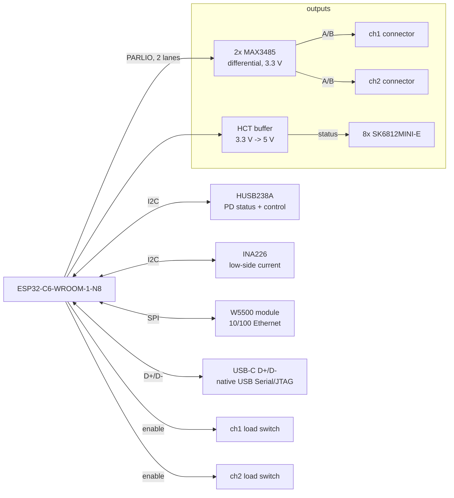
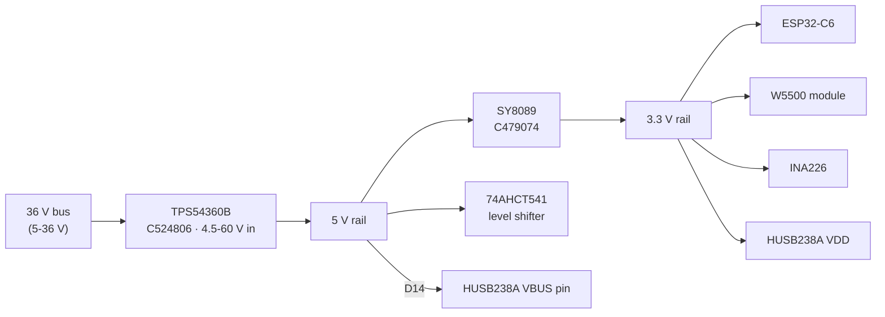
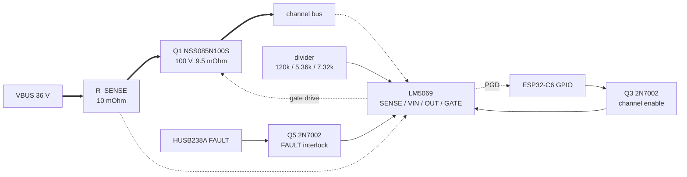

# LED matrix controller — status

Design brief in `BRIEF.md`. Nothing laid out yet. Requirements are settled;
several items under Open questions still block the netlist.

## What the board does

Negotiates USB PD, supplies a chained set of LED matrix modules over a
high-voltage bus, and runs an ESP32-C6 that drives the chain over Ethernet
(W5500) or USB. Brightness is capped in software to whatever PD actually
negotiated, so modules can be added freely up to **12 per channel** — above that
the channel's bulk capacitance defeats the hot-swap controller's start-up timer,
see Why two channels — and within that limit the board divides the
available power between them.

## Environment

**The wall mounts on a soundwall for tekno. Sustained, high-amplitude vibration
is a given, not an edge case.** This gates part selection from here on rather
than being something to remember ad hoc.

Vibration attacks a connection two ways — the connector walking out of its
header, and the wire loosening in its termination. Screw terminals are
specifically bad at the second: screws back out, and industrial practice is
periodic re-torquing, which nobody is going to do on a soundwall.

It also puts anything with **mass on long leads** at risk of solder-joint
fatigue. Affected, and still to be revisited:

- the module's bulk electrolytic — a 220-330 uF radial cap is a lump of mass on
  two leads, and this is the classic vibration failure. Bond the body down, or
  move to SMD polymer or an MLCC bank
- converter board inductors — heavy and tall
- **board mounting**: standoffs at several points, not two corners. An
  unsupported span has a resonance and parts in the middle see amplified
  acceleration
- **cable strain relief**: a tie-down near each connector so cable movement does
  not load the contacts. Cheap, and it matters more than the connector choice

## Settled decisions

| Decision | Choice | Why |
|---|---|---|
| Bus voltage | **36 V** | highest EPR PDO the modules survive; XL1509 is 40 V operating / 45 V absolute |
| Power budget | **180 W** (36 V x 5 A) | EPR fixed PDO; matches the original brief |
| PD controller | **HUSB238A-BB001-QN16R** (C24833806) | I2C variant |
| PD mode | **I2C**, ADDR to GND = 0x42 | GPIO mode caps at 28 V/3.25 A = 91 W |
| PD front end | **p.16 Figure 6 topology** | 36 V exceeds the 33 V VBUS absolute max, so the chip sits behind a BSS138 follower. It carries **no power path**: VBUS feeds the bus directly and the channels switch downstream |
| Channel switching | **LM5069** (C52940995) x2 + **NSS085N100S** | four discrete gate networks failed; ramp, current limit, power limit, fast turn-off and dV/dt immunity are integrated |
| External part ratings | **mixed: 100 V on the switched path, 60 V on the bus** | the channel switch is 100 V (1.72x the TVS clamp) and the LM5069 operates from 8 V to 90 V — its own datasheet gives 8-90 V in the
electrical table, 9-90 V in the recommended-operating block and 9-80 V in the body text, and the 8 V figure is the one the pre-negotiation argument leans on, but the TPS54360B and SS36 are 60 V and set the real limit at 1.03x the clamp. Still no room for a future 48 V/240 W bus, which would need every module respun anyway |
| Channels | **2**, 10 modules each | fps depends only on modules per channel; 10/ch = 90 fps |
| Target scale | **20 modules**, 80% perceived brightness | what 180 W supports before brightness falls off; 10 per channel |
| UART bridge | **none** | ESP32-C6 has native USB Serial/JTAG, and PD runs on CC not D+/D- |
| MCU | ESP32-C6-WROOM-1-N8 (C5366877) | from brief |
| Ethernet | **W5500 module** (W5500 Lite / WIZ850io class), soldered down | the brief said W5500; this design first read that as the bare chip. A finished module carries the PHY front end, the crystal and the magnetics, which retires two blocking open questions and the hardest routing on the board |
| Current sense | **INA226** (C49851), **low-side** | specified 0-36 V operating (40 V absolute), so on a 36 V bus there is no operating margin at all; the shunt goes in the ground return where common mode is ~0 V |
| Module connector | **Wago picoMAX 3.5** (2091 series), 4-pole: **+36V / GND / A / B** | 10 A, push-in spring, integrated locking latch. Spring force does not relax like a screw; the latch stops it walking out. Reichelt 2091-1424 board side, 2091-1104 cable side; not LCSC |
| Data link | **differential pair**, MAX3485 (C6395158) x2 | one per channel. Removes the single-ended distance limit and the level shifting at this end |
| Status-LED level shift | **74AHCT541** (C84548) | the SK6812 chain needs 5 V logic off a 3.3 V GPIO. Octal and only one channel used — oversized, see KB |

### Architecture

Split into power and control. One diagram carrying both always crosses itself,
because the MCU touches everything on the board.

**Power path** — left to right, the two channels parallel:

Thick edges carry the bus current; thin edges are control and sense. The shunt
sits in the **return** path, which is what makes low-side sensing work.

**Control and data:**

Both I2C devices share one bus. The buffer drives only the status chain — the
data outputs are differential and need no level shifting here — so one channel
of eight is used.

### Why not 240 W

48 V is supported by the PD chip (p.16 Figure 6) but **destroys the modules** - the XL1509
is 40 V operating, 45 V absolute. 240 W would need every module respun onto a 60 V-class
buck. The controller's bus-side parts are rated **60 V class**, which does not leave room
for 48 V — that would want 100 V throughout, where only the channel switch is
100 V today. Since 48 V needs every module respun
anyway, the door is closed by the modules, not by this board.

### Why not 28 V

At 14 modules, 140 W and 180 W are nearly indistinguishable (83% vs 85% perceived) —
the 180 W case is thermally capped there, the 140 W case just barely power-limited at 67%. At 20 modules the gap is real: 71% vs 80%. 20 modules is the target,
so the extra front-end complexity is worth it.

## Power budget

180 W, less ~4 W for the controller, leaves ~175 W for modules.
Perceived brightness applies a gamma of 2.2.

| Modules | Power | Perceived | fps (2 ch) | Binds on |
|---|---|---|---|---|
| 10 | 70% | 85% | 176 | thermal |
| 14 | 70% | 85% | 128 | thermal |
| 20 | 61% | 80% | 90 | power |
| 24 | 51% | 73% | 76 | power |

<picture>
  <source media="(prefers-color-scheme: dark)" srcset="figures/brightness-vs-modules-dark.svg">
  
</picture>

Thermal and power cross over near 17 modules. Below that the modules are heat-limited
however much is negotiated; above it, software divides what is available.

## Cabling

**Terminology:** the link is called a **differential pair** throughout. The
drivers are RS-485 transceivers and follow RS-485 line levels, but none of the
RS-485 *connector* conventions apply — the pair runs over two poles of a picoMAX
alongside power and ground.

The converter is a **separate board from the LED matrix**: controller → wire →
per-module converter board on the back of the wall → LED matrix board. The
modules sit adjacent and chain board-to-board like a snake, so **only the
controller-to-first-module cable has any length.** Everything after it is a
short board-to-board link whose drop is negligible.

That single cable carries the whole channel: 2.43 A sustained, 4.0 A on a
full-white flash.

<picture>
  <source media="(prefers-color-scheme: dark)" srcset="figures/cable-drop-vs-hop-length-dark.svg">
  
</picture>

| AWG | 5 m | 10 m | 15 m | max at 5% |
|---|---|---|---|---|
| 18 | 0.51 V | 1.02 V | 1.53 V | **17.6 m** |
| **20** | **0.81 V** | **1.62 V** | 2.43 V | **11.1 m** |
| 22 | 1.29 V | 2.58 V | 3.86 V | 7.0 m |
| 24 | 2.05 V | 4.09 V | 6.14 V | 4.4 m |

**Power is not the constraint.** The converter needs only 6.5 V in (5 V out plus
1.5 V dropout), so from 36 V there is 29.5 V of headroom — the cable would have
to be absurd before the converter stopped regulating. The 5% line above is an
efficiency choice, not a functional limit. At 20 AWG and 10 m the cable burns
3.9 W per channel, which is the real cost.

**Data is no longer the limit.** Going differential removed it. A differential
pair is good for tens of metres at 800 kbps, well past anything power
allows, and it is far more tolerant of a room full of switching converters than
a single-ended line would have been.

So **power is now the only constraint: 20 AWG, up to about 11 m** at 5% drop.
That is a real gain over the ~5 m the single-ended link would have been held to.

Practice for the pair:

- **Twist A and B together.** The connector pinout is +36V / GND / A / B so the
  pair is adjacent and away from the power conductor.
- **120 Ω termination at the far end**, on the first converter board.
- Keep the pair away from the +36 V conductor and its converter switching noise.

Worth noting this is a dividend of the 36 V decision. At a 5 V bus a 1.6 V drop
would be 32% of the supply; at 36 V it is 4.5%.

## Status indication

Eight SK6812MINI-E in a chain on ONE GPIO, level-shifted through a 74AHCT541. Discrete LEDs are not an option: the GPIO budget is tight —
see GPIO assignment.

- **6 as a power bar** - watts, not volts, at 30 W per LED across the 180 W budget.
  Watts is what the limiter reasons about and it reads at a glance. Voltage can be
  encoded in colour if wanted. (Actual PD PDOs are 5/9/12/15/20/28/36/48, but 48 V is
  never requested because it destroys modules, so a voltage bar would need 7.)
- **1 for power limiting**, **1 for thermal limiting**. RGB encodes history on a single
  LED rather than one per time window: bright red = limiting now, orange = within
  5 min, dim yellow = within 10 min, off = clean for 10+ min.

Selected: SK6812MINI-E (C5149201). WS2812C-2020 (C2976072, 2x2 mm) is the smaller
alternative if board area gets tight.

**The thermal indicator is a model, not a measurement.** There is no temperature sensor
on the modules - the controller infers thermal state from commanded brightness
integrated over time against the RthJA figures in the knowledge base. Real thermal data
would need a sensor on the module, i.e. a module revision.

## Software power limiting

The use case is flashing effects, not sustained brightness, which changes what
the limiter has to do.

**Predictive limiting is primary.** Compute a frame's draw before displaying it
and scale the frame if it would breach the negotiated current. Reacting to a
measurement is too late: a sudden all-white flash steps the bus by several amps,
and if that exceeds what PD negotiated the source can cut VBUS entirely, blacking
out the whole installation.

The model needs three terms, and an earlier version of this paragraph had only
the first:

    I_bus  =  (sum(channel values) x 20 mA / 255) x 5 V / (36 V x eta)   [LED term]
           +  N_ICs x 0.6 mA x 5 V / (36 V x eta)                        [quiescent floor]
           +  controller overhead

- **The sum is amperes at the module's 5 V rail**, and the contract is amperes
  at 36 V. The conversion is ÷7.2 and ÷η — a factor of about **9.6** at the
  design's 75% efficiency estimate — which the earlier formula omitted entirely.
- **An all-black frame does not draw zero.** The WS2812D-F8 specifies no
  quiescent current; the sibling SK6812 gives 0.6 mA per IC and the family runs
  0.5-1 mA. At 720 ICs that is 0.36-0.72 A at 5 V, i.e. **2.4-4.8 W off the
  bus** — 1.5-2.7% of a budget this document already computes at 5.2 A against a
  5.0 A contract. The floor is not optional headroom; it is always present.
- η is the same optimistic 75% the whole power budget rests on, characterised at
  28 V rather than 36 V. The limiter inherits that error and should carry a
  margin for it rather than trusting the figure.

**The step is slower than "microseconds".** The modules' own converters and their
3.3 mF of bulk slew a full-white transition over roughly 100 µs, not
instantaneously — which is what makes a predictive limiter viable at all, and is
worth stating because the earlier wording argued the opposite way.

**The INA226 is the slow loop**: calibrating the model, noticing the module
count changed, and acting as a safety net. Not the first line of defence.

**Inrush is handled in hardware, not software** — each channel switch ramps into
its own module bank under power limit rather than switching into it. See
Channel switching and inrush.

## Cold-start sequence

**The rails are fed from VBUS directly.** There is no master pass FET — see
Channel switching and inrush. Wiring the rails behind any switch creates a circular deadlock that
would stop the board ever powering up:

> EN_N is pulled up internally and the HUSB238A is enabled by pulling it to GND
> (datasheet p.5). If EN_N sits on an MCU GPIO, that GPIO is high-Z until the MCU
> is powered. So the chip stays disabled, GATE never closes, the bus never comes
> up, the rails never come up, and the MCU never boots to pull EN_N low.

Feeding the rails pre-FET breaks it, and turns EN_N's internal pull-up from a
trap into the correct safe default — nothing negotiates until firmware is alive:

1. Plug in. VBUS is at vSafe5V (5 V), both channel switches are off, no LED power.
2. The TPS54360B runs straight off that 5 V — this is exactly why ~100% duty
   pass-through was a selection criterion — giving ~4.85 V, and the SY8089 makes
   3.3 V from it.
3. The MCU boots. EN_N is still high (internal pull-up), so the PD chip is idle.
4. Firmware pulls EN_N low and the HUSB238A negotiates. **It is powered from
   VDD**, which step 2 already brought up — an earlier version of this step said
   the chip "self-powers from VBUS, so it needs nothing from us", and that is
   exactly what does not work here: behind the Figure 6 follower the VBUS pin
   sees only 3.05-3.75 V at vSafe5V, under the 4.5 V the chip needs when VDD is
   absent. D14 holds the pin at ~4.13 V and VDD does the supplying.
5. VBUS rises to 36 V. The rails ride through it; the TPS54360B is a 60 V part
   and simply leaves pass-through.
6. Past ~28 V each LM5069 releases its own UVLO, and firmware enables the
   channels by pulling the enable GPIOs low.
7. **Nothing happens for several seconds.** Each controller holds its gate down
   for its insertion time — 6.1 s typical, 2.9-13.6 s over the spread — counted
   from when VBUS crossed ~5.5-7.5 V, and no firmware action shortens it.
8. Each channel then ramps its own 3.3 mF under a 39.8 W power limit, taking
   **61 ms** typical and 96 ms at the corners. The bus is already static at 36 V,
   so they ramp into a steady source.

There is no master pass FET — see Channel switching and inrush. A PD
fault sheds the LED channels while the controller stays alive to report it, which
is the behaviour we want.

## Rail architecture

The board must run from a 5 V bus as well as 36 V, with software holding back
what it cannot power. That constrains the rails more than the 36 V case does.

**This is a statement about the rails, not about the LED output.** The LM5069
UVLO releases the channel switches at 28.3 V typ and **32.2 V worst case**,
deliberately set just under the 34.2 V minimum of a 36 V contract. So on a 20 V
or even a 28 V PDO the controller boots, talks and reports — and the LEDs stay
dark. An earlier version of this sentence said "all eight PD levels usable",
which is true of the rails and false of the load.

**TPS54360B** (4.5-60 V in, 3.5 A, 60k stock). Chosen specifically because its automatic
BOOT recharge circuit allows "duty cycles approaching 100%", so "the maximum output
voltage is near the minimum input supply voltage" (datasheet p.10). An ordinary buck
cannot make 5 V from a 5 V bus; this one passes through.

Output across the input range at 0.7 A, from the datasheet's p.12 Eq. 1, inverted:

    V_OUT = 0.99·V_IN + 0.99·V_F − 0.99·R_DS(on)·I_OUT − V_F − R_dc·I_OUT

with R_DS(on) = 0.12 Ω (p.5) and R_dc = **0.163 Ω** — the inductor DCR implied by
this document's own thermal row, 0.08 W at 0.7 A.

| bus | 5 V rail | 74AHCT541 needs 4.5-5.5 V |
|---|---|---|
| 4.75 V (USB-C low tolerance) | **4.50 V** | **at the floor, zero margin** |
| 5.00 V | 4.75 V | ok |
| >= 5.25 V | 5.00 V | ok |

**An earlier version of this table claimed 4.60 V at a 4.75 V bus**, which assumed
a flat 0.15 V drop rather than working the equation with a real DCR. The 0.10 V
difference matters twice: the 74AHCT541 lands exactly on its 4.5 V minimum, and
D14 then holds the HUSB238A VBUS pin at **4.13 V** rather than 4.23 V.

**Neither is fatal, and here is why.** The 74AHCT541 only drives the status LED
chain; a marginal rail during the few seconds of the 5 V phase means the
indicators may misbehave before negotiation, not that the board fails to start.
And 4.13 V still clears the VBUS pin's 3.15 V minimum by 0.98 V. What it does
erode is the margin against two 4.0 V thresholds — see Known electrical limits.

**The sag at low bus voltage matters locally, not across the cable.** An earlier
version argued it was self-correcting because the modules' own XL1509 is also in
pass-through at 5 V, so module VDD falls too and WS2812 thresholds track. That
tracking argument is void here — the controller's 5 V rail and the modules' 5 V
rail no longer share a signal path, only a differential pair at 3.3 V logic.

What the sag actually threatens is the **SK6812 status chain on this board**:
its VIH is 0.65 x VDD, so at a 4.50 V rail the threshold is 2.93 V and the
74AHCT541 drives it comfortably. The binding constraint is the buffer's own
4.5 V supply minimum, which the rail reaches exactly — see the dropout table.

**SY8089** (C479074, SOT-23-5, 100k stock) for 3.3 V rather than an LDO. At 4.85 V in,
3.3 V out, and the ESP32-C6's ~500 mA transmit peaks, an LDO would burn ~0.8 W; a
synchronous buck burns under 0.1 W and avoids a thermal problem in a small package.

### Why two conversion stages

The board needs **both** rails: 3.3 V for the MCU, Ethernet module, INA226 and the
HUSB238A's VDD, and 5 V for the 74AHCT541, the SK6812 status chain and **D14**.

**The reason is the status chain, not the modules.** An earlier version of this
paragraph argued from the WS2812's 0.7 x VDD = 3.5 V threshold — but the
controller does not drive any WS2812. It drives two MAX3485s at 3.3 V, and the
3.3 -> 5 V shift lives on the converter board, which the module record states
outright. The governing number is the **SK6812MINI-E's 0.65 x 5.0 = 3.25 V** on
the controller's own rail, which a 3.3 V GPIO clears by only 50 mV — margin, plus
the rail's own sag, is what justifies the buffer.

Cascading costs almost nothing. The 3.3 V rail delivers ~2.3 W, so:

| | efficiency | lost |
|---|---|---|
| cascade, 36 -> 5 -> 3.3 V | ~78% | 0.649 W |
| hypothetical single 36 -> 3.3 V | ~80% | 0.575 W |

**A 74 mW penalty**, against saving a second wide-input buck. (Earlier versions
of this passage gave 60 mW, 66 mW and 74 mW from the same two efficiencies; 2.3 W
at 78% and 80% is 0.649 W against 0.575 W.) The alternatives
are all worse:

- **Two parallel wide-input bucks** (bus to 5 V, bus to 3.3 V) needs two
  TPS54360-class parts and two inductors, for that same 74 mW.
- **One bus-to-3.3 V buck plus a charge pump to 5 V** works — the level shifter
  draws only tens of mA — but adds a part and puts switching noise next to the
  data lines.
- **Eliminating the 5 V rail is not available.** An earlier version of this
  bullet called it "the only real simplification" and framed it as a *module*
  change — running the modules at 4.5 V so a 3.3 V GPIO could drive their
  WS2812s directly. That argument belongs to a design where the controller
  drives the modules' LEDs, which this one stopped doing when the link went
  differential. Three things on **this** board need 5 V and no module revision
  touches any of them: the 74AHCT541, the SK6812 status chain it buffers, and
  **D14**, which must sit above the HUSB238A's VBUS pin to hold it at 4.13 V.

So the two stages are forced by the 5 V logic requirement, and the cascade is
the cheapest way to meet it.

## Protection architecture

**The eFuse question is resolved by the LM5069.** The TPS26630 was dropped for
two reasons: its integrated FET is 40 V (1.11x at 36 V) and it was redundant to
the master pass FET. The second reason died with the pass FET, leaving the bus
with no active current limiting — which is the gap the hot-swap controllers now
fill, **per channel** rather than once for the bus.

What protects the load, in order of speed:

1. **LM5069 current limit**, 5.5 A typ per channel (4.8-6.5 A). Autonomous, but
   see Known electrical limits: against a 5.0 A *total* contract the PD source
   acts first on a hard short, so "one chain sheds, the other keeps running" is
   **not reliably obtainable**
2. **LM5069 OVLO**, a hardware overvoltage trip at 45.3 V typ, needing no firmware
3. the PD source limiting at the negotiated level
4. HUSB238A FAULT into the interlock transistor, pulling both UVLO pins low on
   OTP or an adapter-capability fault (OVP/UVP do not survive the clamp topology
   above 28 V)
5. software via the INA226, as a slow safety net

**What is still unprotected is the bus node upstream of the two controllers.**
The rails and the PD front end sit there with only the TVS
and the PD source's own limiting between them and a fault.

**Current sensing is low-side.** The shunt sits in the ground return, so
common-mode is near 0 V and the INA226's rating — 0-36 V operating, 40 V absolute,
so no operating margin on a 36 V bus — stops mattering. Forced by both 85 V parts (INA228, INA238) being at zero stock;
it turned out to be the better answer. Costs the ability to detect an output
short to ground, and lifts the load ground by 50 mV at 5 A through 10 mOhm.

**The Figure 6 "Voltage Regulator" is a BSS138 source follower.** Hynetek
publishes it with values at [hynetek.com/2730.html](https://www.hynetek.com/2730.html)
— it is not in the datasheet. Gate pulled up through 10 kΩ and clamped by a Zener, source feeding the VBUS pin; a 0 Ω link bypasses it for
builds at 28 V or below.

**We use 20 V (BZT52C20), not Hynetek's 28 V.** It puts the VBUS pin at roughly
18.5 V, comfortably inside its 3.15-29.4 V window, where a 28-30 V part would sit
at ~28.5 V against a 29.4 V recommended maximum. The functions we rely on —
VBUS-present detection and supply backup — work anywhere in that range, and
OVP/UVP are lost to the clamp topology regardless. A deliberate deviation from
the vendor reference, worth validating.

This replaces the earlier assumption of a resistor-plus-Zener shunt, and the
difference matters: a follower holds the pin near (Vgate − Vth) with low output
impedance, where a series resistor would drop voltage with load current.

#### The follower is too lossy at 5 V, and the fix is two parts

The follower costs one Vgs, and it costs it exactly where there is no room. At
the bottom of vSafe5V — a **4.75 V** bus — it delivers only **3.05-3.75 V**,
against a VBUS-pin minimum of 4.5 V when VDD is unpowered. The chip would not
reliably come up.

**First: VDD (pin 5) is an input supply, so tie it to 3V3.** The datasheet is
explicit — *"It is recommended to tie this pin to the single cell battery or a
3.3 V power rail. When the power is not available from this pin, the VBUS pin may
power the internal circuitry"* (p.4). That one connection changes two numbers at
once:

| With VDD = 3.3 V | With VDD unpowered |
|---|---|
| VBUS pin range **3.15 – 29.4 V** | 4.5 – 29.4 V |
| VBUS pin current **330 µA typ / 800 µA max** | 4.5 mA |

The requirement drops by 1.35 V and the current by **5.6x**, which also shrinks
the follower's own Vgs. Sequencing makes this safe: nothing has to happen until
firmware pulls EN_N low, and by then the 5 V and 3.3 V rails are both up, because
they are fed from the bus directly.

**Second: a Schottky from the 5 V rail to the VBUS pin.** At a 4.75 V bus the
rail sits at **4.50 V** (the dropout table), and an RB751V-40 drops **0.37 V max
at 1 mA** (p.2), so the pin is held at **4.13 V** — and the follower, seeing its
source above (Vgate − Vth), simply stops conducting. Once the bus rises the
follower takes the pin to ~18.5 V and the Schottky is reverse-biased by 13.5 V,
well inside its 40 V rating. It does nothing at 36 V and everything at 5 V.

| | Follower alone | With D14 |
|---|---|---|
| Pin at a 4.75 V bus | 3.05 – 3.75 V | **4.13 V** |
| Against the 3.15 V minimum | **fails at the low corner** | 1.08 V margin |

**Two residuals at the bottom of vSafe5V, and they are tighter than they look.**
Both are 4.0 V thresholds against the 4.13 V the Schottky delivers:

| Threshold | Value | Margin at 4.13 V |
|---|---|---|
| `VBUS_OK` rising, vVBPRS_R | **3.67 / 4.0 / 4.4 V** min/typ/max (p.6) | +0.13 V on typ, **−0.27 V on max** |
| VBUS UV falling, vVBUV_F1 | **80% of the requested voltage** = 4.0 V on a 5 V RDO (p.6) | +0.13 V |

The first decides whether VBUS-present is seen; the second is the under-voltage
detector that, per the same datasheet's UVP section, *"moves out the Attached.SNK
state"*. An earlier version of this paragraph labelled 3.67 V as the typical —
it is the **minimum** — and argued the risk away on the grounds that "negotiation
runs on CC". That argument is weaker than it was made to sound: USB Type-C gates
the `AttachWait.SNK → Attached.SNK` transition on VBUS detection, which is what
vVBPRS_R implements, and the UV detector was not mentioned at all.

**Honest position: this works on a typical part and is not guaranteed at the
corner.** Both margins are 0.13 V, and both would widen by 0.35 V if the 5 V rail
were not at its own dropout floor. Bench-check it on the first board; if it
fails, the lever is the rail, not the diode — a lower-DCR inductor buys back
more than any Schottky swap can.

**Hynetek's >28 V gate drive is not built here, and this note survives only to
say why.** Figures 4, 5 and 6 all draw the *same* Zener gate network — the 28 V
one, not a 48 V feature — and above 28 V Hynetek replaces it with GATE pulled to
3V3 through 5.1 kΩ and level-shifted by a PMOS-then-NMOS pair into a high-side
P-FET.

That mattered while the HUSB238A's GATE pin drove the power path. **It no longer
does:** GATE is unconnected, the channels switch through their own controllers,
and none of this arrangement exists in the BOM. It also retires the open question
about a small-signal PMOS — the design needs no such part.

### No overvoltage protection above 28 V

Hynetek states it plainly: *"因为HUSB238A没有36V/48V OV保护"* — there is no
36 V/48 V OV protection. The clamp preserves the supply function and
VBUS-present detection, but **destroys OVP, UVP and the discharge path**. It is
also why 48 V is I²C-only while GPIO mode stops at 28 V.

Accepted, because it is inherent to the topology rather than a mistake — but it
changes what protects the bus. The **SMAJ36CA TVS is now the only fast
overvoltage protection**, with the 470 k/27 k ADC divider as a slow software
check. Those two were added for surge and brownout; they are now carrying OVP as
well.

Worth knowing this approach is the **outlier**. The common industry solution is
an active 0.42× ratiometric level shifter in a companion IC (TI TPD4S480,
Kinetic KTU1133, Fortune FA2218), which *preserves* measurement where Hynetek's
clamp does not. If a later revision wants real OVP back, that is the direction.

## Channel switching and inrush

**Four attempts at a discrete gate network, four failures.** The topology is
abandoned. Each channel now switches through an **LM5069 hot-swap controller**
(C52940995) driving an N-channel MOSFET, which does ramp, current limit, power
limit, fast turn-off and dV/dt immunity in silicon.

### Why the discrete attempts kept failing

| Attempt | What it got right | What it broke |
|---|---|---|
| R_pu 100 k / R_pd 1 M | — | Vgs 3.27 V, FET never enhances |
| R_pu 10 M / R_pd 1 M / C_gd 1 uF | the divider | ramp on the wrong node; 180 s turn-off; dV/dt self-turn-on |
| Drop the pass FET, C_gd 3.3 uF | removed one FET | moved the same faults onto switches with 27x more load capacitance |
| C_gs + diode across R_pu | dV/dt immunity | the diode clamps Vgs so the FET never enhances; C_gs cannot set a ramp |

The fourth was written here as **settled**, which makes it the worst of the four.
Two independent errors, both found by review:

- **The bypass diode cannot work.** R_pu sits gate-to-source and carries current
  source-to-gate in *both* phases — when turning off (wanted) and when the
  pull-down drags the gate low (not wanted). A diode across it cannot tell those
  apart. Anode at the source, it forward-biases as soon as Vgs passes -0.6 V and
  clamps there, so the FET never reaches its -1.0 to -2.5 V threshold; anode at
  the gate, it is reverse-biased during turn-off and does nothing. The
  diode-across-a-resistor trick needs a *series* gate resistor to bypass, and
  this topology has none.
- **A gate-to-source capacitor cannot set a ramp.** The FET is in common source:
  the drain transition happens entirely inside the Miller plateau, where Vgs is
  constant by definition, so C_gs carries **zero** current while the drain slews.
  It adds turn-on *delay*, not dV/dt control. The drain rate would instead be set
  by the FET's own Crss against the net gate current — 326 uA into 98 pF is
  3.3 V/us, the full 36 V in about 11 us — with the current rise through a 35 S
  transconductance entirely uncontrolled.

The thread running through all four: **a discrete network has to deliver ramp,
current limit, turn-off and dV/dt immunity from one capacitor and two resistors,
and those requirements pull against each other.** No value set reconciles them.
That is what the integrated part exists for.

### The replacement

One LM5069 per channel, high-side, driving an N-channel FET. The controller's
charge pump holds the gate ~12 V above the source, so **the level shifters, the
Vgs clamp Zeners and the whole high-side gate problem disappear** — the parts
that caused four failures are not in the design any more.

Switching to an N-channel part also settles an argument the 60 V P-FET never
won: at 100 V the FET sits at **1.72x the SMAJ36CA's 58.1 V clamp** instead of
the 1.03x the document twice called uncomfortable — though that figure survives
on the bus parts, see ESD and surge protection. It is cheaper too — $0.39
against $0.40 — because N-channel silicon of the same on-resistance is smaller.

### Values, derived

Per channel, from the Tokmas LM5069 datasheet (equations cited by number). The
bus maximum is **V_INMAX = 37.8 V** (36 V at the PDO's +5%) and the load is
**C_OUT = 3.3 mF** (10 modules x 330 uF).

| Element | Value | Derivation |
|---|---|---|
| R_SENSE | **10 mOhm**, 1%, >=0.5 W | current limit is 55 mV / R_S (p.14) = **5.5 A typ**; over the 48-65 mV spread (p.5), 4.8-6.5 A. Sized against the **4.0 A white-flash peak**, not the 2.43 A sustained figure — 1.20x at the worst-case low end |
| R_PWR | **64.9 kOhm** 1% | Eq. 14: R_PWR = 180000 x R_S x (P_LIM - 1.0 mV x V_INMAX/R_S), so 64.9 kOhm sets **P_LIM = 39.8 W** |
| C_TIMER | **6.8 uF** X7R 25 V | sets insertion delay *and* fault timeout; see below — both constraints pull on this one part |
| UVLO/OVLO string | **120 kOhm / 5.36 kOhm / 7.32 kOhm** 1% | VIN-UVLO-OVLO-GND. Thresholds 2.25/2.5/2.75 V, hysteresis current 12/18/24 uA (p.5) |
| C_VIN | **100 nF** >=100 V | p.3: "a small ceramic bypass capacitor close to this pin is recommended" |

**Start time.** Eq. 10, the power-limited case, at typicals and then at the
corners that matter (P_LIM carries PWR_ILM 19/25/31 mV = +/-24%, and C_OUT is
taken +20%):

    typ:   t_start = 1.65 mF x (1428.8/39.8 + 39.8/30.25)  =  61 ms
    worst: t_start = 1.98 mF x (1428.8/30.3 + 30.3/23.0)   =  96 ms

**The TIMER pin has two jobs, and only one of them was derived at first.** p.3
pin 6 sets "the insertion time delay **and** the fault timeout period", and p.13
is explicit that "during insertion time the GATE pin is held low by a 2 mA
pulldown current ... **regardless of the voltage at VIN or UVLO**". The two are
locked together at 17.5:1 by the datasheet's own currents (4 uA insertion against
70 uA fault detection), so this cannot be tuned away:

| | Formula | With 6.8 uF |
|---|---|---|
| Fault timeout | C x V_TMRH / 70 uA (Eq. 11) | **350 ms** typ, **183 ms** worst case after 20% derating |
| Required | 1.5 x t_start | **144 ms** — so 1.27x margin at the corner |
| **Insertion delay** | C x V_TMRH / 4 uA | **6.1 s** typ, **2.9-13.6 s** over the spread |

**So the board waits several seconds at power-on before the LEDs can come on**,
and nothing firmware does shortens it. That is a behaviour to know about, not a
fault — it is a one-time delay after the PD transition — but it has to be
documented or the first person to power the board will debug a dead output.
Shrinking C_TIMER is not available: 4.7 uF drops the worst-case fault timeout to
127 ms, under the 144 ms the ramp needs, and the start-up would time out.

**P_LIM is set high deliberately, at 39.8 W.** It is what buys the short ramp,
and the short ramp is what keeps C_TIMER small enough for a tolerable insertion
delay. The SOA budget pays for it comfortably — see below.

**SOA.** The NSS085N100S publishes a real SOA family (Fig. 12 p.4), which the
P-FET it replaced did not. **This figure has to be read by pixel, not by eye** —
two earlier readings here were wrong, once by 4.5x and once by 1.4x. Extracting
the DC trace and calibrating against its own low-V_DS segment, which must fall on
the R_DS(on) line and does (0.1 V, 13.3 A = 7.5 mΩ, the datasheet typical):

| V_DS | 1 V | 10 V | 20 V | **36 V** | 50 V | 70 V |
|---|---|---|---|---|---|---|
| I_D | 82 A | 7.6 A | 3.7 A | **2.0 A** | 1.4 A | 1.0 A |
| P | 82 W | 76 W | 73 W | **72 W** | 71 W | 70 W |

So the constant-power asymptote is **~70-75 W**, the 1 A point sits at **70 V**
— the vertical segment at 100 V is the BV_DSS wall, not a power line, and
mistaking it for one is what produced the earlier 100 W figure. At V_DS = 36 V
the DC SOA allows **~72 W**, so P_LIM = 39.8 W clears it by **1.8x**, falling to
**1.46x** at the PWR_ILM max corner (31 mV → 49.4 W). The 10 ms curve gives
171 W at 36 V. The design passes; it does not pass comfortably.

**The junction rise IS verifiable — an earlier version of this section said it
was not.** The SOA chart is annotated "RATED TC=25 C Single", a case-temperature
rating, and on this board R_thJA is 50 C/W, so 39.8 W sustained would be fatal.
But **Fig. 13 p.6** publishes normalised transient thermal impedance against
pulse width, single-pulse plus six duty cycles, with its own formula
`T_J,PK = T_C + P_DM x Z_TH-JC x R_TH-JC`. At the 96 ms worst-case ramp the
single-pulse curve reads **Z ≈ 0.45–0.50** — it is a log-log plot and the band is
the honest width of the reading — and the figure annotates R_TH-JC = 4.5 C/W:

| Z | rise | T_J at 25 °C ambient | T_J at 45 °C ambient |
|---|---|---|---|
| 0.45 | 81 °C | 106 °C | 126 °C |
| **0.50** | **90 °C** | **115 °C** | **135 °C** |

Case temperature is essentially ambient here, since steady-state dissipation is
0.079 W. **The binding case is the top of the band at 45 °C ambient: 135 °C
against a 150 °C limit, 15 °C of margin** — thin, and in the same enclosure
condition the thermal budget already calls over-budget. At 25 °C ambient it is
comfortable either way.

Two things widen it in practice. The datasheet contradicts itself — the p.1
thermal table gives R_θJC = **0.84 C/W** against Fig. 13's 4.5 C/W, a 5.4x
difference — and the figures above use the pessimistic one. And 39.8 W is the
power limit, reached only at the start of the ramp where V_DS is largest; the
average over the ramp is lower. Neither is quantified here, so **15 °C is the
number to design against**, not the one to be reassured by.

**The two channels must be ramped one at a time.** Under power limit the current
*rises* as the output charges — it is P_LIM/V_DS — so it starts at 1.05 A and
reaches the 5.5 A current limit once V_out passes **30.6 V**, after which the
channel charges at a flat 5.5 A for the last **4.3 ms**. The average over the
ramp is charge over time:

    I_avg = C x V / t_start = 3.3 mF x 37.8 V / 61.4 ms = 2.03 A

An earlier version of this paragraph said ~1.0 A, computed from ½CV² = 2.36 J.
That is the energy stored **in the capacitor**; under power limit the FET burns
an equal amount, so the source delivers twice it, and the current is exactly 2x
what that figure implied. Two channels released together would put **11 A**
against a 5.0 A contract.

Staggering is a firmware requirement, not a hardware property: both insertion
timers run from the moment VBUS crossed ~5.5-7.5 V regardless of UVLO, so they
expire together, and what separates the two ramps is firmware releasing one
enable GPIO at a time. Even staggered, a ramping channel averages 2.03 A beside a
neighbour at the sustained 2.43 A — **~4.5 A against a 5.0 A contract** — and its
4.3 ms plateau pushes the instantaneous total to ~7.9 A. So **the channels have
to be ramped before pixel data starts**, while the modules draw only quiescent
current. That ordering is what the cold-start sequence already does; it is
recorded here because it is now a constraint rather than an accident.

**Staggering does not bring the ramp inside the contract on its own.** One
channel alone holds a flat **5.5 A typ (4.8-6.5 A)** for those 4.3 ms, which is
over 5.0 A before any neighbour current is counted. See Known electrical limits.

**Thresholds**, with the 1% resistor tolerance carried through rather than the
comparator spread alone:

| Threshold | Typ | Worst case, incl. 1% resistors | Against |
|---|---|---|---|
| UVLO rising (enable) | 28.3 V | **32.2 V** | must stay below the **34.2 V** minimum bus (-5% PDO) — 2.0 V of margin |
| UVLO falling | 26.2 V | — | channels shed before the rails do |
| OVLO rising (trip) | 45.3 V | **40.0 V** low / 50.8 V high | must stay above the **37.8 V** maximum bus — 2.2 V of margin at the low end |
| OVLO falling | 43.1 V | — | above 37.8 V, so a recovered bus re-enables rather than latching out |

An earlier version of this table quoted the comparator spread only and claimed
1.1 V of OVLO margin; with 1% resistors at the adverse combination that was
really 0.4 V. The divider above was re-centred to restore it.

This hands back something the clamp topology took away: **the HUSB238A has no
OVP above 28 V, and the LM5069's OVLO is a hardware overvoltage trip on the
channels.** It is not a full replacement — it protects the load, not the
controller's own front end — but it is faster than the 2.55 ms ADC path and
needs no firmware.

Below 8 V the LM5069 is under its own VIN minimum and holds the gate down, so
**the channels are off during the entire 5 V pre-negotiation phase with no
firmware involvement.** That is the cold-start behaviour the old design had to
sequence by hand.

**This part auto-restarts; it does not latch off.** C52940995 is the **-2**
suffix, and its datasheet p.13 describes the automatic restart sequence — the
Timer pin cycling between 3.6 V and 0.8 V seven times after a fault timeout, at a
0.5% duty cycle. The full period is seven *complete* cycles plus the eighth
ramp, not seven discharges — p.13 ends the sequence when the Timer pin reaches
0.3 V on the eighth high-to-low ramp:

    7 x (2.8 V x C / 2.5 uA  +  2.8 V x C / 70 uA)  +  3.3 V x C / 2.5 uA
    = 7 x (7.62 s + 0.27 s) + 8.98 s = 64 s

With C_TIMER = 6.8 uF that is **~64 s** between retries on a persistent channel
fault, which the datasheet's own 0.5% duty figure corroborates (350 ms / 64.5 s =
0.54%; the ~53 s an earlier version gave here would have been 0.66%). Firmware can force an earlier retry by toggling the
enable GPIO, since that resets the controller through UVLO. TI's LM5069MM-1
(C486026) is the latch-off variant, not this one — an earlier note here had the
two suffixes exactly backwards.

### Enable, and why the logic is inverted

UVLO doubles as ENABLE: pulling it below 2.5 V shuts the channel off. So a
2N7002 with its drain on UVLO disables the channel when its gate goes **high**.
The gate carries a **100 kOhm pull-up to 3V3** so the channel is off whenever the
MCU is in reset or absent, and firmware drives the GPIO **low to enable**.

This also retires a defect. The FAULT interlock used to put its 2N7002 drain on
gates driven push-pull by the MCU, which was contention; its drain now sits on
UVLO in parallel with the enable transistor, where two open drains onto a passive
divider node cannot fight. The series gate resistors that were needed to keep
that contention survivable are no longer required for this purpose.

### What is still open here

- **PGD wiring.** Both LM5069 PGD pins are open-drain; wiring them together into
  one GPIO with a pull-up reports "both channels good" and costs the single spare
  pin. Which channel failed is then inferred from which one firmware enabled.
- **R_SENSE package and layout.** A 10 mOhm sense resistor wants Kelvin
  connection; at 0.059 W steady state the part is thermally trivial but the sense traces are
  not a routing afterthought.
- **The Tokmas part is a second source.** C52940995 is a Tokmas LM5069MMX-2, not
  TI silicon, at **105 units** live stock — jlcsearch claimed 2952, which is
  exactly the staleness the workflow warns about. TI's own LM5069MM-1/NOPB
  (C486026, 89 units, $5.90) is the fallback and is the **latch-off** variant
  where this one auto-restarts, so swapping to it means firmware must clear
  every fault through the enable GPIO instead of waiting out a retry.
- **The insertion delay is inherent, not tuned.** Several seconds at power-on
  with no way to shorten it; see the derivation. If that turns out to matter, the
  lever is a smaller C_OUT per channel, not a smaller C_TIMER.

## Why two channels

Checked rather than assumed. At the 20-module target:

| channels | modules/ch | fps | A/ch balanced | % of 10 A | A/ch worst case | % |
|---|---|---|---|---|---|---|
| **2** | **10** | **90** | **2.43 A** | **24%** | 2.80 A | 28% |
| 3 | 6.7 | 134 | 1.62 A | 16% | 1.87 A | 19% |
| 4 | 5 | 176 | 1.22 A | 12% | 1.40 A | 14% |

"Worst case" is one channel sustained at the 70% thermal cap while the other is
dark — PD limits the *total* to 5 A, not how it splits. Percentages are against
the picoMAX's 10 A rating; at two channels the connector has 3.6x margin and is
nowhere near binding.

<picture>
  <source media="(prefers-color-scheme: dark)" srcset="figures/current-vs-connector-rating-dark.svg">
  
</picture>

Two is right because 180 W caps the wall near 20 modules anyway, so channels and
power budget run out together. 10 per channel is also the even physical grouping
wanted; three channels would mean 6.7 per chain for no benefit that is felt.

Two boundaries worth knowing rather than discovering:

- **An unbalanced load is no longer a connector problem.** PD caps the total at
  5 A but says nothing about the split, so one channel at the thermal cap while
  the other is dark draws 2.80 A — 28% of the picoMAX's 10 A. This was a real
  constraint at the old 3 A connector and is not one now.
- **Growth is capped at ~12 modules per channel by the LM5069 fault timer, not
  by frame rate.** t_start scales linearly with the channel's bulk capacitance
  while the fault timeout does not, so the ratio the design needs — t_FLT at
  least 1.5x t_start — runs out long before the fps floor does:

  | modules/ch | C_OUT | t_start worst | t_FLT / t_start | |
  |---|---|---|---|---|
  | 10 (target) | 3.30 mF | 96 ms | 1.91 | ok |
  | 12 | 3.96 mF | 115 ms | 1.59 | last value that clears 1.5x |
  | 15 | 4.95 mF | 144 ms | 1.27 | under the rule |
  | 20 | 6.60 mF | 192 ms | **0.95** | **times out mid-ramp — the channel never comes up, retrying every 64 s** |

  The ceiling is **12.7 modules per channel**, worked at the corners that bind
  (C_OUT +20%, P_LIM at the 19 mV PWR_ILM minimum, I_LIM at 48 mV, t_FLT at
  183 ms). An earlier version of this bullet described growth past ~24 modules as
  a frame-rate degradation — 76, 61 and 46 fps — which is true of the numbers and
  misses the failure: at 40 modules the LEDs do not come on at all.

- **Frame rate past ~24 modules degrades too**, if the capacitance problem were
  solved: 24 -> 76 fps, 30 -> 61 fps (at the floor), 40 -> 46 fps (below it).
  Beyond ~24 is a board revision with 3-4
  channels, not a software change.

<picture>
  <source media="(prefers-color-scheme: dark)" srcset="figures/fps-vs-modules-per-channel-dark.svg">
  
</picture>

## Bill of materials

Active parts. Passives are listed below the table.

| Ref | Part | LCSC | Qty | Role | $ |
|---|---|---|---|---|---|
| U1 | HUSB238A-BB001-QN16R | C24833806 | 1 | USB PD sink, I2C mode | 0.66 |
| U2 | ESP32-C6-WROOM-1-N8 | C5366877 | 1 | MCU, native USB | 4.25 |
| U3 | W5500 module, WIZ850io-class | — | 1 | 10/100 Ethernet, **soldered down**, see Ethernet module | — |
| U4 | TPS54360B | C524806 | 1 | bus to 5 V, ~100% duty | 0.760 |
| U5 | SY8089A1AAC | C479074 | 1 | 5 V to 3.3 V | 0.087 |
| U6 | INA226 | C49851 | 1 | low-side current sense | 0.76 |
| U7,U8 | MAX3485 | C6395158 | 2 | differential line driver, one per channel | 0.35 |
| U9 | 74AHCT541 | C84548 | 1 | status-chain level shift (oversized, see KB) | 0.224 |
| U10,U11 | LM5069MMX-2 | C52940995 | 2 | hot-swap controller, one per channel | 1.23 |
| Q1,Q2 | NSS085N100S | C7427705 | 2 | channel switch, 100 V / 9.5 mΩ max, 2.43 A each | 0.39 |
| Q3,Q4 | 2N7002 | C7420321 | 2 | pulls its channel's UVLO low to disable | 0.018 |
| Q5,Q6 | 2N7002 | C7420321 | 2 | FAULT interlock, **one per channel** | 0.018 |
| Q7 | BSS138 | C7420339 | 1 | source follower feeding the VBUS pin | 0.027 |
| D1 | BZT52C20 | C19077415 | 1 | clamps the BSS138 follower gate | 0.017 |
| D2 | SS36 | C2903825 | 1 | TPS54360B catch diode (required, p.26) | 0.063 |
| D3-D6 | H5VL10B | C7420372 | 4 | ESD on USB-C D+/D- and CC1/CC2 | 0.0065 |
| D7-D9 | SMAJ36CA | C19077551 | 3 | 36 V TVS, clamps at 58.1 V — the 100 V FET is 1.72x that, but the 60 V bus parts are only **1.03x** | 0.037 |
| D10-D13 | SMAJ7.0CA | C19077529 | 4 | 7 V TVS on the A/B pair, 2 per output — clamps at **12 V**, under the MAX3485's ±15 V | 0.043 |
| D14 | RB751V-40 | C7502691 | 1 | 5V rail → HUSB238A VBUS pin at vSafe5V | 0.018 |
| L1 | ANR5040T100M | C7427121 | 1 | 10 uH, TPS54360B output, 2.9 A Isat | 0.058 |
| L2 | ANR6028T2R2M | C7427146 | 1 | 2.2 uH, SY8089 output | 0.068 |
| R1 | FRM252WFR010TN | C7419995 | 1 | 10 mΩ 1% shunt, low-side | 0.058 |
| R2,R3 | FRM252WFR010TN | C7419995 | 2 | LM5069 current-sense — **same part as R1**, 10 mΩ 1% 2512 at 2 W, which covers the 0.42 W worst-case trip with 4.8x to spare | 0.058 |
| R4 | 10 kΩ 0.25 W 1206 | — | 1 | bus bleeder, jellybean, final selection at layout | — |
| J1 | CX90B-16P (Hirose) | C3198004 | 1 | USB-C, **5 A / 48 V AC/DC**, USB 2.0 | 0.99 |
| J2,J3 | Wago picoMAX 3.5 4-pole, angled | 2091-1424 | 2 | module output, see sourcing table | 0.77 |
| LED1-8 | SK6812MINI-E | C5149201 | 8 | status chain | 0.081 |

**Not from LCSC/JLCPCB.** Three line items are hand-fitted, so the board is not
fully JLCPCB-assemblable. Order numbers so the build is reproducible:

| Ref | Part | Source | Order no. | Price |
|---|---|---|---|---|
| U3 | JOY-IT SBC-USR-ES1, W5500 module | Reichelt | **DEBO SPI RJ45** (art. 305766) | €12.30 |
| J2,J3 | Wago picoMAX 3.5, pin header **angled**, 4-pole — board side | Reichelt | **WAGO 2091-1424** (art. 136753) | €0.77 |
| — | Wago picoMAX 3.5, **spring plug** 4-pole — cable side, 2 per module hop | Reichelt | **WAGO 2091-1104** (art. 136715) | — |

The straight-pin alternative is **2091-1524** (art. 136759, €3.10); angled is the
default because the cable then leaves parallel to a wall-mounted board rather
than standing off it. The spring plug is not a board part — it is counted here
because a 20-module run needs 20 of them and they are easy to forget when
ordering.

Passives, standard values, final selection at layout:

- **120 Ω** differential termination (far end, on the converter board — not here)
- **900 kΩ x3** on HUSB238A ADDR, DEBUG_N **and EN_HVDCP/OUT1**, per datasheet
  p.4-5 and p.11 Table 7, to keep standby current low. Three parts, not two —
  all three pins are dual-function and become push-pull outputs after
  initialisation, which is why the resistor cannot be omitted on any of them
- **LM5069 support, per channel**: R_PWR **64.9 kΩ** 1%, C_TIMER **6.8 µF** X7R
  25 V, UVLO/OVLO string **120 kΩ / 5.36 kΩ / 7.32 kΩ** 1%, C_VIN **100 nF**
  ≥100 V. All derived in Channel switching and inrush
- **100 kΩ** pull-up to 3V3 on each channel-enable 2N7002 gate, so both channels
  are off whenever the MCU is in reset
- **10 kΩ** on the FAULT interlock gate, **4.7 kΩ** I2C pull-ups, **10 kΩ** on
  INT_N, **10 kΩ** on the shared PGD line
- **100 nF 0402** per supply pin, plus bulk per rail

## Network protocol

**Custom UDP, not Art-Net.** Art-Net's 512-channel universe limit means 20 modules
(2160 bytes of pixel data) would be split across 5 universes and 30 modules across
7 — protocol bookkeeping that buys nothing here, because this is one controller
driving its own fixed set of chains, not a lighting desk addressing arbitrary
fixtures.

A plain UDP frame protocol is simpler and smaller:

| Modules | Pixel bytes | Packets at 1400 B MTU | At 90 fps |
|---|---|---|---|
| 10 | 1080 | 1 | 90 pkt/s |
| 20 | 2160 | 2 | 180 pkt/s |
| 30 | 3240 | 3 | 270 pkt/s |

Trivial *bandwidth* for a W5500 — 1.56 Mbit/s at the target — but **not trivial
buffering, and the default allocation drops half of every frame.** The W5500 has
16 kB of RX split **2 kB per socket by default** (§3.3 p.30, `Sn_RXBUF_SIZE`
p.52), and it prepends an 8-byte PACKET-INFO header per datagram. Packet 1 of a
20-module frame occupies 1088 B; packet 2 arrives about 92 µs later on a 100 Mbit
link, while draining packet 1 over SPI costs 109 µs at 80 MHz and 218 µs at
40 MHz before interrupt latency. With 960 B free the W5500 **discards a datagram
that does not fit**. The fix is one register write at init: `Sn_RXBUF_SIZE = 8`
for the pixel socket, taking it to 8 kB.

Keep each datagram under the ~1400 byte MTU rather than relying on IP
fragmentation, which is fragile over UDP and makes a single lost fragment cost
the whole frame.

Worth building in from the start: a **frame number and byte offset** in each
packet header, so the controller only displays once every packet of a frame has
arrived. Without it a dropped packet tears the image instead of just repeating
the previous frame.

**And a stale-frame watchdog, which is a safety requirement rather than a
polish item.** "Repeat the previous frame" is the right behaviour for one lost
packet and the wrong one for a lost link: a frozen full-white frame is 180 W of
sustained load with nobody watching. Blank the output after a bounded number of
missed frames — a few hundred milliseconds — and treat link-down as immediate
blank.

Two more things the protocol section owes an implementer: **addressing** (static,
DHCP or mDNS — this is a wall with no display, so a lost address is a site
visit), and the **MAC address source**. The W5500 has no EEPROM and no assigned
MAC; derive one from the ESP32-C6's eFuse base MAC rather than hard-coding a
literal that would collide on a multi-controller wall.

TouchDesigner drives it directly. If Art-Net is ever wanted it can be a software
translation layer; nothing in the hardware depends on the choice.

## ESD and surge protection

A rave means people plugging and unplugging connectors, and up to 11 m of cable
per channel acting as an antenna. Three different problems, three different
parts:

| Interface | Part | Qty | Why that one |
|---|---|---|---|
| USB-C D+/D-, CC1/CC2 | H5VL10B | 4 | 5 V class, and low capacitance matters on USB 2.0 full speed |
| USB-C VBUS, both output +36 V | **SMAJ36CA** | 3 | Vrwm 36 V, Vbr 40.0-44.2 V, **Vc 58.1 V** — stays off at the PDO's +5% and clamps under the FET's 60 V rating |
| Differential A and B, both outputs | **SMAJ7.0CA** | 4 | 7 V bidirectional, clamps at 12 V — under the MAX3485's ±15 V |

**The A/B pair needed its own part, not the 5 V one.** The RS-485 electrical
standard these drivers follow defines a
common-mode range of −7 V to +12 V, so a 5 V clamp would conduct during normal
operation and corrupt the bus. 15 V clears the +12 V limit with margin, and
bidirectional is required because the lines swing both polarities.

**Ethernet needs nothing extra.** The module's RJ45 has integrated magnetics, so
the cable side is galvanically isolated, and Bob Smith termination is inside the
jack rather than something to add. Shield-to-GND bonding is the module's
arrangement, not ours.

**This was an error, now corrected.** The earlier text claimed "no part both
stays off at 36 V and clamps below 60 V" and leaned on the P-FET's body diode to
excuse a 64 V clamp. Both halves were wrong.

**SMAJ36CA** clamps at **58.1 V**, well under the NSS085N100S's 100 V (1.72x) — so the earlier
claim that no part could both stay off at 36 V and clamp below 60 V was simply
wrong, and was never checked.

But it is not comfortable either. A compliant PD fixed PDO is **±5%**, so a
source may sit at **37.8 V indefinitely** against Vrwm = 36 V. Checking only
Vbr(min) = 40 V was the wrong criterion: above Vrwm the leakage is unspecified
and strongly temperature-dependent — µA at 25 °C, potentially mA at 85 °C — which
means standby draw and self-heating on three parts.

**The 58.1 V against 60 V squeeze did not go away with the FET — it moved.** The
channel switch is now a 100 V part at 1.72x, but the clamp sits on the
*unswitched* bus, where the **TPS54360B** (60 V absolute input) and the **SS36**
catch diode (60 V) share the node. For those two it is still **1.03x**, measured
at 10/1000 µs, and an 8/20 µs surge drives the clamp higher. Changing the FET
fixed the part that was no longer the constraint. **Unresolved**, and the lever
is a lower-clamping TVS or a 100 V-class buck, not another FET.

**The body diode does not protect against input-side surges**, and with the
N-channel switch it points the other way than this section used to assume. Its
anode is on the **channel** bus and its cathode on the VBUS side, so it conducts
channel-to-VBUS: no help at all for a surge arriving on USB-C, and for an
output-side transient it defeats per-channel isolation by dumping onto the live
bus and into the TPS54360B input. The body diode is never part of the protection
argument here — it is a liability, which is why it also drives the back-feed
finding in Known electrical limits.

## Mechanical envelope

**Target: no larger than an iPhone 16 (71.6 x 147.6 mm), ideally 2/3 the
height — so 71.6 x 98 mm, 7045 mm2.**

Component area estimates at **~2389 mm2** — the Ethernet module made the board
slightly *bigger*, 575 mm2 against the ~496 it replaced, and an earlier 2310
figure predates that swap. At 45% utilisation (2-layer, relaxed) that is roughly
**72 x 74 mm**; at 60% (4-layer, dense) about 72 x 55 mm. The target is still met
with room to spare.

The largest items are where any further shrink comes from:

| Item | mm2 | Lever |
|---|---|---|
| ESP32-C6-WROOM-1-N8 | 459 | ESP32-C6-MINI-1 is 219 mm2 — saves 240 |
| 2x NSS085N100S + copper | 240 | the master FET is gone |
| 2x LM5069 + sense resistors | 130 | the price of integrated protection |
| W5500 module (25 × 23 mm) | 575 | unavoidable if Ethernet stays; replaces chip + crystal + jack at ~496 |

**The PPTCs are already gone** — there is no PPTC line in the BOM, and this
section is the record of why. They were specified when the connector was 3 A; at
the picoMAX's 10 A the worst case is 28% of rating and their job evaporated. They
were also through-hole radial — bulky, and mass on leads in a vibration
environment. Dropping them saved 192 mm2 and two hand-soldered parts, and the
per-channel overcurrent role they half-filled is now the LM5069's.

## Thermals and the FET choice

Size and dissipation pull against each other: a TO-252 is cooled by the copper
around it, and a small board has less of it.

The NSS085N100S carries **2.43 A per channel**. Its Rds(on) is **9.5 mΩ max at
25 °C** (p.1), roughly 13.3 mΩ at Tj ≈ 100 °C, so steady-state conduction is
**0.079 W each** — better than the 60 V P-FET it replaces, because N-channel
silicon of a given on-resistance is smaller. The 10 mΩ sense resistors add
**0.059 W each**, so the whole switched power path is about **0.28 W**.

**The dissipation that matters is during the ramp**, and it is now bounded by
design rather than by hope: the LM5069 holds the FET at **39.8 W** for the 61 ms
ramp (96 ms at the corners), against a DC SOA line of roughly 72 W at Vds 36 V—
1.8x, falling to 1.46x at the power-limit tolerance corner.
Three of the four discrete attempts produced 2.16 W, 5.9 W and 44 W for the same
circuit — the spread is the clearest evidence that the topology, not the
arithmetic, was the problem.

Steady state is not the binding constraint on this part. RθJA is **50 °C/W** on
1 in² of 2 oz copper (p.1 note 2), so the package allows about 2.5 W at 25 °C
ambient; at 0.079 W the FET runs essentially cold.

## Fault handling

**FAULT is wired as a hardware interlock, not just an interrupt.** The HUSB238A
pulls pin 13 high "if the power adapter cannot supply the required voltage or
current, or if an OVP/UVP/OTP event is detected" (datasheet p.5) — the chip
senses this natively, so no software is needed to notice it.

**Two** 2N7002, Q5 and Q6, gates both on FAULT, sources to ground, and each
drain on **one channel's UVLO pin**. FAULT high turns them on, both UVLO pins go
below 2.5 V, both LM5069s pull their gates down with a 2 mA sink, and the LED
load is shed regardless of what firmware is doing.

**It has to be two transistors.** A MOSFET drain is a single node, so one device
tied to both UVLO pins would short the two dividers together and Q3 would then
disable *both* channels — destroying the independent enable the GPIO budget and
the per-channel shedding both depend on. Two devices, or a diode-OR into each
UVLO pin; two 2N7002 at $0.018 is the cheaper of the two.

An earlier version of this paragraph described the interlock pulling *gates* low
to release *P-FETs*, which under the inverted enable logic would have **enabled**
both channels on a fault. That text predates the hot-swap controllers.

Supporting pieces:

- **Bus voltage sense**: **470 k / 27 k** divider into an ESP32-C6 ADC, plus
  **100 nF** at the tap. Gives **1.95 V at 36 V** and 2.72 V at 50 V, so events up to ~57 V are on-scale (3.26 V at 60 V is above the SAR's usable ceiling) —
  which matters because this divider is now the only overvoltage measurement the
  system has. An earlier 330 k/33 k gave 3.27 V, above the SAR ADC's ~3.1 V
  usable top at 12 dB, pinning the reading at full scale **at the normal
  operating point**. The INA226 cannot do this job: its VBUS pin is specified
  0-36 V against a 36 V bus, so no margin. The 100 nF fixes the source
  impedance, which an ESP32 SAR wants nearer 10 kΩ — but 25.5 kΩ with 100 nF is
  **τ = 2.55 ms**, so this cannot see an OV event faster than ~10 ms. It is a
  slow check, not fast protection, which matters because it is carrying the OVP
  role the HUSB238A lost.
- **No hold-up capacitor.** Three versions of one were designed and all three
  failed. On the bus it discharges backwards into a collapsed source — there is
  no switch between VBUS and the bus — and its 29 ms figure assumed only the
  2.2 W rail load, where sharing the bus with 5 A of LEDs drains 36 V to 5 V in
  **0.62 ms**. Behind a series Schottky it isolates correctly but costs 0.35-0.45 V
  on every start, putting the TPS54360B under its 4.5 V minimum at the bottom of
  vSafe5V. **Deleted.** A PD collapse now takes the controller down with the LEDs,
  which is a recoverable event on an LED wall rather than a failure, and it
  removes the largest single contributor to the Type-C bypass-capacitance limit.
- PD renegotiation gives a sink ~15 ms (tSnkNewPower) to reduce draw. One frame
  at 90 fps is 11.1 ms, so firmware can react **only if it is already watching**;
  blocking on a network read would miss the window. The FAULT interlock is the
  backstop for exactly that case.

## Per-IC support networks

Every value here is datasheet-mandated, not a preference. A schematic missing
any of them does not work. Cited so they can be checked rather than trusted.

### TPS54360B (U4) — bus to 5 V

| Part | Value | Source |
|---|---|---|
| BOOT cap, BOOT→SW | 100 nF X7R ≥10 V | p.27 §8.2.2.7 "must be connected for proper operation" |
| RT/CLK to GND | **100 kΩ 1% → 964 kHz** | p.14 §7.3.9 — the pin **cannot float**. The equation gives 963.7 kHz; "1 MHz" elsewhere is that rounded |
| Feedback divider | 53.6 kΩ / 10.2 kΩ 1% (VREF 0.8 V) | p.28 §8.2.2.9 |
| COMP network | ~4.7 kΩ + 33 nF series, 150 pF parallel | p.13 §7.3.5, eq. 44-51 |
| CIN | ≥3 µF **effective after DC-bias derating**, 100 V X7R | p.26 §8.2.2.6 |
| COUT | ≥22 µF 10 V X7R | p.24-25 §8.2.2.4 |

PowerPAD must be **electrically** connected to GND, not just thermally (p.3).
EN is left floating deliberately: abs max 8.4 V (p.4), and a UVLO divider would
sit at ~9.5 V on a 36 V bus — over it. Floating gives the internal 4.3 V UVLO.
No soft-start or PWRGD pin exists on the DDA package.

### SY8089 (U5) — 5 V to 3.3 V

| Part | Value | Source |
|---|---|---|
| Feedback divider | 100 kΩ / 22.1 kΩ 1% (VREF 0.600 V) | p.2, Table 1 p.7 |
| CIN | ≥10 µF ceramic | p.2 and p.7 |
| COUT | **≥22 µF** | p.1 selection table, validated against the 2.2 µH L2 |
| EN pull-up | 100 kΩ to 5 V | p.2 "Do not leave it floating" |

### Ethernet module (U3) — W5500 on a daughterboard

**The board carries a finished W5500 module, not a bare W5500.** The brief said
"W5500" and this design first read that as the chip, which put the PHY front end,
a 25 MHz crystal and an RJ45 with magnetics on the controller board. A module
removes all three.

What that retires, and this is the point rather than the cost saving:

| Gone | Why it mattered |
|---|---|
| EXRES1 12.4 kΩ 1%, TOCAP 4.7 µF, 1V2O 10 nF, RSVD tie, 4 × LED resistors | six values that all had to be exactly right |
| 25 MHz crystal | **CL mismatch was a blocking open question** — the part on hand was 20 pF against a required 18 pF |
| HR911105A and its centre taps | **the TCT/RCT bias network is undocumented** in the W5500 datasheet — the second blocking open question |
| Differential pair routing to the jack | the only controlled-impedance work on an otherwise forgiving board |

Both of those open questions were unresolvable here without WIZnet's reference
schematic. On a module they are the module vendor's problem, already solved in
volume.

**Interface: six signals plus power**, which is exactly what the controller
already budgets — the GPIO assignment does not change.

| Signal | Note |
|---|---|
| SCLK, MOSI, MISO, SCSn | SPI, mode 0, up to 80 MHz |
| RSTn | active low, **≥ 500 µs**; keep the pull-down that holds the PHY in reset while the MCU boots |
| INTn | open-drain interrupt |
| 3V3, GND | the module regulates its own 1.2 V core internally |

**Soldered down, not socketed.** This is a soundwall: the same vibration argument
that chose picoMAX with a latch over screw terminals applies to a stacked
daughterboard. Pin headers soldered through both boards, no receptacle.

**Pin map, confirmed against the module on hand.** Two 1×6 headers, taken from
the WIZ850io datasheet p.2 and checked against the clone's silkscreen:

WIZnet calls the module's two headers J1 and J2, which collide with this board's
own J1 (USB-C) and J2/J3 (picoMAX). They are written **MJ1** and **MJ2** here.

| | 1 | 2 | 3 | 4 | 5 | 6 |
|---|---|---|---|---|---|---|
| **MJ1** | GND | GND | MOSI | SCLK | SCSn | INTn |
| **MJ2** | GND | 3V3 | 3V3 | NC | RSTn | MISO |

The clone reads as `INT CS SCK MO G G` and `G V V NC RST WT`. The first of those
is MJ1 right-to-left, which is what reading both headers left-to-right across the
board produces — **MJ1 and MJ2 sit on opposite edges, so they run in opposite
directions.** Both readings are therefore consistent with the table above. MJ2
position 4 being **NC** also settles which family it is: the WIZ550io carries a
RDY pin there, the WIZ850io does not.

**`WT` is MISO by elimination, not by datasheet.** Twelve pads; eleven are
identified, and the only mandatory SPI signal left unexposed is MISO — a W5500
module without it would be useless — and it sits exactly where both official
variants put it. That is sound but weaker than a datasheet line, so it carries
provenance `inferred` in the knowledge base.

**Neither WIZnet's documentation nor the LCSC datasheet states which physical
end is pin 1** — the wiki page carries a pinmap image and links an external
dimension PDF, and the LCSC file is an export of that page. So the handedness of
the clone against the official footprint cannot be settled on paper.

It can be settled with a multimeter in under a minute, with no power applied.
**All grounds are common**, so ringing MJ2 position 1 against the two G pads on
MJ1 identifies which end of MJ1 is the ground end — and that, with the signal order
already read off the silkscreen, fixes the orientation completely.

**And the layout should make a mismatch visible rather than invisible.** Put the
signal name next to every pad on the controller's silkscreen — `MOSI`, `SCLK`,
`SCSn`, `INTn`, `RSTn`, `MISO`, `3V3`, `GND`. Then at assembly the two
silkscreens are read against each other and a mirrored module is obvious before
it is soldered. This costs nothing and converts the one error class that survives
fabrication into one that cannot survive assembly.

**This does not block the netlist, but not for the reason an earlier version of
this paragraph gave.** That version said the netlist maps pin *names* to nets.
It does not — the format in CLAUDE.md step 5 is `"pins": { "1": "GND", … }`,
keyed by **pin number**, and `erc.py`'s K3 rule checks those numbers against the
KB pin map.

The reason it is still not blocking is narrower: the netlist is written against
**C134462's documented numbering**, where MJ1-1 is GND and MJ2-6 is MISO, and those
numbers keep meaning those signals whichever way round the board is. A mirrored
clone needs a **mirrored footprint** so that pad 1 lands on its ground end; the
netlist is unchanged. Footprint work, not netlist work.

**Symbol, footprint and 3D model come free, via the official part.** The clone
has no EasyEDA library entry, but it does not need one: put **C134462** — the
WIZnet WIZ850io — in the netlist as the `Supplier Part`, and
EasyEDA resolves the symbol, the footprint and the 3D model from its own library.
The clone drops into that footprint because it is the same one.

**Mark it do-not-fit for assembly.** The netlist exists to place the part on the
schematic; it must not end up on a JLCPCB PCBA order, or they will fit a $22.89
WIZ850io where a $4 clone was intended. Treat it like J2/J3, which are in the
BOM but hand-fitted.

Whether EasyEDA actually carries C134462 is a one-click check in the editor and
has not been verified here — the LCSC detail endpoint does not report library
availability. If it does not, the fallback is drawing a 2 × 1×6 header footprint
by hand, which is the simplest footprint on the board.

**Area is not the reason to do this.** The module is ~25 × 23 mm = 575 mm²
against roughly 496 mm² for the chip, crystal, jack and support passives, so the
board gets slightly *bigger*. The win is the two retired open questions, the six
retired exact values and the routing.

### ESP32-C6-WROOM-1 (U2)

| Part | Value | Source |
|---|---|---|
| EN RC | 10 kΩ to 3V3 + 1 µF to GND | Figure 7 p.28 "an RC delay circuit must be added" |
| GPIO8 pull-up | 10 kΩ | Figure 7 (R8). GPIO8 has **no internal pull**, and GPIO8=0 with GPIO9=0 is an invalid strap (Table 7 p.13) |
| GPIO15 | external resistor to define the strap | §3.3.4 p.14 — must not be high-Z |
| 3V3 bulk | **22 µF + 0.1 µF** | Figure 7 p.28 |

### HUSB238A (U1) — the PD controller

Absent from this section until a review pointed out that the one IC the whole
design is built around had no entry.

| Part | Value | Source |
|---|---|---|
| **VDD (pin 5) to 3V3** | tie it, do not leave it on VBUS alone | p.4: VDD is an **input supply**, "recommended to tie this pin to … a 3.3 V power rail". This is what makes the follower's drop survivable — see below |
| VDD decoupling | **1 µF ceramic** | p.4, pin 5 — and an error-severity rule in the part's KB record |
| D14, 5V rail → VBUS pin | **RB751V-40** (C7502691) | lifts the VBUS pin at vSafe5V; reverse-biased once the follower takes over |
| ADDR, DEBUG_N | 900 kΩ each | p.4-5, keeps standby current low |
| INT_N pull-up | 10 kΩ | p.5, open-drain |
| BSS138 gate pull-up | 10 kΩ | same source |
| Follower bypass link | 0 Ω, **do not fit** at 36 V | same source — it exists for ≤28 V builds |
| EN_HVDCP/OUT1 (pin 7) | **900 kΩ to GND** | p.11 Table 7: GND via 900 kΩ = BC1.2 only. Floating would enable HVDCP detection, which is pointless with D+/D− unconnected |
| FLGIN (pin 14) | **tie to GND** | p.7: a digital input (VIH 2 V / VIL 0.8 V). Its only function is disabling the GATE driver, and GATE is unconnected, so a defined low is the whole requirement |

Pin 17 is the exposed pad and the **only** GND connection.

**GATE (pin 15) is left unconnected.** Its job is driving an external VBUS
switch, and there is no longer one — see Channel switching and inrush. FAULT into
the interlock transistor pair covers load shedding instead, by pulling both
LM5069 UVLO pins low.

**D+/D− (pins 1-2) are left unconnected.** The chip drives BC1.2 pull-ups onto
that pair for legacy charger detection, and the pair belongs to the ESP32-C6's
native USB — sharing them would break enumeration. We only want PD, which runs
on CC1/CC2, so the legacy detection is given up deliberately.

### LM5069 (U10, U11) — the channel hot-swap controllers

Two identical instances. Derivations are in Channel switching and inrush; this
table is the schematic checklist.

| Part | Value | Source |
|---|---|---|
| R_SENSE, VIN→SENSE | **10 mΩ** 1%, ≥0.5 W | p.14 — current limit at 55 mV across it. **Kelvin-connect it**; p.14 also caps R_S at 100 mΩ |
| R_PWR, PWR→GND | **64.9 kΩ** 1% | p.14 Eq. 14 — sets the 39.8 W MOSFET power limit |
| C_TIMER, Timer→GND | **6.8 µF** X7R 25 V | p.14 Eq. 11 for the fault timeout, and p.13 for the insertion delay it also sets |
| UVLO/OVLO string | **120 kΩ / 5.36 kΩ / 7.32 kΩ** 1% | VIN→UVLO→OVLO→GND, thresholds 2.5 V typ (p.5) |
| C_VIN, VIN→GND | **100 nF** ≥100 V | p.3 pin 2 — "a small ceramic bypass capacitor close to this pin" |
| PGD pull-up | **10 kΩ** to 3V3, shared | p.3 pin 8 — open drain |
| OUT (pin 9) | to the **MOSFET source**, i.e. the channel bus | p.3 — this is the V_DS sense for power limiting, not a supply |

**GATE (pin 10) goes only to the MOSFET gate**; it swings ~12 V above OUT, so it
is not a logic-level node and must not be loaded. The MSOP-10 package has **no
exposed pad** — the pad shown in the datasheet's package drawings belongs to the
DFN3×3 variant, and GND (pin 5) is the only ground connection on the part fitted
here.

### Tie-offs that are inputs, not options

- **74AHCT541**: OE0 (pin 1) and OE1 (pin 19) are active-LOW enables and must go
  to GND, or every output stays high-Z. The seven unused A inputs must be tied.
- **INA226**: A0 and A1 must each be tied to GND/SCL/SDA/VS (p.3) — they are
  inputs. **Tie both to GND**, giving address **0x40**. This is not free choice:
  the HUSB238A sits at 0x42, which is also a legal INA226 address (A1 GND, A0
  SDA), so the no-clash argument in Known electrical limits depends on pinning
  this one here. VBUS (pin 8) cannot float either; tie it to 3V3 and treat the bus and
  power registers as unused, since bus sensing is done by the ADC divider.
- **MAX3485**: DE to VCC **and RE to VCC** — RE is a CMOS input, "unused" is not
  a state. 0.1 µF at each VCC. **DI needs a pull-down**, so the line idles low
  and GPIO4/GPIO5 have defined strap levels through MCU reset (MTMS=0/MTDI=0 is
  a valid SDIO combination).
- **Fail-safe is a converter-board problem, and an earlier note here dismissed
  it wrongly.** That note said "failsafe biasing is genuinely not needed, since
  DE is permanently asserted and the pair is never idle-floating". That covers
  the **driver** end. The fitted part's fail-safe is **open-circuit only** (p.1,
  p.5 function table, p.9) with V_TH = ±200 mV and RO undefined inside that band
  — and a *terminated but undriven* pair is not an open circuit: the far end's
  own 120 Ω holds it at ~0 mV differential, squarely indeterminate. Two cases are
  uncovered: controller brownout or power loss, where the modules' 3.3 mF keeps
  the converter boards alive for milliseconds with a chattering receiver driving
  their LED chains, and the cable unplugged at the controller. The fix belongs on
  the **converter board** — a 560/120/560 bias divider, or a true-fail-safe
  receiver such as SN65HVD75 (C57928), which the KB rejected over $0.24.
- **Channel enable**: each 2N7002 gate needs a **100 kΩ pull-up to 3V3**, not a
  pull-down. Pulling the gate high pulls UVLO low, which holds the channel
  **off** — so through reset and the whole boot window, when the driving GPIOs
  are high-Z, both 36 V channels are defined off. Firmware drives the GPIO **low
  to enable**; the inverted sense is deliberate and is the fail-safe direction.
- **HUSB238A ADDR**: tie to **GND (0x42)**, not VDD. Mode and address latch at
  power-up, when the 3.3 V rail does not yet exist — so a VDD tie reads as GND
  anyway, or worse is ambiguous against the float-means-GPIO-mode state.
- **SK6812 chain**: ~500 Ω series resistors on data in and out, plus 100 nF per
  LED (datasheet p.9). Note its VIH is **0.65 × VDD**, not the 0.7 × VDD that
  applies to the WS2812D-F8.
- **INA226 ALERT** is open-drain (p.3) and needs a **10 kΩ pull-up**. ERC rule
  E3 would fire on this.
- **LM5069 PGD** outputs are open-drain (p.3); the two are wired together into
  one GPIO with a **10 kΩ pull-up**.

### Still unresolved in this section

- The Ethernet module's handedness, which no datasheet settles — resolve it with
  a ground-continuity check and a labelled silkscreen. See Ethernet module. It
  affects the footprint, not the netlist.
## GPIO assignment

The module exposes **exactly 23** GPIO pads (datasheet Table 3, pp.10-11):
0-13, 15-23. GPIO14 does not exist on this package; GPIO24-30 go to the internal
QSPI flash and reach no pad.

The design needs **19**, not the 17 an early count suggested — that count omitted
the status chain and the bus-voltage ADC:

| Signal | Count |
|---|---|
| W5500 SPI: SCLK, MOSI, MISO, SCSn | 4 |
| W5500 RSTn, INTn | 2 |
| I2C SDA, SCL | 2 |
| HUSB238A INT_N, EN_N | 2 |
| INA226 ALERT | 1 |
| Channel data to MAX3485 DI x2 | 2 |
| Channel load-switch enables x2 | 2 |
| SK6812 status chain | 1 |
| Bus-voltage ADC divider | 1 |
| USB D-/D+ (GPIO12/13, fixed) | 2 |
| **total** | **19** |

**Seven pins carry constraints**, though three of them can still carry signals.
GPIO4 and GPIO5 are MTMS/MTDI straps (§3.3 p.11-12) carrying the MAX3485 DI
lines — benign, because they only select the SDIO sampling edge, which is unused.
The cost is that external JTAG is no longer available; see Recovery and debug.
GPIO12/13 are the USB pair and are unavailable. GPIO8 must read high at reset and
GPIO15 must not be high-Z — both usable if the signal's idle state matches the
required strap, which the assignment below exploits. GPIO9 wants the BOOT button.
It fits at all only because of those two strap-sharing tricks — and the one pad
they bought has since gone to the shared PGD line, so the count below is exact
with nothing left over.

A workable assignment, which also shows how tight it is:

| GPIO | Signal | Note |
|---|---|---|
| 6, 7 | I2C SDA, SCL | LP_I2C pins |
| 18, 19, 20 | W5500 SCLK, MOSI, MISO | |
| 8 | W5500 SCSn | the mandatory 10 kΩ strap pull-up doubles as deselect-at-reset |
| 21, 22 | W5500 RSTn, INTn | RSTn needs a pull-down to hold the PHY in reset while the MCU boots |
| 23, 10 | HUSB238A INT_N, EN_N | |
| 11 | INA226 ALERT | |
| 4, 5 | MAX3485 ch1/ch2 DI | |
| 0, 1 | channel enables | each with a **pull-up to 3V3** — high holds UVLO low, so the channel is OFF through MCU reset. A pull-down here would enable both 36 V channels during reset. Costs the 32.768 kHz crystal option |
| 15 | SK6812 chain | a pull-down gives both the required strap level and the right idle state |
| 3 | bus-voltage ADC | GPIO2/3 are the **only** ADC pins free of strap, JTAG or 32 kHz conflicts |
| 12, 13 | USB D-/D+ | fixed |
| 9 | BOOT button | |
| 16, 17 | UART0 console | |
| **2** | **LM5069 PGD, both channels** | open-drain pair wired together with a 10 kΩ pull-up |

**No spare GPIO left.** The last free pin now carries the shared PGD line, so
the budget is 20 signals on exactly 23 pads with BOOT and UART0. One
**The PARLIO clock-pin worry that used to sit here is resolved and was the wrong
worry.** `clk_out_gpio_num = -1` is accepted from IDF v5.3 onward, so no pin is
at risk and the PGD line is safe. (It would not have been a usable fallback
anyway: one shunt in the shared return cannot tell which channel failed.)

What is real is the other direction. The ESP32-C6 has exactly **one** PARLIO TX
unit, not two — so the two channels are one unit at `data_width = 2` driving two
GPIOs with time-aligned bit streams, sharing a clock, a DMA stream and a
start/stop. Unequal chains must be zero-padded to the longer one. RMT is not an
alternative for both: the C6 has only **2 RMT TX channels**, which cannot carry
two data channels *and* the SK6812 status chain. `data_width = 4` on the single
PARLIO unit is the clean answer if the status chain ever needs to join them.

## Recovery and debug

Absent from the design and worth fixing before layout: there is **no way to
recover the board if firmware misbehaves**. Native USB Serial/JTAG covers normal
flashing, but it lives on GPIO12/13 and disappears the moment firmware
reconfigures them or the chip hangs before USB enumerates.

Espressif's reference (Figure 7, p.28) shows both a BOOT button on GPIO9 and a
reset button on EN. Minimum: **BOOT button, EN button, and UART0 TX/RX/GND
pads.**

Also not yet specified as parts rather than prose: four M3 mounting holes and
three fiducials (the vibration section argues for standoffs at several points),
and the module's header footprint and mechanical retention.

## Thermal budget

At the 72 x 74 mm envelope the board is 53 cm2.

| Source | W | Note |
|---|---|---|
| ESP32-C6 (TX peak) | 1.26 | 382 mA at 3.3 V, module datasheet |
| W5500 module | 0.50 | module draws the same as the bare PHY |
| TPS54360B catch diode | 0.30 | 0.60 A average at 0.7 A out, conducts 86% of the cycle |
| TPS54360B IC | ~0.5 | conduction + switching at ~1 MHz |
| Q1 + Q2 NSS085N100S | 0.16 | 13.3 mΩ hot, 2.43 A each |
| 2x 10 mΩ sense resistor | 0.12 | 2.43 A each |
| 2x LM5069 + dividers | 0.07 | 650 µA max IQ at 37.8 V, plus the 133 kΩ strings |
| shunt 10 mΩ | 0.25 | at full 5 A |
| SY8089 + inductor | 0.19 | |
| 10 µH inductor DCR | 0.08 | |
| BSS138 follower + 10 kΩ + D1 | 0.07 | 14 mW channel at the 800 µA the pin draws with VDD tied, 26 mW pull-up, 32 mW Zener |
| 2x MAX3485 driving 120 Ω | 0.06 | DE tied high, line never idle |
| 74AHCT541 | 0.02 | |
| R4 bus bleeder | 0.13 | 36 V across 10 kΩ, continuous |
| **total** | **3.71** | status LEDs excluded; TVS leakage not counted |

The rows sum to 3.71 W against roughly **4.8 W** of capacity at 0.09 W/cm² over
53 cm², so **1.29x headroom** — and that is at **25 °C ambient**. Inside an
enclosure on a soundwall it is worse; at 45 °C ambient the margin is gone. This
still needs resolving before layout, but the power path is no longer the reason:
switching to the LM5069 and an N-channel FET moved the whole switched path to
0.30 W, and the two largest rows are now the MCU and the buck.

**Capping status-LED brightness is a thermal requirement, not a preference.**
Eight SK6812MINI-E at full white add **1.44 W typ / 1.74 W max** — the earlier
2.4 W assumed 20 mA per channel, but this is the 12 mA part — which still takes
the total past the board's capacity. They are indicators; a few percent duty is plenty. This is the
second reason to cap them — the first was L1's saturation margin, which is why
the 22 µH part was dropped for a 10 µH one in the first place.

Hot spots need local copper rather than relying on the board average: the
ESP32-C6 (1.26 W), the Ethernet module and the TPS54360B (0.50 W each), the catch diode
(0.30 W) and the shunt (0.25 W). The channel FETs are **no longer hot spots** at
0.079 W each. The two bucks should not share a thermal zone with the module or
the Ethernet controller.

The N-channel switch is what made this comfortable: the 100 V P-channel
alternative once considered here would have dissipated far more for the same job,
where the NSS085N100S gives 100 V *and* lower loss than the 60 V part it
replaced.

**The TPS54360B needs an external catch diode** (datasheet p.26) — this was
missing from the BOM until the thermal pass. SS36 covers it: 60 V blocks the
36 V input, 3 A against **0.60 A** average at the 0.7 A rail load used
everywhere else in this document.

## Known electrical limits

Found by review, accepted or still open rather than silently carried.

**The A/B TVS is resolved — SMAJ7.0CA, not SMAJ15CA.** The fitted part clamped
at **24.4 V** against the MAX3485's ±15 V absolute maximum, so it could not
conduct until the pin was already past its limit. The reasoning that rejected a
5 V part assumed the RS-485 common-mode window of -7 V to +12 V, and that is the
transceiver's *capability*, not what this cable imposes.

**This link is not a bus.** Both ends share GND in the same 4-pole picoMAX shell,
so the real common-mode excursion is the cable's own IR drop — the table above
budgets 1.62 V round-trip at 20 AWG over 10 m, so the return carries ~0.81 V, and
~1.5 V on a 4.0 A white flash. SMAJ7.0CA stands off **7 V** against that (4.7x)
and clamps at **12 V**, below the ±15 V limit. That is the ordering the SMAJ15CA
could never achieve, and it closes an item that had been open since the first
review.

**What it still does not cover:** +36 V sits two poles from A/B in the same
connector, so a mis-wired cable puts 2.4x the absolute maximum on those pins. No
TVS survives that as a sustained condition — it is a mechanical and
build-discipline problem, handled by the polarised shell and the hard module
housings.

**H5VL10B on CC1/CC2 is marginal.** 5 V standoff, 5.6 V breakdown, against a
3.0 A Rp that pulls CC toward 5 V ±5 % with no cable attached. A 6 V-class part
is the usual choice. **Open.**

**ADDR to GND, 0x42.** An earlier note claimed 0x42 clashes with the INA226 and
specified a VDD tie for 0x62 — both wrong. The INA226 occupies exactly **one**
address (0x40 with A0/A1 to GND), so 0x42 is free. And a VDD tie is unsafe here:
ADDR latches at power-up, and with the follower in front of the VBUS pin that
power-up does not happen on plug-in — the pin reaches only 3.05-3.75 V at
vSafe5V, under the 4.5 V the chip needs with VDD absent. The chip therefore
latches when **3V3 arrives**, after two converters have started. GND is valid at
that moment and at every other, which is why it stays the tie; a VDD tie would
now also be valid, but it buys nothing and depends on rail sequencing to stay
true. An earlier version of this paragraph argued from the chip self-powering
off VBUS the instant it appears, which is the behaviour this board does not
have.

**EN_N must stay HIGH at power-up**, which the internal pull-up already does —
the cold-start sequence depends on the chip being idle until firmware enables it.
An earlier note here specified a 100 kΩ **pull-down**, which would have enabled
the chip before the MCU existed and contradicted step 3. No external pull is
needed; the GPIO drives it low to enable. If a defined state during MCU reset is
wanted, it must be a pull-**up** to 3V3, reinforcing the internal one.

**The FAULT interlock used to fight the GPIOs — fixed by the LM5069.** Its
2N7002 drain sat on gates driven push-pull by MCU pins, so asserting it shorted a
driven-high GPIO through tens of ohms. The drain now sits on the **UVLO** pins
instead, in parallel with the per-channel enable transistors: two open drains
onto a passive divider node cannot contend. Tying FAULT straight to FLGIN would
still leave no software path to clear a latched fault, which is why it goes
through the interlock transistor rather than directly.

**The module draws 2.16 A from a 2.0 A converter.** Every brightness, current and
fps figure in this document derives from 14.4 W per module, which derives from
that 8 % exceedance. It is recorded in the module KB but was never surfaced here.
The 75 % efficiency behind 14.4 W is also characterised at 28 V, so at 36 V the
real figure is worse and 2.43 A per channel is a floor, not a ceiling.

**Thermal ambient is unstated.** The 0.08-0.1 W/cm² and the **1.29x** headroom
assume a 40 °C rise from **25 °C** ambient. Inside an enclosure on a soundwall
that is optimistic: at 45 °C ambient the allowed rise halves, capacity falls to
roughly 2.4 W, and the board is at **0.65x** — over budget, not merely tight.
This is the largest unquantified risk left in the thermal section.

**The channel body diodes back-feed the USB-C receptacle.** An N-channel
high-side switch has its body diode anode on the channel bus, so it conducts
module→bus→VBUS regardless of gate state — the switch change did not fix this.
On unplug or a PD hard reset the module bank holds the VBUS contacts near 36 V
with ~4 J behind it, and the HUSB238A's own discharge path is lost to the clamp
topology.

**A passive bleeder cannot meet vSafe0V against 6.6 mF.** Discharging it from
36 V to 0.8 V inside the 650 ms deadline needs ~26 Ω, which burns **50 W
continuously** at 36 V. What actually drains the module banks is the modules' own
load, which keeps conducting until their converters drop out — an unquantified
path, because the module's low-voltage behaviour is not characterised.

Specified: **R4, 10 kΩ 0.25 W across the bus**, which handles the controller-side
capacitance (τ = 50 ms at ~5 µF, so under 0.8 V in ~190 ms) and costs 0.13 W. The
module-side energy is **not** covered and is recorded here as the open part.

**The power budget omits cable loss.** 175 W of modules at 20 modules is 4.86 A;
add 2× 10 m of 20 AWG at 3.93 W per channel (0.22 A) and 0.14 A of controller
draw and the total is **≈5.2 A against a 5.0 A contract**. The 5 % drop line is
described as an efficiency choice; at the 20-module target it is an overrun.

**The current limit cannot fit between the flash peak and the PD contract.** It
has to sit above the **4.0 A** white-flash peak so a flash does not trip it, and
below the **5.0 A** contract so the LM5069 sheds a faulted channel before the PD
source gives up on the whole bus. With a ±18% comparator spread (48-65 mV) there
is no sense-resistor value that does both: 10 mΩ gives 4.8-6.5 A, clearing the
flash by 1.20x but sitting at or above the contract across the whole range.

The consequence is that on a hard short the source's own protection acts first,
in a few milliseconds, against the LM5069's 350 ms fault timeout — so the whole
wall goes dark rather than one chain. **Per-channel autonomous isolation is
therefore not reliably obtainable**, and the protection list has been corrected
to say so. Closing this needs either a tighter-tolerance controller or a lower
flash peak, i.e. fewer modules per channel.

**The ramp plateau itself exceeds the contract.** Independently of the above, a
single channel ramping draws a flat 5.5 A typ for 4.3 ms, over the 5.0 A
contract, and staggering only removes the *second* channel's contribution. The
levers are a smaller C_OUT per channel or a lower P_LIM, and the second one
trades directly against the insertion delay. Whether a compliant source tolerates
4.3 ms of 1.1x is not something this design can assert.

**OVLO now trips above the TVS breakdown, which inverts the intended ordering.**
The SMAJ36CA's V_BR is **40.0-44.2 V**, and OVLO was re-centred to 45.3 V nominal
to win margin over the 37.8 V maximum bus. So on a *sustained* overvoltage the
TVS enters breakdown first and must dissipate continuously — an SMA part rated
400 W at 10/1000 µs, i.e. a surge device, not a sustained one. Open question 11
previously said "above that the SMAJ36CA clamps", which has the order backwards.

Note OVLO could not fix this even if it tripped first: it sheds the **channels**,
while the TVS, the rails and the PD front end all sit **upstream** of the
switches. Nothing on this board disconnects them from a sustained overvoltage.

**The FAULT interlock gate drive is marginal.** HUSB238A FAULT/OUT2 is push-pull
with V_OH ≥ 0.8 × VDD (p.8), so **2.64 V** on a 3.3 V rail, against the 2N7002's
V_GS(th) of **2.5 V max** (at 250 µA). A worst-case pair leaves ~0.14 V of
overdrive to sink the ~97 µA needed to pull the UVLO node below 2.5 V. It
probably works and should not be assumed to. A logic-level MOSFET, or a small
pull-up on the FAULT line, would remove the question. **Open.**

**The bus bypass capacitance is now inside the Type-C limit, but only just.**
USB Type-C bounds a sink's VBUS bypass capacitance to **10 µF** so attach inrush
stays within what a source tolerates. Deleting the hold-up removed ~100 µF from
that node, leaving CIN (≥3 µF effective after derating), three SMAJ36CA and
decoupling — a few µF. The module banks were never part of it: at attach the bus
is 5 V, below the LM5069's 8 V minimum VIN, so both channel switches are held off
and the 6.6 mF is genuinely isolated. **Worth re-checking once CIN is finally
sized**, because ≥3 µF effective can mean 10 µF or more of nameplate.

**L1 saturates before the converter current-limits.** 2.9 A Isat against a
4.5 A minimum open-loop limit, so any 5 V-rail overload saturates the inductor
first. Wants Isat ≥ 7 A.

**TPS54360B at 963 kHz sits at its pulse-skip boundary.** Equation 9 gives
f_SW(max skip) ≈ 1.13 MHz typ, falling to 1.07 MHz at a +5 % PDO — a margin of
1.01-1.17×, where TI's own example sits at 0.85×. RT = 200 kΩ (500 kHz) gives
2.2× and halves switching loss. **The 1 MHz choice should probably be reverted**;
it was made to raise the inductor's saturation margin, which a higher-Isat part
would do without this cost.

## Open questions

### Blocking the netlist

**None.** The USB-C receptacle (CX90B-16P), the Ethernet front end (module,
which retired the crystal and magnetics questions), the gate network (LM5069),
the HUSB238A's supply at vSafe5V, and the hold-up capacitor — deleted, see Known
electrical limits — are all settled.

**So `designs/led-matrix-controller/netlist.json` can be written**, and
`tools/erc.py` has never run on this design.

### Verification, not design

1. **The Ethernet module's handedness.** Ring MJ2 position 1 against the two G
   pads on MJ1 to find which end of MJ1 is ground, and read the controller's
   silkscreen against the module's at assembly. Needs the physical module, not a
   datasheet — WIZnet does not publish the pin-1 end. Affects the **footprint**,
   not the netlist.

2. **The SOA margin rests on a graphical reading, now taken by pixel.** The
   NSS085N100S's Fig. 12 p.4 has no 100 ms curve, so the 61-96 ms ramp is bounded
   by the **DC** line: a constant-power asymptote at ~72 W at Vds 36 V, giving
   **1.8x** over the 39.8 W power limit and **1.46x** at the PWR_ILM max corner.
   Two earlier readings here were wrong — 21 W (by 4.5x) and then 100 W (by 1.4x),
   the second from mistaking the vertical BV_DSS wall at 100 V for the power line.
   The calibration is cross-checked against the curve's own R_DS(on) segment, so
   it is better founded than either, but it is still a reading off a plot.
   The thermal half of this is no longer open: Fig. 13 p.6 gives single-pulse
   transient thermal impedance, and at 96 ms it puts the junction rise at ~81 °C.

3. **The thermal model is unmeasured.** ~70% sustainable brightness, calculated
   not observed. Testable for free using the XL1509's own thermal shutdown: run
   one module at full white for 15 minutes and watch for the LEDs cutting out and
   recovering. The TSD threshold is unspecified, so a pass means "below some
   unknown value", not "at 70%".

### Depends on the converter board

4. **The differential receiver footprint and 120 Ω termination** must exist on
   the first converter board of each chain. Populating only the controller end is
   useless.

5. **The module's inductor, catch diode and input bulk capacitor** are unknown —
   the .epro2 converter sheet has no LCSC parts assigned. None of them block the
   controller: the inrush ramp was sized for a worst case beyond what it can
   power.

### Accepted

6. **The board is not fully JLCPCB-assemblable.** Three line items are hand
   fitted — the W5500 module and the two picoMAX headers — so a PCBA order
   covers everything else and these three are soldered afterwards. Order numbers
   are in the sourcing table. This is a consequence of choosing a finished
   Ethernet module and a latching connector, both of which were the right call
   for their own reasons.

7. **No overvoltage protection above 28 V**, inherent to the HUSB238A topology.
    The SMAJ36CA and the ADC divider carry it.

8. **Connector orientation is handled mechanically** — picoMAX is polarised and
    each module sits in a hard shell. The residual risk is a mis-wired cable, and
    the failure modes are asymmetric: A/B swapped is non-destructive, power onto
    a data pole destroys the transceiver.

9. **The OVLO cannot be set to protect the modules.** Carrying both the ±10%
    comparator spread and the 1% resistors, an OVLO that stays above the 37.8 V
    maximum bus at its *low* extreme needs **≥42.8 V** nominal, and one that stays
    below the modules' 45 V absolute at its *high* extreme needs **≤40.1 V**.
    Those are **mutually exclusive**. It is set at 45.3 V nominal to protect the
    controller with 2.0 V of margin, which leaves a **45-50.8 V** window where a
    worst-case part passes voltage the modules are not rated for. The SMAJ36CA
    does not cover that window the way an earlier version of this entry claimed:
    its breakdown is 40.0-44.2 V, i.e. **below** the OVLO trip, so on a sustained
    overvoltage the TVS conducts first and cooks. See Known electrical limits.
    Accepted — closing it needs a tighter comparator than this part has.

## Resolved

Kept so they are not re-opened:

- **Module connector** — Wago picoMAX 3.5 (2091 series), 4-pole, 10 A per
  contact, pinout **+36V / GND / A / B**. Push-in spring and an integrated
  locking latch, chosen for the vibration environment. At 10 A the worst case is
  28% of rating, so the connector stopped being a binding constraint.
  (Supersedes the Wurth WR-PHD 2.54 mm at 3 A, and the Micro-Fit alternative.)
- **Catch diode** — SS36 (C2903825), 3.0 A / 60 V. On the **controller** it is
  the TPS54360B's catch diode at **0.60 A** average (20% of rating) for the
  0.7 A rail load used everywhere else in this document; an 0.86 A figure
  appeared here from a 1.0 A load assumption that nothing else uses. The 1.86 A /
  62% figure is the **module's** diode and does not belong in the controller's
  list.
- **Rails** — TPS54360B to 5 V, SY8089 to 3.3 V. Chosen for ~100% duty
  pass-through so a 5 V bus still works. See Rail architecture.
- **Bus voltage and budget** — 36 V / 180 W, the highest EPR PDO the modules
  survive.
- **Channel count** — two, verified against three and four. See Why two channels.
- **Module BOM** — extracted from the .epro2 with `tools/epro.py`. The project is
  titled V2 but is V3.
- **No hold-up capacitor.** Three designs for one all failed, and it was causing
  three separate defects at once: the 5 V cold start through its series Schottky,
  an unfillable BOM line, and almost the whole Type-C bypass-capacitance overrun.
  What it bought was ride-through of a PD renegotiation — and the LEDs go dark on
  a bus collapse regardless, so all it protected was the controller from a
  brownout reset. **Do not re-add it as a Schottky**; that is the forward drop
  that broke the cold start. If ride-through is ever wanted it needs an
  ideal-diode controller.
- **HUSB238A supply at vSafe5V** — **VDD (pin 5) tied to 3V3**, plus **D14**
  (RB751V-40) from the 5 V rail to the VBUS pin. VDD is an input supply, not an
  output, so tying it drops the VBUS-pin requirement from 4.5 V to 3.15 V and its
  draw from 4.5 mA to 800 µA; the Schottky then holds the pin at 4.13 V on a
  4.75 V bus where the follower alone gave 3.05-3.75 V. Residual: two 4.0 V
  thresholds — `VBUS_OK` rising and the under-voltage detector — each sit 0.13 V
  below it, so this works on a typical part and is not guaranteed at the corner.
- **USB-C receptacle** — **CX90B-16P** (C3198004), Hirose CX series, **5 A /
  48 V AC/DC**, 16-position USB 2.0. Closes the longest-standing blocking
  question. Note LCSC's parameter table says 20 V for it and is **wrong**; the
  48 V comes from Hirose's own series catalogue. Reaching 5 A needs all four
  VBUS and all four GND contacts paralleled — 1.25 A per contact.
- **Channel switching** — one **LM5069** hot-swap controller per channel driving
  an **NSS085N100S**, after four discrete gate networks failed. Ramp, current
  limit, power limit, fast turn-off and dV/dt immunity are integrated; the
  high-side gate drive, the level shifters and the Vgs clamps are gone. Values
  are derived in Channel switching and inrush. **Do not re-open this as a
  discrete network** — the four attempts and why each failed are recorded there.

## Reference design

`reference/*.epro2` holds the existing LED matrix module project (EasyEDA Pro
3.2.149). **The project is titled "V2" but is actually V3** — V2 used a
different converter and had no decoupling capacitors.

Read it with `tools/epro.py`:

    ./tools/epro.py bom "reference/ProPrj_LED Matrix V2_2026-10-01 (2).epro2"

That yields the real BOM with LCSC numbers. **Only the 36 WS2812D-F8 and the 36
per-LED 100nF capacitors were actually confirmed this way** — see below for why
the converter parts were not. See the CLAUDE.md section on reading an EasyEDA project for the file
format and its one parsing trap.

**The archive holds several boards, and the converter is not resolved:**

| board | contents | converter |
|---|---|---|
| PCB_LED Matrix | 36x WS2812 + 36x 100nF + 3 connectors | none |
| PCB_LED Matrix v1 | as above + LT1085CT-5 | LT1085 linear |
| PCB6 | has `L`, `D`, `COUT`, `U x4` | present, **no LCSC parts assigned** |

So the XL1509, the SS36 and the electrolytics are in the project *library* but
are **not placed on any complete board** in the archive. The XL1509 is taken as
the module's converter because you said so, not because the file says so, and
every thermal and inrush figure here is conditional on that.

That also means the input bulk capacitor cannot be read out. It no longer
blocks anything — the inrush ramp was sized for a worst case beyond what this
controller can power — but it is why the module's own ripple and damping
behaviour is still estimated rather than known.

Multiple archives are present and they differ in size, so they are not duplicate
downloads. The most recent is `(2)`; check before trusting an older one.

For a netlist to run ERC against, **export one from EasyEDA Pro directly**
(File -> Export). `tools/epro.py` is a read-only reverse-engineering aid, not a
substitute for the supported path.
