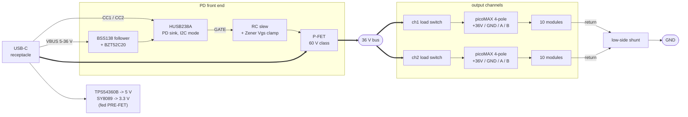
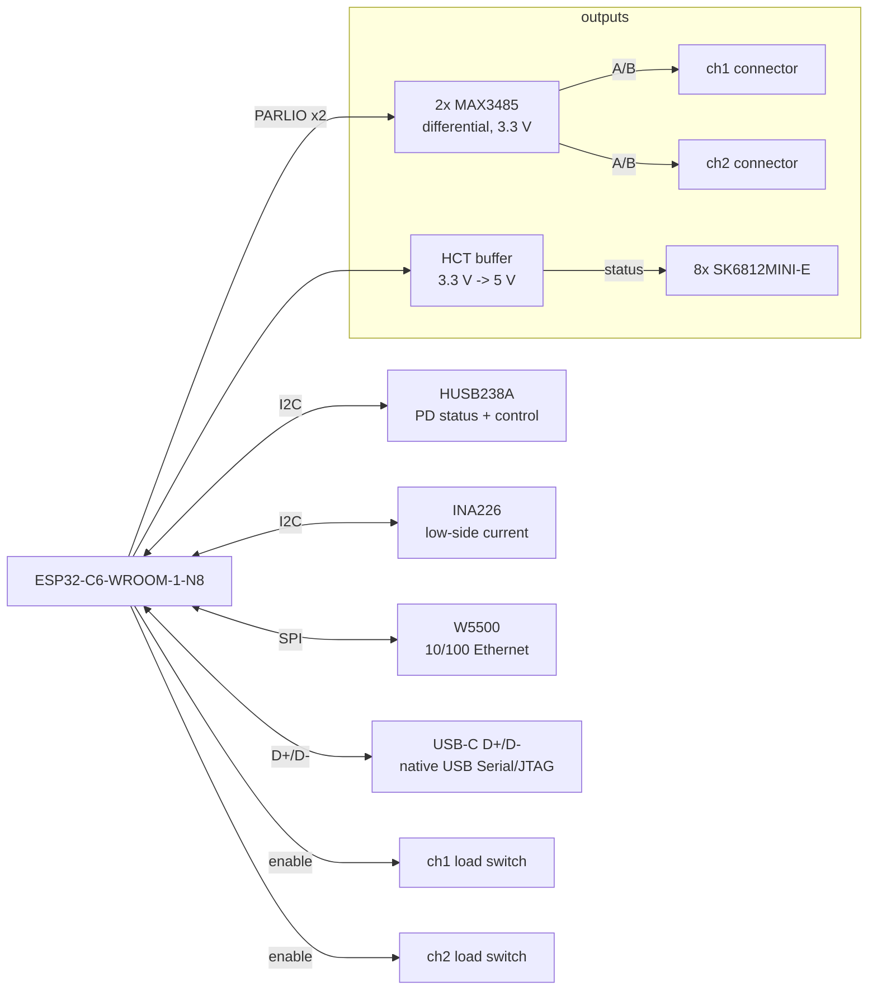
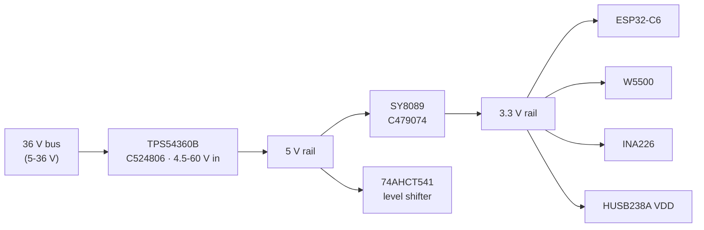

# LED matrix controller — status

Design brief in `BRIEF.md`. Nothing laid out yet; requirements are settled and
the next step is the netlist.

## What the board does

Negotiates USB PD, supplies a chained set of LED matrix modules over a
high-voltage bus, and runs an ESP32-C6 that drives the chain over Ethernet
(W5500) or USB. Brightness is capped in software to whatever PD actually
negotiated, so any number of modules can be attached and the board divides the
available power between them.

## Environment

**The wall mounts on a soundwall for tekno. Sustained, high-amplitude vibration
is a given, not an edge case.** This gates part selection from here on rather
than being something to remember ad hoc.

Vibration attacks a connection two ways — the connector walking out of its
header, and the wire loosening in its termination. Screw terminals are
specifically bad at the second: screws back out, and industrial practice is
periodic re-torquing, which nobody is going to do on a soundwall.

It also puts anything with **mass on long leads** at risk of solder-joint
fatigue. Affected, and still to be revisited:

- the module's bulk electrolytic — a 220-330 uF radial cap is a lump of mass on
  two leads, and this is the classic vibration failure. Bond the body down, or
  move to SMD polymer or an MLCC bank
- the JK60-300 PPTC (10.2 mm radial through-hole) — same geometry, much lighter
- converter board inductors — heavy and tall
- **board mounting**: standoffs at several points, not two corners. An
  unsupported span has a resonance and parts in the middle see amplified
  acceleration
- **cable strain relief**: a tie-down near each connector so cable movement does
  not load the contacts. Cheap, and it matters more than the connector choice

## Settled decisions

| Decision | Choice | Why |
|---|---|---|
| Bus voltage | **36 V** | highest EPR PDO the modules survive; XL1509 is 40 V operating / 45 V absolute |
| Power budget | **180 W** (36 V x 5 A) | EPR fixed PDO; matches the original brief |
| PD controller | **HUSB238A-BB001-QN16R** (C24833806) | I2C variant |
| PD mode | **I2C**, ADDR to GND = 0x42 | GPIO mode caps at 28 V/3.25 A = 91 W |
| PD front end | **p.16 Figure 6 topology** | 36 V exceeds the 33 V VBUS absolute max, so the chip must sit behind an external regulator with the power path on an external P-FET |
| External part ratings | **60 V class** | enough for a 36 V bus at 1.67x margin. This does NOT leave room for a future 48 V/240 W bus — that would want 100 V parts, and would need every module respun anyway |
| Channels | **2**, 10 modules each | fps depends only on modules per channel; 10/ch = 90 fps |
| Target scale | **20 modules**, 80% perceived brightness | what 180 W supports before brightness falls off; 10 per channel |
| UART bridge | **none** | ESP32-C6 has native USB Serial/JTAG, and PD runs on CC not D+/D- |
| MCU | ESP32-C6-WROOM-1-N8 (C5366877) | from brief |
| Ethernet | W5500 (C32843) | from brief |
| Current sense | **INA226** (C49851), **low-side** | specified 0-36 V operating (40 V absolute), so on a 36 V bus there is no operating margin at all; the shunt goes in the ground return where common mode is ~0 V |
| Module connector | **Wago picoMAX 3.5** (2091 series), 4-pole: **+36V / GND / A / B** | 10 A, push-in spring, integrated locking latch. Spring force does not relax like a screw; the latch stops it walking out. Sourced from Reichelt/Mouser, not LCSC |
| Data link | **differential pair**, MAX3485 (C6395158) x2 | one per channel. Removes the single-ended distance limit and the level shifting at this end |
| Status-LED level shift | **74AHCT541** (C84548) | the SK6812 chain needs 5 V logic off a 3.3 V GPIO. Octal and only one channel used — oversized, see KB |

### Architecture

Split into power and control. One diagram carrying both always crosses itself,
because the MCU touches everything on the board.

**Power path** — left to right, the two channels parallel:

Thick edges carry the bus current; thin edges are control and sense. The shunt
sits in the **return** path, which is what makes low-side sensing work.

**Control and data:**

Both I2C devices share one bus. The buffer drives only the status chain — the
data outputs are differential and need no level shifting here — so one channel
of eight is used.

### Why not 240 W

48 V is supported by the PD chip (p.16 Figure 6) but **destroys the modules** - the XL1509
is 40 V operating, 45 V absolute. 240 W would need every module respun onto a 60 V-class
buck. The controller's external parts are rated **60 V class**, which does not leave room
for 48 V — that would want 100 V parts. Since 48 V needs every module respun
anyway, the door is closed by the modules, not by this board.

### Why not 28 V

At 14 modules, 140 W and 180 W are nearly indistinguishable (83% vs 85% perceived) —
the 180 W case is thermally capped there, the 140 W case just barely power-limited at 67%. At 20 modules the gap is real: 71% vs 80%. 20 modules is the target,
so the extra front-end complexity is worth it.

## Power budget

180 W, less ~5 W for the controller, leaves ~175 W for modules.
Perceived brightness applies a gamma of 2.2.

| Modules | Power | Perceived | fps (2 ch) | Binds on |
|---|---|---|---|---|
| 10 | 70% | 85% | 176 | thermal |
| 14 | 70% | 85% | 128 | thermal |
| 20 | 61% | 80% | 90 | power |
| 24 | 51% | 73% | 76 | power |

<picture>
  <source media="(prefers-color-scheme: dark)" srcset="figures/brightness-vs-modules-dark.svg">
  
</picture>

Thermal and power cross over near 17 modules. Below that the modules are heat-limited
however much is negotiated; above it, software divides what is available.

## Cabling

**Terminology:** the link is called a **differential pair** throughout. The
drivers are RS-485 transceivers and follow RS-485 line levels, but none of the
RS-485 *connector* conventions apply — the pair runs over two poles of a picoMAX
alongside power and ground.

The converter is a **separate board from the LED matrix**: controller → wire →
per-module converter board on the back of the wall → LED matrix board. The
modules sit adjacent and chain board-to-board like a snake, so **only the
controller-to-first-module cable has any length.** Everything after it is a
short board-to-board link whose drop is negligible.

That single cable carries the whole channel: 2.43 A sustained, 4.0 A on a
full-white flash.

<picture>
  <source media="(prefers-color-scheme: dark)" srcset="figures/cable-drop-vs-hop-length-dark.svg">
  
</picture>

| AWG | 5 m | 10 m | 15 m | max at 5% |
|---|---|---|---|---|
| 18 | 0.51 V | 1.02 V | 1.53 V | **17.6 m** |
| **20** | **0.81 V** | **1.62 V** | 2.43 V | **11.1 m** |
| 22 | 1.29 V | 2.58 V | 3.86 V | 7.0 m |
| 24 | 2.05 V | 4.09 V | 6.14 V | 4.4 m |

**Power is not the constraint.** The converter needs only 6.5 V in (5 V out plus
1.5 V dropout), so from 36 V there is 29.5 V of headroom — the cable would have
to be absurd before the converter stopped regulating. The 5% line above is an
efficiency choice, not a functional limit. At 20 AWG and 10 m the cable burns
3.9 W per channel, which is the real cost.

**Data is no longer the limit.** Going differential removed it. A differential
pair is good for tens of metres at 800 kbps, well past anything power
allows, and it is far more tolerant of a room full of switching converters than
a single-ended line would have been.

So **power is now the only constraint: 20 AWG, up to about 11 m** at 5% drop.
That is a real gain over the ~5 m the single-ended link would have been held to.

Practice for the pair:

- **Twist A and B together.** The connector pinout is +36V / GND / A / B so the
  pair is adjacent and away from the power conductor.
- **120 Ω termination at the far end**, on the first converter board.
- Keep the pair away from the +36 V conductor and its converter switching noise.

Worth noting this is a dividend of the 36 V decision. At a 5 V bus a 1.6 V drop
would be 32% of the supply; at 36 V it is 4.5%.

## Status indication

Eight WS2812s in a chain on ONE GPIO, level-shifted through a 74AHCT541. Discrete LEDs are not an option: the
GPIO budget is ~17 of the ~23-26 the module exposes.

- **6 as a power bar** - watts, not volts, at 30 W per LED across the 180 W budget.
  Watts is what the limiter reasons about and it reads at a glance. Voltage can be
  encoded in colour if wanted. (Actual PD PDOs are 5/9/12/15/20/28/36/48, but 48 V is
  never requested because it destroys modules, so a voltage bar would need 7.)
- **1 for power limiting**, **1 for thermal limiting**. RGB encodes history on a single
  LED rather than one per time window: bright red = limiting now, orange = within
  5 min, dim yellow = within 10 min, off = clean for 10+ min.

Selected: SK6812MINI-E (C5149201). WS2812C-2020 (C2976072, 2x2 mm) is the smaller
alternative if board area gets tight.

**The thermal indicator is a model, not a measurement.** There is no temperature sensor
on the modules - the controller infers thermal state from commanded brightness
integrated over time against the RthJA figures in the knowledge base. Real thermal data
would need a sensor on the module, i.e. a module revision.

## Software power limiting

The use case is flashing effects, not sustained brightness, which changes what
the limiter has to do.

**Predictive limiting is primary.** Compute a frame's draw before displaying
it — sum all channel values x 20 mA / 255 — and scale the frame if it would
breach the negotiated current. Reacting to a measurement is too late: a sudden
all-white flash steps the bus from ~1 A to ~5 A in microseconds, and if that
exceeds what PD negotiated the source can cut VBUS entirely, blacking out the
whole installation.

**The INA226 is the slow loop**: calibrating the model, noticing the module
count changed, and acting as a safety net. Not the first line of defence.

**Inrush is handled in hardware, not software** — the RC on the Figure 6 P-FET
gate ramps the bus instead of switching it. See Protection architecture. Its sizing is
resolved — see Inrush ramp. It was deliberately sized for a worst case well
beyond what this controller can power, so it does not wait on the unread module
capacitance.

## Cold-start sequence

**The rails are fed from VBUS *ahead* of the P-FET, not from the switched bus.**
This is not a detail — wiring them downstream creates a circular deadlock that
would stop the board ever powering up:

> EN_N is pulled up internally and the HUSB238A is enabled by pulling it to GND
> (datasheet p.5). If EN_N sits on an MCU GPIO, that GPIO is high-Z until the MCU
> is powered. So the chip stays disabled, GATE never closes, the bus never comes
> up, the rails never come up, and the MCU never boots to pull EN_N low.

Feeding the rails pre-FET breaks it, and turns EN_N's internal pull-up from a
trap into the correct safe default — nothing negotiates until firmware is alive:

1. Plug in. VBUS is at vSafe5V (5 V), the P-FET is open, no LED power.
2. The TPS54360B runs straight off that 5 V — this is exactly why ~100% duty
   pass-through was a selection criterion — giving ~4.85 V, and the SY8089 makes
   3.3 V from it.
3. The MCU boots. EN_N is still high (internal pull-up), so the PD chip is idle.
4. Firmware pulls EN_N low. The HUSB238A negotiates — it self-powers from VBUS
   (p.5, pin 16), so it needs nothing from us to do this.
5. VBUS rises to 36 V. The rails ride through it; the TPS54360B is a 60 V part
   and simply leaves pass-through.
6. Firmware closes the channel load switches, each with its own 1-second ramp
   into its own 3.3 mF. The bus is already static at 36 V, so they switch into a
   steady source.

There is no master pass FET — see Gate network for why it was removed. A PD
fault sheds the LED channels while the controller stays alive to report it, which
is the behaviour we want.

## Rail architecture

The board must run from a 5 V bus as well as 36 V - all eight PD levels usable, with
software holding back what it cannot power. That constrains the rails more than the
36 V case does.

**TPS54360B** (4.5-60 V in, 3.5 A, 60k stock). Chosen specifically because its automatic
BOOT recharge circuit allows "duty cycles approaching 100%", so "the maximum output
voltage is near the minimum input supply voltage" (datasheet p.10). An ordinary buck
cannot make 5 V from a 5 V bus; this one passes through.

Output across the input range at 0.7 A, from the datasheet's p.12 dropout formula:

| bus | 5 V rail | 74AHCT541 needs 4.5-5.5 V |
|---|---|---|
| 4.75 V (USB-C low tolerance) | 4.60 V | ok |
| 5.00 V | 4.85 V | ok |
| >= 5.25 V | 5.00 V | ok |

The sag at low bus voltage is self-correcting rather than a problem: the modules' own
XL1509 is also in pass-through at 5 V (1.5 V minimum dropout means it cannot regulate
5 V out from 5 V in), so module VDD falls too. WS2812 VIH is 0.7 x VDD, so the level
shifter and the modules track together and the thresholds stay valid.

**SY8089** (C479074, SOT-23-5, 100k stock) for 3.3 V rather than an LDO. At 4.85 V in,
3.3 V out, and the ESP32-C6's ~500 mA transmit peaks, an LDO would burn ~0.8 W; a
synchronous buck burns under 0.1 W and avoids a thermal problem in a small package.

### Why two conversion stages

The board needs **both** rails: 3.3 V for the MCU, W5500, INA226 and the
HUSB238A's VDD, and 5 V for the 74AHCT541, because WS2812 VIH is 0.7 x VDD =
3.5 V on a 5 V module rail and a 3.3 V GPIO cannot reach it.

Cascading costs almost nothing. The 3.3 V rail delivers ~2.3 W, so:

| | efficiency | lost |
|---|---|---|
| cascade, 36 -> 5 -> 3.3 V | ~78% | 0.64 W |
| hypothetical single 36 -> 3.3 V | ~80% | 0.58 W |

**A 66 mW penalty**, against saving a second wide-input buck. The alternatives
are all worse:

- **Two parallel wide-input bucks** (bus to 5 V, bus to 3.3 V) needs two
  TPS54360-class parts and two inductors, for that same 66 mW.
- **One bus-to-3.3 V buck plus a charge pump to 5 V** works — the level shifter
  draws only tens of mA — but adds a part and puts switching noise next to the
  data lines.
- **Eliminating the 5 V rail entirely** is the only real simplification, and it
  is a *module* change: if the modules ran at ~4.5 V instead of 5.0 V, WS2812
  VIH would fall to 3.15 V and a 3.3 V GPIO could drive them directly. That
  removes the 5 V rail **and** the 74AHCT541. It needs XL1509-ADJ in place of
  the fixed XL1509-5.0, so it only makes sense if the modules are being revised
  for another reason.

So the two stages are forced by the 5 V logic requirement, and the cascade is
the cheapest way to meet it.

## Protection architecture

**No separate eFuse.** The p.16 Figure 6 topology already requires an external
P-FET driven by the HUSB238A's open-drain GATE pin. Adding an RC to that gate
network gives controlled turn-on slew, which **is** inrush limiting — the circuit
36 V forces on us already contains the solution. A Zener clamps V_GS.

A TPS26630 was the earlier plan at 28 V and was dropped for two reasons: its
integrated FET is 40 V (only 1.11x margin at 36 V), and it became redundant.

What this gives up versus a real eFuse is *active* current limiting and fast
overcurrent trip. Mitigated by, in order of speed:

1. the PD source limiting at the negotiated level
2. HUSB238A FAULT -> FLGIN cutting GATE on OTP or an adapter-capability fault (OVP/UVP do not survive the clamp topology above 28 V)
3. per-channel load switches isolating one chain
4. software via the INA226

**Current sensing is low-side.** The shunt sits in the ground return, so
common-mode is near 0 V and the INA226's rating — 0-36 V operating, 40 V absolute,
so no operating margin on a 36 V bus — stops mattering. Forced by both 85 V parts (INA228, INA238) being at zero stock;
it turned out to be the better answer. Costs the ability to detect an output
short to ground, and lifts the load ground by 50 mV at 5 A through 10 mOhm.

**The Figure 6 "Voltage Regulator" is a BSS138 source follower.** Hynetek
publishes it with values at [hynetek.com/2730.html](https://www.hynetek.com/2730.html)
— it is not in the datasheet. Gate pulled up through 10 kΩ and clamped by a Zener, source feeding the VBUS pin; a 0 Ω link bypasses it for
builds at 28 V or below.

**We use 20 V (BZT52C20), not Hynetek's 28 V.** It puts the VBUS pin at roughly
18.5 V, comfortably inside its 3.15-29.4 V window, where a 28-30 V part would sit
at ~28.5 V against a 29.4 V recommended maximum. The functions we rely on —
VBUS-present detection and supply backup — work anywhere in that range, and
OVP/UVP are lost to the clamp topology regardless. A deliberate deviation from
the vendor reference, worth validating.

This replaces the earlier assumption of a resistor-plus-Zener shunt, and the
difference matters: a follower holds the pin near (Vgate − Vth) with low output
impedance, where a series resistor would drop voltage with load current.

**The gate drive needs a separate fix that Figure 6 does not show.** Figures 4,
5 and 6 all draw the *same* Zener gate network — it is the 28 V one, not a 48 V
feature. Above 28 V Hynetek replaces it: GATE pulled to the MCU's 3V3 through
5.1 kΩ, level-shifted through a PMOS-then-NMOS pair into the high-side P-FET,
clamped by a 15 V Zener and 100 kΩ. Copying Figure 6's gate network verbatim
would be wrong at 36 V.

This independently confirms the 33 V GATE-pin problem found earlier here. The
2N7002 level shift was the right instinct; Hynetek's published arrangement is the
specific one to follow.

### No overvoltage protection above 28 V

Hynetek states it plainly: *"因为HUSB238A没有36V/48V OV保护"* — there is no
36 V/48 V OV protection. The clamp preserves the supply function and
VBUS-present detection, but **destroys OVP, UVP and the discharge path**. It is
also why 48 V is I²C-only while GPIO mode stops at 28 V.

Accepted, because it is inherent to the topology rather than a mistake — but it
changes what protects the bus. The **SMAJ36CA TVS is now the only fast
overvoltage protection**, with the 470 k/27 k ADC divider as a slow software
check. Those two were added for surge and brownout; they are now carrying OVP as
well.

Worth knowing this approach is the **outlier**. The common industry solution is
an active 0.42× ratiometric level shifter in a companion IC (TI TPD4S480,
Kinetic KTU1133, Fortune FA2218), which *preserves* measurement where Hynetek's
clamp does not. If a later revision wants real OVP back, that is the direction.

## Gate network

**Resolved by removing Q1, not by a third set of values.** The master pass FET
was the source of all three faults, and the two channel switches already shed
every load it could.

### What Q1 was costing

Three constraints fought each other while a FET sat between VBUS and the bus:

| Want | Needs | Conflict |
|---|---|---|
| Slow ramp into 3.3 mF | large C_gd | — |
| Fast turn-off | large pull-up current | large C_gd makes it impossibly slow |
| Survive the PD 5→36 V step | pull-up current ≫ C_gd × dV/dt | large C_gd self-turns-on the FET |

No passive network satisfies all three. The second attempt here failed all three
at once: the ramp sat on the FET with no capacitance behind it, turn-off took
~180 s, and the Miller capacitor turned the PD voltage step into a turn-on event.

### The architecture that removes them

**VBUS connects straight to the bus. Q2 and Q3 are the only switches**, and they
close *after* the bus is static at 36 V — so they never see a source dV/dt, and
the third constraint disappears entirely.

During the PD transition the source charges only the local capacitance:
100 µF × 1.24 kV/s = **124 mA**, trivial for it, and slew-rate controlled by the
PD specification rather than by us.

| | Value |
|---|---|
| R_pu, gate to source | **100 kΩ** |
| R_pd, gate to 2N7002 drain | **100 kΩ** |
| Zener, gate to source | BZT52C12 |
| C, gate to drain | **3.3 µF**, ≥50 V |

Which gives, per channel:

- **Ramp 0.99 s** — 120 µA plateau into 3.3 µF = 36 V/s
- **Inrush 0.12 A** into 3.3 mF of module capacitance
- **Turn-off 567 µs** — fast enough that the FAULT interlock means something
- **2.16 W average** in the FET over the ramp, against 4.6 kW in the broken version
- **13 mW standby** per switch

One honest caveat: the Zener runs at 120 µA against its 5 mA test current, so the
clamp is nearer 10-11 V than 12 V. That still clears the 10 V at which the
TM40P06D's 23 mΩ is specified, but it is an extrapolation, not a datasheet point.
Dropping both resistors to 10 kΩ would put the Zener at 1.2 mA and turn-off at
57 µs, at the cost of 130 mW standby per switch and a 10 µF Miller capacitor.

### What dropping Q1 costs

The HUSB238A's GATE pin goes unused. Its documented job is driving an external
VBUS switch for fault disconnect, and we give that up — **FAULT → the interlock
transistor → both channel gates** covers load shedding instead, now in 567 µs
rather than never.

What remains unprotected is a short on the bus node itself, upstream of the
channel switches. That is the PD source's current limit and the input TVS, not
ours. Accepted: the bus node is short, entirely on-board, and carries no
connector.

## Why two channels## Why two channels## Why two channels

Checked rather than assumed. At the 20-module target:

| channels | modules/ch | fps | A/ch balanced | % of 10 A | A/ch worst case | % |
|---|---|---|---|---|---|---|
| **2** | **10** | **90** | **2.43 A** | **24%** | 2.80 A | 28% |
| 3 | 6.7 | 134 | 1.62 A | 16% | 1.87 A | 19% |
| 4 | 5 | 176 | 1.22 A | 12% | 1.40 A | 14% |

"Worst case" is one channel sustained at the 70% thermal cap while the other is
dark — PD limits the *total* to 5 A, not how it splits. Percentages are against
the picoMAX's 10 A rating; at two channels the connector has 3.6x margin and is
nowhere near binding.

<picture>
  <source media="(prefers-color-scheme: dark)" srcset="figures/current-vs-connector-rating-dark.svg">
  
</picture>

Two is right because 180 W caps the wall near 20 modules anyway, so channels and
power budget run out together. 10 per channel is also the even physical grouping
wanted; three channels would mean 6.7 per chain for no benefit that is felt.

Two boundaries worth knowing rather than discovering:

- **An unbalanced load is no longer a connector problem.** PD caps the total at
  5 A but says nothing about the split, so one channel at the thermal cap while
  the other is dark draws 2.80 A — 28% of the picoMAX's 10 A. This was a real
  constraint at the old 3 A connector and is not one now.
- **Growth past ~24 modules degrades:** 24 -> 76 fps, 30 -> 61 fps (at the
  floor), 40 -> 46 fps (below it). Beyond ~24 is a board revision with 3-4
  channels, not a software change.

<picture>
  <source media="(prefers-color-scheme: dark)" srcset="figures/fps-vs-modules-per-channel-dark.svg">
  
</picture>

## Bill of materials

Active parts. Passives are listed below the table.

| Ref | Part | LCSC | Qty | Role | $ |
|---|---|---|---|---|---|
| U1 | HUSB238A-BB001-QN16R | C24833806 | 1 | USB PD sink, I2C mode | 0.66 |
| U2 | ESP32-C6-WROOM-1-N8 | C5366877 | 1 | MCU, native USB | 4.25 |
| U3 | W5500 | C32843 | 1 | 10/100 Ethernet | 2.85 |
| U4 | TPS54360B | C524806 | 1 | bus to 5 V, ~100% duty | 0.760 |
| U5 | SY8089A1AAC | C479074 | 1 | 5 V to 3.3 V | 0.087 |
| U6 | INA226 | C49851 | 1 | low-side current sense | 0.76 |
| U7,U8 | MAX3485 | C6395158 | 2 | differential line driver, one per channel | 0.35 |
| U9 | 74AHCT541 | C84548 | 1 | status-chain level shift (oversized, see KB) | 0.224 |
| Q1,Q2 | TM40P06D | C7422850 | 2 | channel load switches | 0.40 |
| Q3-Q5 | 2N7002 | C7420321 | 3 | gate level shift x2, FAULT interlock x1 | 0.018 |
| Q8 | BSS138 | C7420339 | 1 | source follower feeding the VBUS pin | 0.027 |
| D1 | BZT52C20 | C19077415 | 1 | clamps the BSS138 follower gate | 0.017 |
| D2,D3 | BZT52C12 | C19077410 | 2 | 12 V, Vgs clamp | 0.017 |
| D5-D8 | H5VL10B | C7420372 | 4 | ESD on USB-C D+/D- and CC1/CC2 | 0.0065 |
| D9-D11 | SMAJ36CA | C19077551 | 3 | 36 V TVS, clamps at 58.1 V — under the FET's 60 V | 0.037 |
| D12-D15 | SMAJ15CA | C7466491 | 4 | 15 V TVS on the A/B pair, 2 per output | 0.031 |
| D0 | SS36 | C2903825 | 1 | TPS54360B catch diode (required, p.26) | 0.063 |
| L1 | ANR5040T100M | C7427121 | 1 | 10 uH, TPS54360B output, 2.9 A Isat | 0.058 |
| L2 | ANR6028T2R2M | C7427146 | 1 | 2.2 uH, SY8089 output | 0.068 |
| R1 | FRM252WFR010TN | C7419995 | 1 | 10 mOhm 1% shunt | 0.058 |
| Y1 | K3A250002010G | C19076760 | 1 | 25 MHz for the W5500 | 0.068 |
| J1 | **REJECTED** — see open question 1 | — | 1 | USB-C: C19274016 is 3.0 A / 5.0 V, needs 5 A / 36 V | — |
| J2 | HR911105A | C12074 | 1 | RJ45 with magnetics | 1.73 |
| J3,J4 | Wago picoMAX 3.5 4-pole | — | 2 | module output, Reichelt/Mouser | — |
| LED1-8 | SK6812MINI-E | C5149201 | 8 | status chain | 0.081 |

Passives, standard values, final selection at layout:

- **120 Ω** differential termination (far end, on the converter board — not here)
- **900 kΩ** on HUSB238A ADDR and DEBUG_N, per datasheet p.4-5, to keep standby
  current low
- **10 MΩ** gate pull-up on Q1-Q3 (gate to source), against **1 MΩ** to the
  2N7002 drain. The ratio is load-bearing, not arbitrary — see Gate network
- **Gate network values are UNRESOLVED** — see Gate network. The ramp belongs on
  Q2/Q3 where the module capacitance is, and a passive pull-up cannot satisfy
  ramp, turn-off and dV/dt immunity together
- **10 kΩ** on the 2N7002 gates, **4.7 kΩ** I2C pull-ups, **10 kΩ** on INT_N
- **100 nF 0402** per supply pin, plus bulk per rail

## Network protocol

**Custom UDP, not Art-Net.** Art-Net's 512-channel universe limit means 20 modules
(2160 bytes of pixel data) would be split across 5 universes and 30 modules across
7 — protocol bookkeeping that buys nothing here, because this is one controller
driving its own fixed set of chains, not a lighting desk addressing arbitrary
fixtures.

A plain UDP frame protocol is simpler and smaller:

| Modules | Pixel bytes | Packets at 1400 B MTU | At 90 fps |
|---|---|---|---|
| 10 | 1080 | 1 | 90 pkt/s |
| 20 | 2160 | 2 | 180 pkt/s |
| 30 | 3240 | 3 | 270 pkt/s |

Trivial rates for a W5500. Keep each datagram under the ~1400 byte MTU rather
than relying on IP fragmentation, which is fragile over UDP and makes a single
lost fragment cost the whole frame.

Worth building in from the start: a **frame number and byte offset** in each
packet header, so the controller only displays once every packet of a frame has
arrived. Without it a dropped packet tears the image instead of just repeating
the previous frame.

TouchDesigner drives it directly. If Art-Net is ever wanted it can be a software
translation layer; nothing in the hardware depends on the choice.

## ESD and surge protection

A rave means people plugging and unplugging connectors, and up to 11 m of cable
per channel acting as an antenna. Three different problems, three different
parts:

| Interface | Part | Qty | Why that one |
|---|---|---|---|
| USB-C D+/D-, CC1/CC2 | H5VL10B | 4 | 5 V class, and low capacitance matters on USB 2.0 full speed |
| USB-C VBUS, both output +36 V | **SMAJ36CA** | 3 | Vrwm 36 V, Vbr 40.0-44.2 V, **Vc 58.1 V** — stays off at the PDO's +5% and clamps under the FET's 60 V rating |
| Differential A and B, both outputs | SMAJ15CA | 4 | 15 V bidirectional |

**The A/B pair needed its own part, not the 5 V one.** The RS-485 electrical
standard these drivers follow defines a
common-mode range of −7 V to +12 V, so a 5 V clamp would conduct during normal
operation and corrupt the bus. 15 V clears the +12 V limit with margin, and
bidirectional is required because the lines swing both polarities.

**Ethernet needs nothing extra.** The HR911105A has integrated magnetics, so the
cable side is galvanically isolated. (Bob Smith termination is worth adding for
EMI, but that is a different problem from ESD.)

**This was an error, now corrected.** The earlier text claimed "no part both
stays off at 36 V and clamps below 60 V" and leaned on the P-FET's body diode to
excuse a 64 V clamp. Both halves were wrong.

**SMAJ36CA** clamps at **58.1 V**, under the TM40P06D's 60 V — so the earlier
claim that no part could both stay off at 36 V and clamp below 60 V was simply
wrong, and was never checked.

But it is not comfortable either. A compliant PD fixed PDO is **±5%**, so a
source may sit at **37.8 V indefinitely** against Vrwm = 36 V. Checking only
Vbr(min) = 40 V was the wrong criterion: above Vrwm the leakage is unspecified
and strongly temperature-dependent — µA at 25 °C, potentially mA at 85 °C — which
means standby draw and self-heating on three parts. And 58.1 V against 60 V is
**1.03x**, measured at 10/1000 µs; an 8/20 µs surge drives it higher.

**This is the same squeeze as before, moved to the other side of the window**,
and it is not resolved. The honest options are a 100 V FET, or a TVS between the
two standoffs that does not exist in this family.

**The body diode does not protect against input-side surges.** With Q1 off and
the bus discharged — plugged in before negotiation, or after a FAULT — a surge on
USB-C VBUS puts the source at the clamp voltage and the drain at 0 V, body diode
reverse-biased, no help at all. It only helps for output-side transients, and
there it defeats per-channel isolation by dumping the surge onto the live bus and
into the TPS54360B input.

With SMAJ36CA the FET is inside its rating in both directions and the body-diode
argument is not needed.

## Mechanical envelope

**Target: no larger than an iPhone 16 (71.6 x 147.6 mm), ideally 2/3 the
height — so 71.6 x 98 mm, 7045 mm2.**

Component area estimates at ~2280 mm2. At 45% utilisation (2-layer, relaxed)
that is roughly **72 x 71 mm**; at 60% (4-layer, dense) about 72 x 53 mm. The
target is met with room to spare.

The four largest items are where any further shrink comes from:

| Item | mm2 | Lever |
|---|---|---|
| ESP32-C6-WROOM-1-N8 | 459 | ESP32-C6-MINI-1 is 219 mm2 — saves 240 |
| 3x TM40P06D + copper | 360 | fixed by thermals, see below |
| HR911105A RJ45 | 336 | unavoidable if Ethernet stays |

**Dropping the PPTCs is the easy win.** They were specified when the connector
was 3 A; at the picoMAX's 10 A the worst case is 28% of rating and their job has
largely evaporated. They are also through-hole radial — bulky, and mass on leads
in a vibration environment. Removing them saves 192 mm2 and two hand-soldered
parts.

## Thermals, and the FET decision

Size and dissipation pull against each other: a TO-252 is cooled by the copper
around it, and a small board has less of it.

| | dissipation | TO-252 at ~50 C/W |
|---|---|---|
| TM40P06D (60 V) | **0.58 W** | 29 C rise — modest pour |
| MOT1793G (100 V) | 2.13 W | 107 C rise — needs several cm2 |

**Decision: the 60 V TM40P06D.** Two reasons.

The size target makes 2.13 W genuinely awkward — finding several cm2 of pour on
a 72 x 71 mm board that already carries a module, an RJ45 and two connectors is
a real constraint, not a detail.

The TVS objection that also pointed at the 100 V part has been removed by
selecting **SMAJ36CA** instead of SMAJ40CA — it clamps at 58.1 V, under the
60 V rating, so the FET is covered in both directions. The earlier body-diode
argument used to excuse a 64 V clamp was wrong and is retracted; see ESD.

The 100 V part stays documented as the alternative if a future revision wants
48 V, which would need the modules respun anyway.

## Fault handling

**FAULT is wired as a hardware interlock, not just an interrupt.** The HUSB238A
pulls pin 13 high "if the power adapter cannot supply the required voltage or
current, or if an OVP/UVP/OTP event is detected" (datasheet p.5) — the chip
senses this natively, so no software is needed to notice it.

One extra 2N7002: its gate on FAULT, its drain on the gates of both channel
control transistors, source to ground. FAULT high pulls those gates low, the
control transistors turn off, both load-switch P-FETs release, and the LED load
is shed in microseconds regardless of what firmware is doing.

Supporting pieces:

- **Bus voltage sense**: **470 k / 27 k** divider into an ESP32-C6 ADC, plus
  **100 nF** at the tap. Gives **1.95 V at 36 V** and 2.72 V at 50 V, so events up to ~57 V are on-scale (3.26 V at 60 V is above the SAR's usable ceiling) —
  which matters because this divider is now the only overvoltage measurement the
  system has. An earlier 330 k/33 k gave 3.27 V, above the SAR ADC's ~3.1 V
  usable top at 12 dB, pinning the reading at full scale **at the normal
  operating point**. The INA226 cannot do this job: its VBUS pin is specified
  0-36 V against a 36 V bus, so no margin. The 100 nF fixes the source
  impedance, which an ESP32 SAR wants nearer 10 kΩ — but 25.5 kΩ with 100 nF is
  **τ = 2.55 ms**, so this cannot see an OV event faster than ~10 ms. It is a
  slow check, not fast protection, which matters because it is carrying the OVP
  role the HUSB238A lost.
- **100 uF hold-up on the rail input, behind a series Schottky.** Two things
  broke the earlier version. Topologically, Q1's body diode conducts bus to VBUS,
  so a capacitor on the bus discharges backwards into a collapsed source —
  exactly the case it was meant to cover. Arithmetically, the 29 ms figure
  assumed only the 2.2 W rail load; sharing the bus with 5 A of LEDs drains
  36 V to 5 V in **0.62 ms**. A series Schottky between VBUS and the rail input,
  with the capacitor on the rail side, isolates it from both.
- PD renegotiation gives a sink ~15 ms (tSnkNewPower) to reduce draw. One frame
  at 90 fps is 11.1 ms, so firmware can react **only if it is already watching**;
  blocking on a network read would miss the window. The FAULT interlock is the
  backstop for exactly that case.

## Per-IC support networks

Every value here is datasheet-mandated, not a preference. A schematic missing
any of them does not work. Cited so they can be checked rather than trusted.

### TPS54360B (U4) — bus to 5 V

| Part | Value | Source |
|---|---|---|
| BOOT cap, BOOT→SW | 100 nF X7R ≥10 V | p.27 §8.2.2.7 "must be connected for proper operation" |
| RT/CLK to GND | ~100 kΩ 1% → **1 MHz** | p.14 §7.3.9 — the pin **cannot float**; confirm against the datasheet equation |
| Feedback divider | 53.6 kΩ / 10.2 kΩ 1% (VREF 0.8 V) | p.28 §8.2.2.9 |
| COMP network | ~4.7 kΩ + 33 nF series, 150 pF parallel | p.13 §7.3.5, eq. 44-51 |
| CIN | ≥3 µF **effective after DC-bias derating**, 100 V X7R | p.26 §8.2.2.6 |
| COUT | ≥22 µF 10 V X7R | p.24-25 §8.2.2.4 |

PowerPAD must be **electrically** connected to GND, not just thermally (p.3).
EN is left floating deliberately: abs max 8.4 V (p.4), and a UVLO divider would
sit at ~9.5 V on a 36 V bus — over it. Floating gives the internal 4.3 V UVLO.
No soft-start or PWRGD pin exists on the DDA package.

### SY8089 (U5) — 5 V to 3.3 V

| Part | Value | Source |
|---|---|---|
| Feedback divider | 100 kΩ / 22.1 kΩ 1% (VREF 0.600 V) | p.2, Table 1 p.7 |
| CIN | ≥10 µF ceramic | p.2 and p.7 |
| COUT | **≥22 µF** | p.1 selection table, validated against the 2.2 µH L2 |
| EN pull-up | 100 kΩ to 5 V | p.2 "Do not leave it floating" |

### W5500 (U3) — Ethernet

| Part | Value | Source |
|---|---|---|
| EXRES1 (pin 10) to AGND | **12.4 kΩ 1%** | p.8, Figure 2 p.11 — sets PHY bias current |
| TOCAP (pin 20) | 4.7 µF | p.8 "must be connected" |
| 1V2O (pin 22) | 10 nF | p.9 "must be connected" |
| RSVD (pin 23) | tie to GND | p.9 |
| LED series resistors | 4 × ~330 Ω | §5.3 p.59 — outputs are unlimited push-pull |

Pin 18 VBG **must be left floating**; pin 7 is DNC. Both are easy to get wrong
writing a netlist from a pin list.

**Crystal mismatch:** the W5500 requires **CL = 18 pF** (§5.5.3 p.60), and Y1
(K3A250002010G) is a **20 pF** part. Either swap for a true 18 pF-CL crystal with
27 pF load caps, or keep Y1 with 30 pF caps and accept an uncharacterised
negative-resistance margin. Figure 3 p.11 also shows a 1 MΩ feedback resistor and
a 0 Ω series resistor in the XO leg. **Not yet resolved.**

**Bob Smith termination is already inside the HR911105A** — 4 × 75 Ω + 1000 pF/2 kV
plus both common-mode chokes. Adding it externally would be a mistake. The
chip-side centre taps (P4 TCT, P5 RCT) need a bias network that the W5500
datasheet does not document; take it from WIZnet's reference schematic rather
than guessing. **Unverified.**

### ESP32-C6-WROOM-1 (U2)

| Part | Value | Source |
|---|---|---|
| EN RC | 10 kΩ to 3V3 + 1 µF to GND | Figure 7 p.28 "an RC delay circuit must be added" |
| GPIO8 pull-up | 10 kΩ | Figure 7 (R8). GPIO8 has **no internal pull**, and GPIO8=0 with GPIO9=0 is an invalid strap (Table 7 p.13) |
| GPIO15 | external resistor to define the strap | §3.3.4 p.14 — must not be high-Z |
| 3V3 bulk | **22 µF + 0.1 µF** | Figure 7 p.28 |

### HUSB238A (U1) — the PD controller

Absent from this section until a review pointed out that the one IC the whole
design is built around had no entry.

| Part | Value | Source |
|---|---|---|
| VDD decoupling | **1 µF ceramic** | p.4, pin 5 — and an error-severity rule in the part's KB record |
| ADDR, DEBUG_N | 900 kΩ each | p.4-5, keeps standby current low |
| INT_N pull-up | 10 kΩ | p.5, open-drain |
| GATE pull-up to 3V3 | **5.1 kΩ** | Hynetek's >28 V arrangement, hynetek.com/2730.html |
| BSS138 gate pull-up | 10 kΩ | same source |
| Follower bypass link | 0 Ω, **do not fit** at 36 V | same source — it exists for ≤28 V builds |

Pin 17 is the exposed pad and the **only** GND connection.

**D+/D− (pins 1-2) are left unconnected.** The chip drives BC1.2 pull-ups onto
that pair for legacy charger detection, and the pair belongs to the ESP32-C6's
native USB — sharing them would break enumeration. We only want PD, which runs
on CC1/CC2, so the legacy detection is given up deliberately.

### Tie-offs that are inputs, not options

- **74AHCT541**: OE0 (pin 1) and OE1 (pin 19) are active-LOW enables and must go
  to GND, or every output stays high-Z. The seven unused A inputs must be tied.
- **INA226**: A0 and A1 must each be tied to GND/SCL/SDA/VS (p.3) — they are
  inputs. VBUS (pin 8) cannot float either; tie it to 3V3 and treat the bus and
  power registers as unused, since bus sensing is done by the ADC divider.
- **MAX3485**: DE to VCC **and RE to VCC** — RE is a CMOS input, "unused" is not
  a state. 0.1 µF at each VCC. Failsafe biasing is genuinely not needed, since DE
  is permanently asserted and the pair is never idle-floating.
- **Channel load switches**: the 2N7002 gates need explicit **pull-downs** to
  GND. Through reset and the whole boot window the driving GPIOs are high-Z, so
  without them both 36 V channels are in an indeterminate state. The 10 kΩ must
  be in series with the GPIO, so the FAULT interlock does not short a driven pin.
- **HUSB238A ADDR**: tie to **GND (0x42)**, not VDD. Mode and address latch at
  power-up, when the 3.3 V rail does not yet exist — so a VDD tie reads as GND
  anyway, or worse is ambiguous against the float-means-GPIO-mode state.
- **SK6812 chain**: ~500 Ω series resistors on data in and out, plus 100 nF per
  LED (datasheet p.9). Note its VIH is **0.65 × VDD**, not the 0.7 × VDD that
  applies to the WS2812D-F8.
- **INA226 ALERT** is open-drain (p.3) and needs a **10 kΩ pull-up**. ERC rule
  E3 would fire on this.
- **Q4, the main-path 2N7002**, needs a gate pull-down like Q5/Q6, so the
  power path is defined through MCU reset.

### Still unresolved in this section

- The W5500 crystal load-capacitance mismatch above.
- The HR911105A centre-tap bias network.
- D1 is **selected**: BZT52C20 (C19077415). See the note below on why 20 V
  rather than Hynetek's 28 V.
- **The small-signal P-channel MOSFET** for the >28 V gate level shift is not in
  the BOM. Q4-Q7 are all N-channel; Hynetek's arrangement needs a PMOS too.

## GPIO assignment

The module exposes **exactly 23** GPIO pads (datasheet Table 3, pp.10-11):
0-13, 15-23. GPIO14 does not exist on this package; GPIO24-30 go to the internal
QSPI flash and reach no pad.

The design needs **19**, not the 17 an early count suggested — that count omitted
the status chain and the bus-voltage ADC:

| Signal | Count |
|---|---|
| W5500 SPI: SCLK, MOSI, MISO, SCSn | 4 |
| W5500 RSTn, INTn | 2 |
| I2C SDA, SCL | 2 |
| HUSB238A INT_N, EN_N | 2 |
| INA226 ALERT | 1 |
| Channel data to MAX3485 DI x2 | 2 |
| Channel load-switch enables x2 | 2 |
| SK6812 status chain | 1 |
| Bus-voltage ADC divider | 1 |
| USB D-/D+ (GPIO12/13, fixed) | 2 |
| **total** | **19** |

**Five pins carry constraints**, though three of them can still carry signals.
GPIO12/13 are the USB pair and are unavailable. GPIO8 must read high at reset and
GPIO15 must not be high-Z — both usable if the signal's idle state matches the
required strap, which the assignment below exploits. GPIO9 wants the BOOT button.
It fits with **one spare**, but only because of those two strap-sharing tricks.

A workable assignment, which also shows how tight it is:

| GPIO | Signal | Note |
|---|---|---|
| 6, 7 | I2C SDA, SCL | LP_I2C pins |
| 18, 19, 20 | W5500 SCLK, MOSI, MISO | |
| 8 | W5500 SCSn | the mandatory 10 kΩ strap pull-up doubles as deselect-at-reset |
| 21, 22 | W5500 RSTn, INTn | RSTn needs a pull-down to hold the PHY in reset while the MCU boots |
| 23, 10 | HUSB238A INT_N, EN_N | |
| 11 | INA226 ALERT | |
| 4, 5 | MAX3485 ch1/ch2 DI | |
| 0, 1 | channel enables | each with a pull-down; costs the 32.768 kHz crystal option |
| 15 | SK6812 chain | a pull-down gives both the required strap level and the right idle state |
| 3 | bus-voltage ADC | GPIO2/3 are the **only** ADC pins free of strap, JTAG or 32 kHz conflicts |
| 12, 13 | USB D-/D+ | fixed |
| 9 | BOOT button | |
| 16, 17 | UART0 console | |
| **2** | **spare** | the one genuinely free pin |

**One spare GPIO**, not the comfortable six-to-nine implied earlier. One
unverified assumption: if PARLIO TX needs a clock-output pin for the two
synchronised channels, that is a 20th signal and the last spare is gone.

## Recovery and debug

Absent from the design and worth fixing before layout: there is **no way to
recover the board if firmware misbehaves**. Native USB Serial/JTAG covers normal
flashing, but it lives on GPIO12/13 and disappears the moment firmware
reconfigures them or the chip hangs before USB enumerates.

Espressif's reference (Figure 7, p.28) shows both a BOOT button on GPIO9 and a
reset button on EN. Minimum: **BOOT button, EN button, and UART0 TX/RX/GND
pads.**

Also not yet specified as parts rather than prose: four M3 mounting holes and
three fiducials (the vibration section argues for standoffs at several points),
the HR911105A shield-tab soldering, and a decision on shield-to-GND bonding.

## Thermal budget

At the 72 x 71 mm envelope the board is 51 cm2.

| Source | W | Note |
|---|---|---|
| TM40P06D main path | 0.57 | TO-252, 23 mΩ at 5 A |
| ESP32-C6 (TX peak) | 1.26 | 382 mA at 3.3 V, module datasheet |
| W5500 | 0.50 | |
| TPS54360B catch diode | 0.43 | conducts 86% of the cycle |
| TPS54360B IC | ~0.5 | conduction + switching at ~1 MHz |
| TM40P06D ch1 + ch2 | 0.27 | 2.43 A each |
| shunt 10 mΩ | 0.25 | at full 5 A |
| SY8089 + inductor | 0.19 | |
| 10 µH inductor DCR | 0.08 | |
| BSS138 follower + 10 kΩ | 0.11 | ~17.5 V at 4.5 mA with BZT52C20, plus 26 mW in the pull-up |
| **total** | **3.13** | status LEDs excluded |

Corrected totals: the ESP32-C6 row was 0.50 W against a datasheet 382 mA at
3.3 V = **1.26 W**, the TPS54360B row assumed 500 kHz when ~1 MHz is now chosen,
and Q1's dissipation uses the 25 °C *typ* 23 mΩ where 28 mΩ max at Tj ≈ 100 °C
gives ~1.0 W. The realistic total is **~4.2-4.5 W against ~4.6 W capacity —
roughly 1.0x headroom, not 1.5x**, and that is at **25 °C ambient**. Inside an
enclosure on a soundwall it is worse. This needs resolving before layout.

**Capping status-LED brightness is a thermal requirement, not a preference.**
Eight SK6812MINI-E at full white add **1.44 W typ / 1.74 W max** — the earlier
2.4 W assumed 20 mA per channel, but this is the 12 mA part — which still takes
the total past the board's capacity. They are indicators; a few percent duty is plenty. This is the
second reason to cap them — the first was the 22 µH inductor's saturation
margin.

Hot spots need local copper rather than relying on the board average: the main
TM40P06D (0.57 W), the ESP32-C6 and W5500 (0.50 W each), and the catch diode
(0.43 W). The two bucks and the power path should not share a thermal zone with
the module or the Ethernet controller.

The 60 V FET choice matters here: the 100 V alternative's 2.13 W would have
taken the total to 4.7 W, at the board's capacity before the LEDs are counted.

**The TPS54360B needs an external catch diode** (datasheet p.26) — this was
missing from the BOM until the thermal pass. SS36 covers it: 60 V blocks the
36 V input, 3 A against 0.86 A average.

## Known electrical limits

Found by review, accepted or still open rather than silently carried.

**SMAJ15CA clamps above the MAX3485's rating.** The transceiver's A/B absolute
maximum is ±15 V; SMAJ15CA breaks down at 16.7-18.5 V and clamps at **24.4 V**,
so it cannot conduct until the pin is already past its limit. The reasoning that
rejected a 5 V part still holds — RS-485 common mode runs -7 V to +12 V — but
there is no symmetric part that clears +12 V and clamps under 15 V. Options: an
asymmetric RS-485 TVS (SM712 class, 7 V/12 V standoff, **not in JLCPCB's
catalogue**), or rely on the MAX3485's own ±15 kV IEC ESD rating and treat the
TVS as surge-only. **Open.**

**H5VL10B on CC1/CC2 is marginal.** 5 V standoff, 5.6 V breakdown, against a
3.0 A Rp that pulls CC toward 5 V ±5 % with no cable attached. A 6 V-class part
is the usual choice. **Open.**

**ADDR to GND, 0x42.** An earlier note claimed 0x42 clashes with the INA226 and
specified a VDD tie for 0x62 — both wrong. The INA226 occupies exactly **one**
address (0x40 with A0/A1 to GND), so 0x42 is free. And a VDD tie is unsafe here:
ADDR latches at power-up, and the chip self-powers from VBUS the instant it
appears, while 3V3 only exists after two converters have started. GND is the only
tie that is guaranteed valid at the moment of latching.

**EN_N must stay HIGH at power-up**, which the internal pull-up already does —
the cold-start sequence depends on the chip being idle until firmware enables it.
An earlier note here specified a 100 kΩ **pull-down**, which would have enabled
the chip before the MCU existed and contradicted step 3. No external pull is
needed; the GPIO drives it low to enable. If a defined state during MCU reset is
wanted, it must be a pull-**up** to 3V3, reinforcing the internal one.

**The FAULT interlock must not fight the GPIOs.** Its 2N7002 drain sits on gates
driven by push-pull MCU pins; asserting it would short a driven-high GPIO through
900 mΩ. Each GPIO needs **1-10 kΩ in series** with its gate node so the interlock
wins without contention. Tying FAULT straight to FLGIN also leaves no software
path to clear a latched fault.

**The module draws 2.16 A from a 2.0 A converter.** Every brightness, current and
fps figure in this document derives from 14.4 W per module, which derives from
that 8 % exceedance. It is recorded in the module KB but was never surfaced here.
The 75 % efficiency behind 14.4 W is also characterised at 28 V, so at 36 V the
real figure is worse and 2.43 A per channel is a floor, not a ceiling.

**Thermal ambient is unstated.** The 0.08-0.1 W/cm² and the 1.5x headroom assume
a 40 °C rise from **25 °C** ambient. Inside an enclosure on a soundwall that is
optimistic; at 45 °C ambient the headroom is roughly 1.0x.

## Open questions

### Blocking the netlist

1. **The USB-C receptacle is over its ratings on both axes.** C19274016's
   datasheet note 4-1 gives **3.0 A / 5.0 V**; the design needs **5 A at 36 V** —
   1.67x the current rating. No adequately qualified part has been found in
   JLCPCB's catalogue. This is the single highest-stress component on the board.
   Whatever replaces it must be explicitly rated 5 A / 50 V for EPR, and the
   netlist must parallel **all four VBUS and all four GND contacts** (a Type-C
   contact is 1.25 A) and tie DP1/DN1 to DP2/DN2 for flip support.

2. **The small-signal P-channel MOSFET for the gate level shift is not selected.**
   Hynetek's >28 V arrangement needs a PMOS-then-NMOS pair; Q4-Q7 are all
   N-channel 2N7002.

3. **The W5500 crystal is the wrong load capacitance.** The W5500 requires
   **CL = 18 pF** (§5.5.3 p.60); Y1 (K3A250002010G) is a **20 pF** part. Either
   swap for a true 18 pF-CL crystal with 27 pF load caps, or keep Y1 with 30 pF
   caps and accept an uncharacterised negative-resistance margin. Figure 3 p.11
   also shows a 1 MΩ feedback resistor and a 0 Ω series resistor in the XO leg.

4. **The HR911105A centre-tap bias (P4 TCT, P5 RCT) is undocumented** in the
   W5500 datasheet. Take it from WIZnet's reference schematic rather than
   guessing; leaving them unconnected is a dead link.

5. **The BSS138 follower may not clear the HUSB238A's UVLO at vSafe5V.** With VDD
   unavailable the chip needs VBUS ≥ 3.67-4.4 V and draws 4.5 mA; at 5 V in, the
   follower delivers roughly 2.8-3.5 V. Feeding the rails pre-FET means VDD is
   powered before this matters, which should resolve it — but the margin at the
   3.15 V floor is thin and Hynetek's 36 V reference should be checked for how
   they bias the follower at 5 V.

### Verification, not design

6. **TM40P06D SOA during the 1-second ramp** — 17.1 W peak in linear mode, no SOA
   curve in the datasheet. See Inrush ramp.

7. **The thermal model is unmeasured.** ~70% sustainable brightness, calculated
   not observed. Testable for free using the XL1509's own thermal shutdown: run
   one module at full white for 15 minutes and watch for the LEDs cutting out and
   recovering. The TSD threshold is unspecified, so a pass means "below some
   unknown value", not "at 70%".

### Depends on the converter board

8. **The differential receiver footprint and 120 Ω termination** must exist on
   the first converter board of each chain. Populating only the controller end is
   useless.

9. **The module's inductor, catch diode and input bulk capacitor** are unknown —
   the .epro2 converter sheet has no LCSC parts assigned. None of them block the
   controller: the inrush ramp was sized for a worst case beyond what it can
   power.

### Accepted

10. **No overvoltage protection above 28 V**, inherent to the HUSB238A topology.
    The SMAJ36CA and the ADC divider carry it.

11. **Connector orientation is handled mechanically** — picoMAX is polarised and
    each module sits in a hard shell. The residual risk is a mis-wired cable, and
    the failure modes are asymmetric: A/B swapped is non-destructive, power onto
    a data pole destroys the transceiver.

12. **Per-channel current limiting is software only.** At the picoMAX's 10 A the
    connector is no longer a binding constraint.

## Resolved

Kept so they are not re-opened:

- **Module connector** — Wago picoMAX 3.5 (2091 series), 4-pole, 10 A per
  contact, pinout **+36V / GND / A / B**. Push-in spring and an integrated
  locking latch, chosen for the vibration environment. At 10 A the worst case is
  28% of rating, so the connector stopped being a binding constraint.
  (Supersedes the Wurth WR-PHD 2.54 mm at 3 A, and the Micro-Fit alternative.)
- **Catch diode** — SS36 (C2903825), 3.0 A / 60 V. On the **controller** it is
  the TPS54360B's catch diode at **0.86 A** average (29% of rating). The 1.86 A /
  62% figure that appeared here is the **module's** diode and does not belong in
  the controller's list.
- **Rails** — TPS54360B to 5 V, SY8089 to 3.3 V. Chosen for ~100% duty
  pass-through so a 5 V bus still works. See Rail architecture.
- **Bus voltage and budget** — 36 V / 180 W, the highest EPR PDO the modules
  survive.
- **Channel count** — two, verified against three and four. See Why two channels.
- **Module BOM** — extracted from the .epro2 with `tools/epro.py`. The project is
  titled V2 but is V3.

## Reference design

`reference/*.epro2` holds the existing LED matrix module project (EasyEDA Pro
3.2.149). **The project is titled "V2" but is actually V3** — V2 used a
different converter and had no decoupling capacitors.

Read it with `tools/epro.py`:

    ./tools/epro.py bom "reference/ProPrj_LED Matrix V2_2026-10-01 (2).epro2"

That yields the real BOM with LCSC numbers. **Only the 36 WS2812D-F8 and the 36
per-LED 100nF capacitors were actually confirmed this way** — see below for why
the converter parts were not. See the CLAUDE.md section on reading an EasyEDA project for the file
format and its one parsing trap.

**The archive holds several boards, and the converter is not resolved:**

| board | contents | converter |
|---|---|---|
| PCB_LED Matrix | 36x WS2812 + 36x 100nF + 3 connectors | none |
| PCB_LED Matrix v1 | as above + LT1085CT-5 | LT1085 linear |
| PCB6 | has `L`, `D`, `COUT`, `U x4` | present, **no LCSC parts assigned** |

So the XL1509, the SS36 and the electrolytics are in the project *library* but
are **not placed on any complete board** in the archive. The XL1509 is taken as
the module's converter because you said so, not because the file says so, and
every thermal and inrush figure here is conditional on that.

That also means the input bulk capacitor cannot be read out. It no longer
blocks anything — the inrush ramp was sized for a worst case beyond what this
controller can power — but it is why the module's own ripple and damping
behaviour is still estimated rather than known.

Multiple archives are present and they differ in size, so they are not duplicate
downloads. The most recent is `(2)`; check before trusting an older one.

For a netlist to run ERC against, **export one from EasyEDA Pro directly**
(File -> Export). `tools/epro.py` is a read-only reverse-engineering aid, not a
substitute for the supported path.
